# Installazione e configurazione iniziale di pfSense su VMware Workstation Pro

### Accesso al portale di download pfSense

1. Apriamo il browser e andiamo dritti alla pagina ufficiale di download: https://www.pfsense.org/download/

2. Diamo un'occhiata alla versione stabile disponibile: in questo momento la release corrente è la **2.8.1**.

3. Facciamo click sul pulsante azzurro **DOWNLOAD** (quello indicato dalla freccia rossa) per farci catapultare sul portale di distribuzione di Netgate.

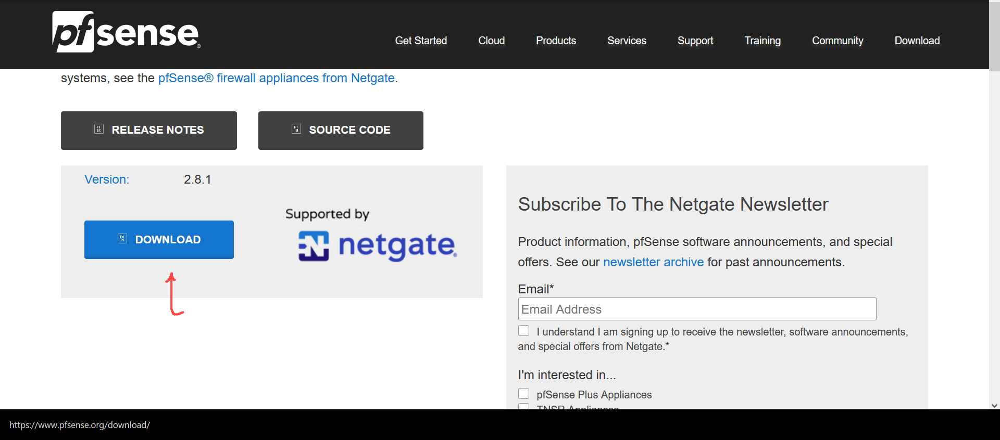

### Selezione dell'architettura e della tipologia d'immagine

1. Nel modulo del Netgate Installer, clicchiamo sul primo menu a tendina `SELECT IMAGE TYPE`.

2. Scegliamo l'opzione **AMD64 ISO IPMI/Virtual Machines**. Ci serve l'immagine `.iso` nativa per gli hypervisor, non quella *Memstick* che useremmo per flashare una chiavetta USB fisica.

3. Clicchiamo su **ADD TO CART** per mettere l'installer nel carrello. Tranquilli, il prezzo finale è **$0.00**.

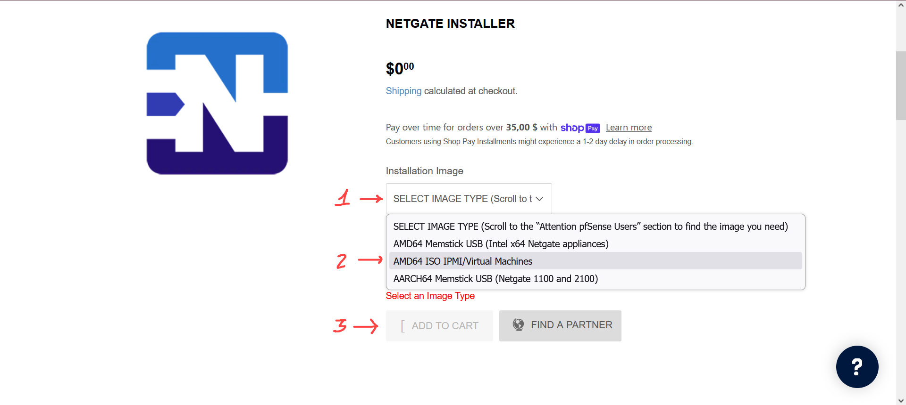

### Avanzamento alla fase di Checkout

1. Clicchiamo su **ENTER CART** per andare a vedere il riepilogo della nostra "spesa".
   
   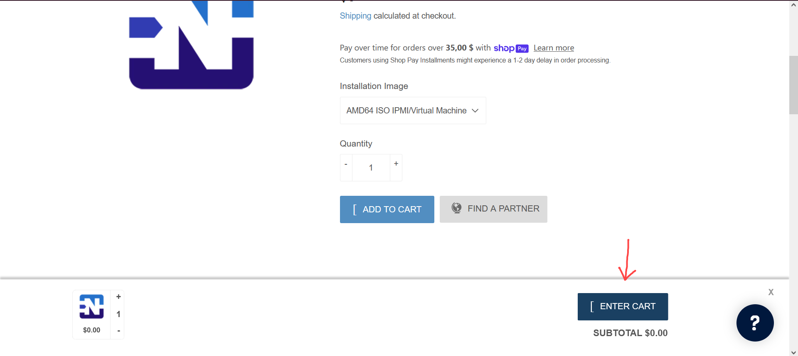

2. Allora andiamo avanti cliccando sul pulsante azzurro **CHECKOUT** in basso a destra.
   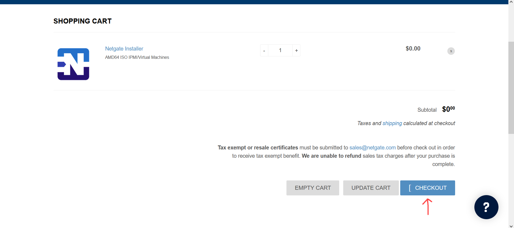

### Inserimento dei dati anagrafici per l'ordine

1. Netgate ci chiede un po' di dati per la fatturazione. Generiamo un'identità fittizia (magari con *Fake Name Generator*) e usiamo una mail usa e getta (tipo *AdGuard Temp Mail*). Compiliamo i campi obbligatori di indirizzo e telefono senza regalare i nostri veri dati al cloud.

2. Spuntiamo la casella per accettare i termini di servizio e il contratto di licenza (**EULA**).

3. Clicchiamo sul bottone blu **Complete order** per lanciare la transazione.

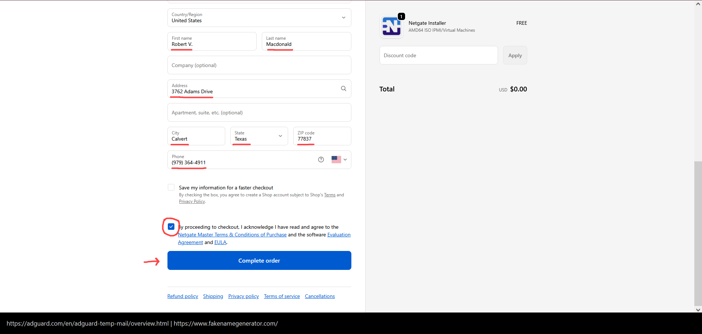

### Download effettivo dell'archivio compresso

1. La transazione passa all'istante e il portale ci mostra la ricevuta con il codice d'ordine.

2. Scendiamo fino al riquadro inferiore dedicato all'installer per macchine virtuali.

3. Clicchiamo sul pulsante blu **Download Now** per ottenere finalmente il file `netgate-installer-v1.2-RELEASE-amd64.iso.gz`.

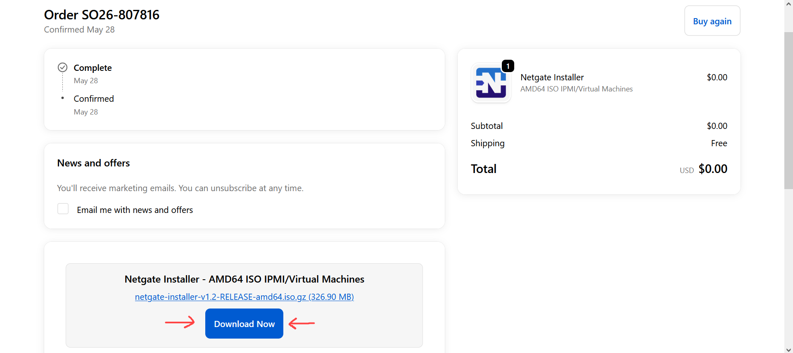

### Estrazione dell'immagine ISO tramite 7-Zip

1. Apriamo l'esploratore di Windows e andiamo nella cartella dove teniamo tutte le ISO del laboratorio (nel mio caso, `D:\Virtual Machines\ISO`).

2. Facciamo click con il tasto destro sul file appena scaricato, che finisce per `.iso.gz`.

3. Andiamo sulla voce **7-Zip** e clicchiamo su **Extract Here**. L'hypervisor non digerisce gli archivi compressi, quindi dobbiamo estrarre il file `.iso` vero e proprio che peserà circa 1 GB.

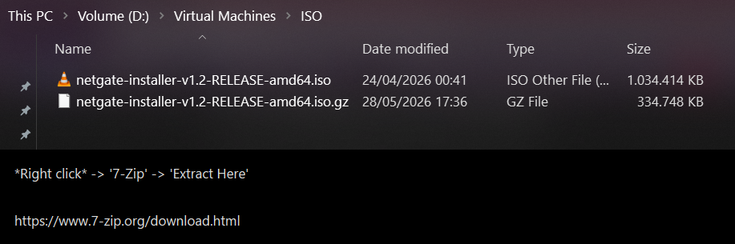

### Creazione Nuova Macchina Virtuale su VMware

1. Apriamo **VMware Workstation Pro**.

2. Clicchiamo su `File` -> `New Virtual Machine...`.

3. Nel wizard lasciamo selezionata l'opzione **Typical (recommended)**. Andiamo avanti con **Next >**.

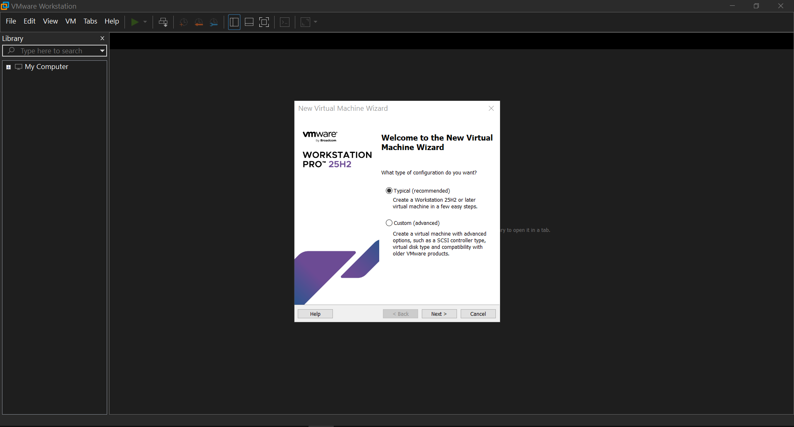

### Puntamento al file ISO di installazione

1. Selezioniamo l'opzione **Installer disc image file (iso):**.

2. Clicchiamo su **Browse...** e andiamo a pescare il file `.iso` scompattato un attimo fa in `D:\Virtual Machines\ISO\netgate-installer-v1.2-RELEASE-amd64.iso`.

3. Notiamo con piacere che VMware è abbastanza intelligente da riconoscere subito cosa c'è dentro: ci dice infatti `FreeBSD version 10 and earlier 64-bit detected` (pfSense gira proprio su base FreeBSD). Clicchiamo su **Next >**.

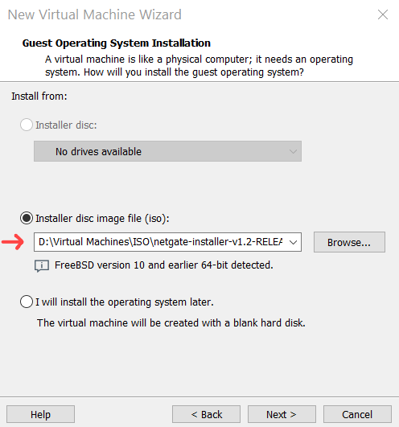

### Assegnazione Nome e Path della Macchina Virtuale

1. Nel campo `Virtual machine name:`, diamo alla VM un nome chiaro e pulito: **`pfSense (firewall)`**.

2. Nel campo `Location:`, personalmente non ho lasciato il path di default sul disco `C:`. Ma ho sfruttato un secondo disco più capiente, impostando il percorso su **`D:\Virtual Machines\pfSense (firewall)`**.

3. Clicchiamo su **Next >** per andare a decidere le dimensioni del disco fisso.

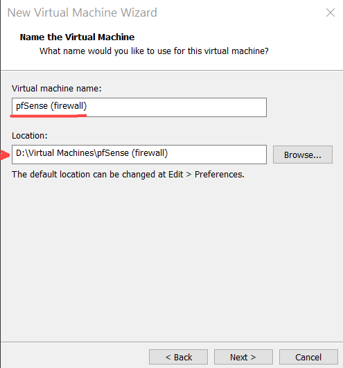

### Dimensionamento del disco fisso virtuale

1. Entriamo nella schermata `Specify Disk Capacity` per definire lo spazio di archiviazione.

2. Nel campo `Maximum disk size (GB):`, lasciamo il valore di default a **`20.0`** GB.

3. Selezioniamo il radio-button **Split virtual disk into multiple files**. Questa opzione spezzetta il disco virtuale in file da 2 GB l'uno; rende molto più agile lo spostamento o il backup della VM su altre unità senza compromettere le performance.

4. Clicchiamo su **Next >**.

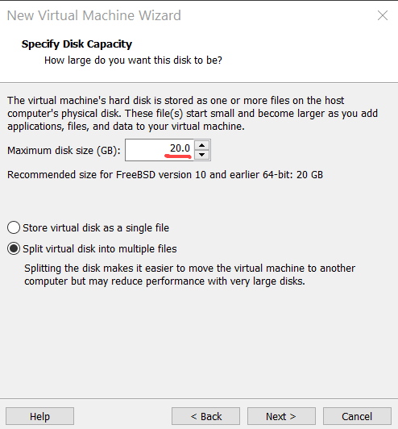

### Controllo finale e accesso alla personalizzazione hardware

1. Il wizard ci mostra il riepilogo della macchina prima di crearla. Notiamo subito che le impostazioni standard assegnano solo `256 MB` di RAM e una sola scheda di rete in `NAT`. Decisamente troppo poco per farlo girare bene e gestire il routing del laboratorio.

2. Clicchiamo sul pulsante **Customize Hardware...** (indicato dalla freccia rossa) per correggere i parametri prima del primo boot.

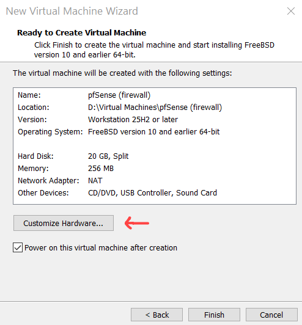

### Ottimizzazione della memoria RAM

1. Nella colonna di sinistra della nuova finestra, clicchiamo sulla voce **Memory**.

2. Nel campo di testo in alto a destra o trascinando il cursore blu, modifichiamo il valore portandolo a **`2048` MB** (ovvero 2 GB). Sebbene pfSense dichiari un minimo raccomandato inferiore, assegnargli 2 GB garantisce stabilità totale durante i futuri stress test di sicurezza e previene rallentamenti dell'interfaccia web.

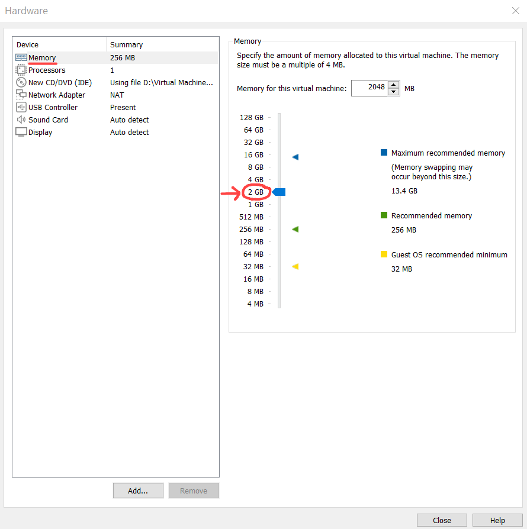

### Aggiunta della seconda interfaccia di rete (LAN)

1. Per fare da firewall e router, a pfSense servono almeno due schede di rete: una per internet (WAN) e una per la rete interna (LAN). Clicchiamo sul pulsante **Add...** in fondo alla schermata (punto 1).

2. Nella finestrella che si apre, selezioniamo la voce **Network Adapter** (punto 2).

3. Confermiamo cliccando sul pulsante **Finish** (punto 3).

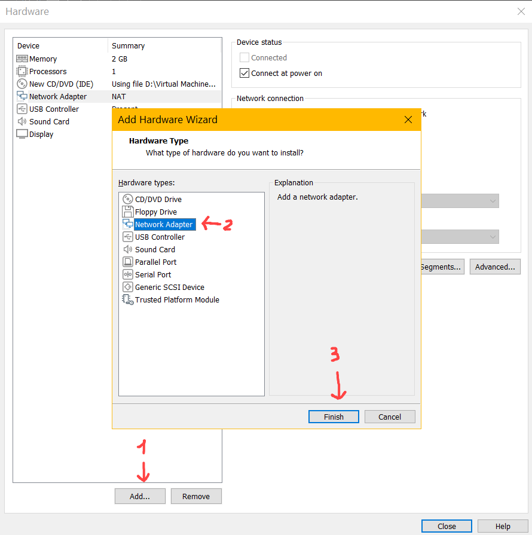

### Isolamento della LAN sul segmento virtuale del laboratorio

1. Clicchiamo sulla nuova scheda appena creata, identificata come **Network Adapter 2**.

2. Spostiamo il pallino su **LAN segment:** nell'elenco delle opzioni di destra.

3. Dal menu a tendina subito sotto, selezioniamo il segmento denominato **`lab`** (lo si crea attraverso il pulsante `LAN Segments`). In questo modo, l'interfaccia rimarrà completamente isolata dall'host fisico e pronta a parlare esclusivamente con le altre VM del laboratorio (il Domain Controller, i client e lo Zabbix Server), mentre la prima scheda (`Network Adapter`) rimarrà in `NAT` per agganciare la WAN e dare connettività Internet controllata.

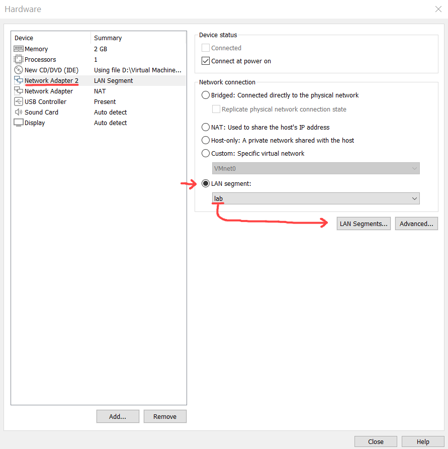

### Configurazione dei core della CPU e avvio della macchina

1. Spostiamoci sulla voce **Processors** nella colonna dei dispositivi.

2. Cambiamo il parametro `Number of cores per processor:` impostandolo a **`2`**, portando così i core totali a 2. Un piccolo boost di calcolo che aiuterà pfSense a gestire meglio i filtri di rete senza gravare troppo sulla CPU dell'host fisico.

3. Clicchiamo sul pulsante **Close** in basso a destra per salvare tutto e poi avviamo la VM cliccando sul tasto di accensione (Play) di VMware.

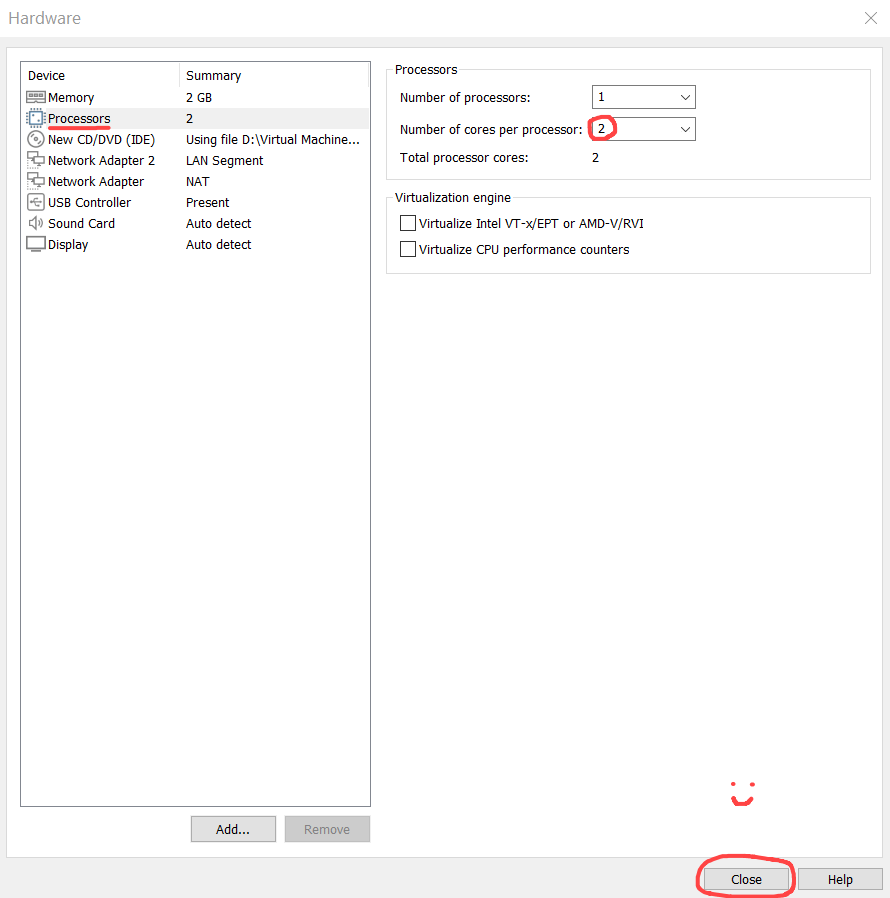

### Accettazione del Copyright e della licenza software

1. Al primo avvio, la VM esegue il boot dalla ISO e avvia il Netgate Installer a interfaccia testuale (Ncurses).

2. Ci troviamo davanti alla schermata di `Copyright and Distribution Notice`. Usiamo le frecce direzionali o il tasto `Tab` per evidenziare il pulsante **[ Accept ]**.

3. Premiamo `Invio` per confermare e proseguire.

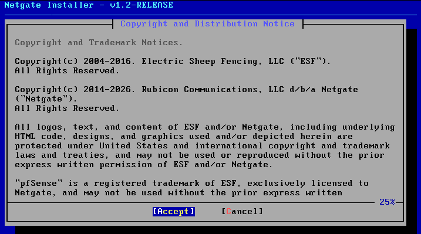

### Avvio dell'installazione di pfSense

1. La schermata di `Welcome` ci offre due strade: installare il sistema o lanciare una shell di ripristino per operazioni di emergenza.

2. Lasciamo l'evidenziatore posizionato sulla voce **`Install` `Install pfSense`**.

3. Assicuriamoci che in basso sia selezionato il tasto **[ OK ]** e premiamo `Invio` per dare inizio alla vera e propria procedura di configurazione sul disco virtuale.

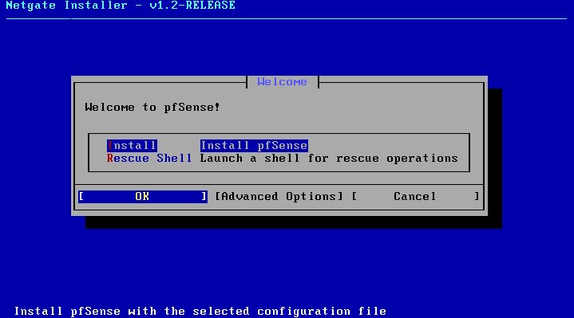

### Inizializzazione della configurazione di rete dell'installer

1. L'installer mostra un pop-up con il messaggio `Setting up the network to continue the installation.`. In questo step, il sistema sta inizializzando i driver delle schede di rete virtuali (`em0` ed `em1` su base FreeBSD) per permettere la successiva assegnazione delle interfacce.

2. Premiamo `Invio` sul tasto **[ OK ]** per procedere.

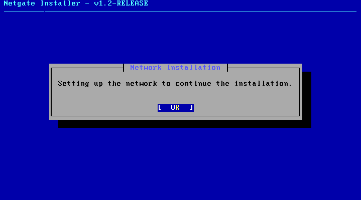

### Selezione dell'interfaccia WAN primaria

1. L'installer ci chiede ora di identificare quale scheda debba fungere da interfaccia **WAN** (quella esposta verso Internet). La schermata mostra entrambe le schede virtuali attive: `em0` ed `em1`.

2. Di norma, VMware assegna le schede in ordine logico: lasciamo selezionata la prima interfaccia **`em0`** (corrispondente al `Network Adapter` in modalità NAT).

3. Verifichiamo che lo stato indichi `(active)` e premiamo `Invio` su **[ OK ]**.

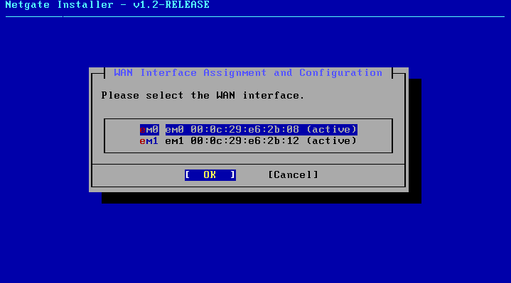

### Configurazione dei parametri di rete della WAN (`em0`)

1. A questo punto il sistema ci chiede se vogliamo modificare il comportamento logico della scheda esposta verso internet.

2. Controlliamo le impostazioni di fabbrica mostrate nel menu: l'interfaccia si trova in modalità **`DHCP (client)`**, non ha VLAN taggate attive (`VLAN Tagging disabled`) e il resolver locale è disattivato (`false`).

3. Visto che la prima scheda della VM è in modalità NAT su VMware e deve proprio prendere l'IP dall'hypervisor, lasciamo l'evidenziatore sulla voce **`>> Continue`** (Proceed with the installation) e premiamo `Invio` sul tasto **[ OK ]**.

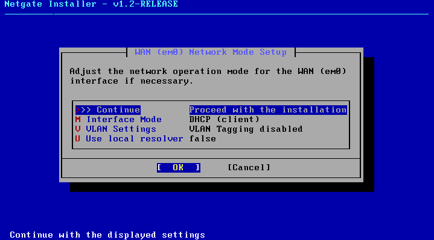

### Assegnazione e attivazione della scheda LAN

1. Passiamo ora alla schermata `LAN Interface Assignment and Configuration`, dove ci viene chiesto di indicare quale scheda fisica assegnare alla nostra rete interna privata (`Please select the LAN interface`).

2. Nell'elenco balza subito all'occhio la scheda **`em1`**, marcata come `(active)` e con il suo indirizzo MAC virtuale ben visibile.

3. Spostiamo il cursore su **`em1`** e premiamo `Invio` su **[ OK ]**.

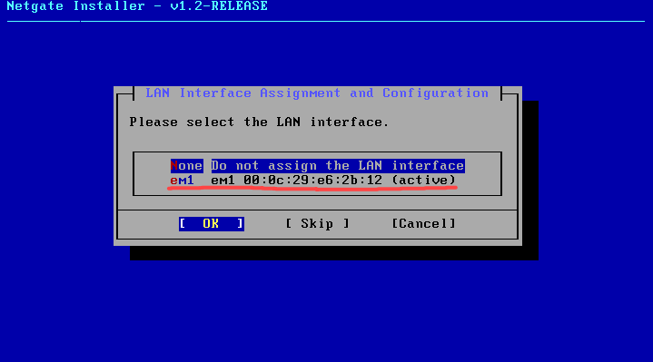

### Configurazione dei parametri di rete della LAN (`em1`)

1. Entriamo nella schermata `LAN (em1) Network Mode Setup`. Qui l'installer si offre di pre-configurare la nostra rete locale.

2. Diamo un'occhiata ai valori di default: la modalità è impostata su **`STATIC`**, l'IP è il classico **`192.168.1.1/24`** e il server DHCP integrato (`DHCPD Enabled`) è attivo con un range che va da `.100` a `.199`.

3. Anche se sappiamo già che l'IP della LAN andrà modificato in seguito per allinearsi alla nostra subnet di laboratorio (`192.168.10.1`), per adesso non tocchiamo nulla. Lasciamo l'evidenziatore su **`>> Continue`** e premiamo `Invio` su **[ OK ]**.

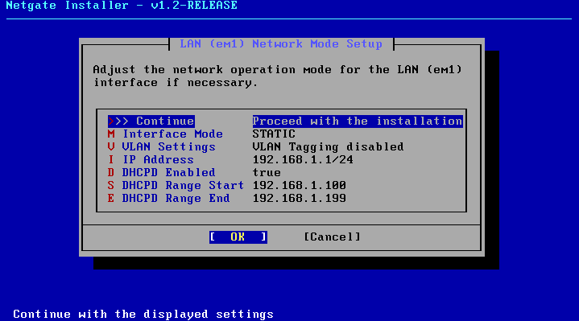

### Conferma della mappatura delle interfacce

1. Arriviamo alla schermata di riepilogo `Interface Assignment and Configuration`. Il sistema ci riconosce correttamente all'interno di una **VMware Virtual Machine** e ci chiede una conferma visiva prima di blindare la configurazione delle schede.

2. Spostiamo il cursore sul pulsante **[ Continue ]** a sinistra e premiamo `Invio`.

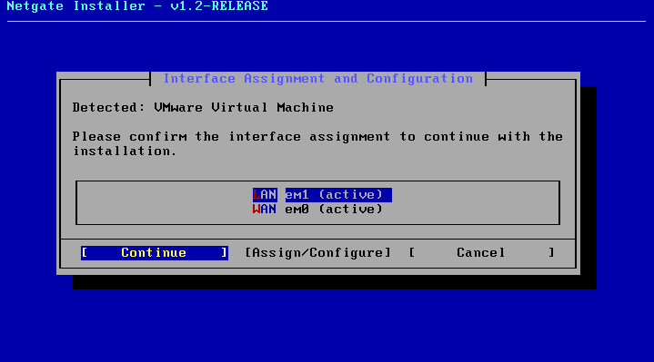

### Gestione della licenza e scelta della versione Community Edition (CE)

1. L'installer ci mostra la schermata `Active Subscription Validation`. Compare un avviso chiaro: `This device does not have an active pfSense Plus subscription.` (il software rileva che non abbiamo una licenza commerciale Plus valida per questa istanza).

2. La schermata ci spiega che possiamo tranquillamente ripiegare sulla versione open-source. Spostiamo l'evidenziatore sul pulsante **[ Install CE ]** e premiamo `Invio` per switchare sull'installazione di pfSense Community Edition.

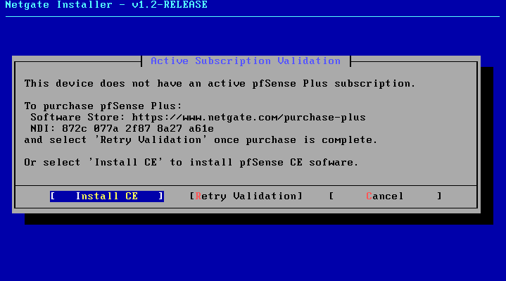

### Scelta del File System (ZFS) e dello schema di partizionamento

1. Entriamo nella finestra `Installation Options` per decidere come preparare il terreno sul disco fisso virtuale.

2. Di default troviamo già impostato il File System su **`ZFS`** (la scelta raccomandata per evitare che il file system salti in aria se spegniamo brutalmente la VM) e il Partition Scheme su **`GPT`** (perfetto per il boot UEFI che abbiamo scelto su VMware).

3. Lasciamo la selezione su **`>> Continue`** (Proceed with the installation) e confermiamo premendo `Invio` sul tasto **[ OK ]**.

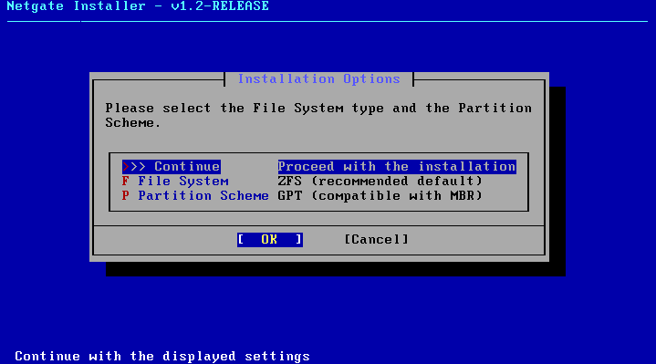

### Configurazione del Virtual Device ZFS (Stripe)

1. Nella schermata `ZFS Virtual Device Type Configuration`, dobbiamo configurare l'architettura del pool ZFS.

2. Avendo assegnato un unico disco virtuale da 20 GB alla macchina, selezioniamo l'opzione **`stripe` `Stripe - No Redundancy`**.

3. Diamo la conferma premendo `Invio` sul pulsante **[ OK ]**.

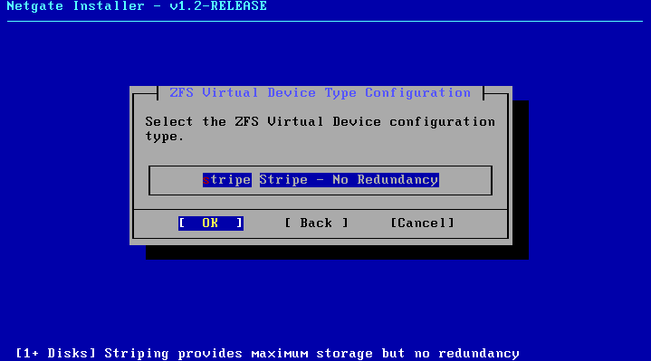

### Selezione fisica del disco rigido di destinazione

1. Arriviamo ora sulla schermata `Disk Selection` per confermare l'unità fisica su cui scaricare il sistema operativo.

2. Al centro della schermata troviamo il nostro disco virtuale rilevato come **`da0`** (da 20 GB, marchiato *VMware Virtual*).

3. Rimaniamo posizionati sul pulsante **[ Ok ]** in basso a sinistra e premiamo `Invio`.

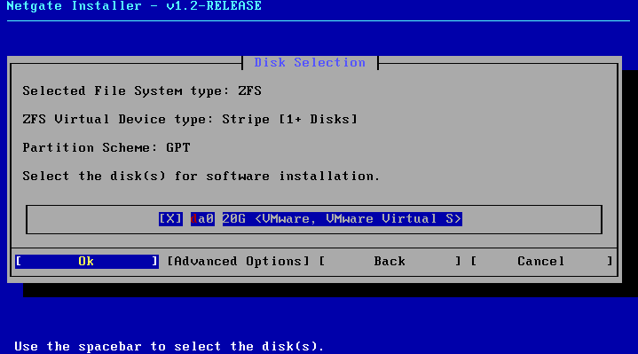

### Avviso finale e formattazione distruttiva del disco

1. L'installer ci lancia un ultimo pop-up di sicurezza (`Confirmation`). Il messaggio ci avverte senza mezzi termini: `Last Chance! Are you sure you want to destroy the current contents of the following disks: da0`.

2. Visto che il disco virtuale è nuovo di zecca e non rischiamo di sovrascrivere dati, spostiamo l'evidenziatore sul pulsante **[ Yes ]** sulla sinistra.

3. Premiamo `Invio` per autorizzare l'installer e creare le nuove tabelle delle partizioni.

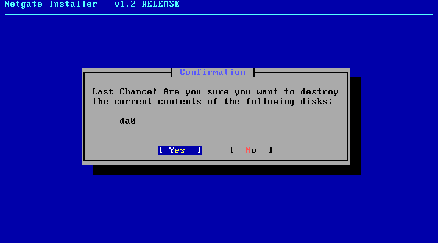

### Selezione della release software e avvio della copia dei file

1. La schermata `Software Version to Install` ci permette di fare un eventuale downgrade se avessimo bisogno di versioni legacy.

2. Rimaniamo saldi sull'opzione predefinita **`0000-2_8_1`**, che corrisponde alla `Current Stable Version (2.8.1)`.

3. Premiamo `Invio` sul pulsante **[ OK ]**. Da questo esatto momento il sistema inizierà a formattare l'unità in ZFS e a scompattare i file core di pfSense CE sul disco `da0`.

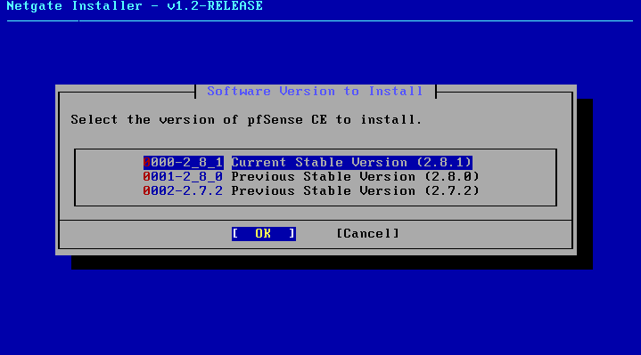

### Avanzamento della scrittura dei pacchetti di sistema

1. Una volta confermata la release, l'installer entra nella schermata `Installation Progress`.

2. Vediamo avanzare la barra di caricamento mentre il sistema esegue i vari passaggi.

3. Non dobbiamo fare nulla, solo attendere i secondi necessari al completamento dell'estrazione.

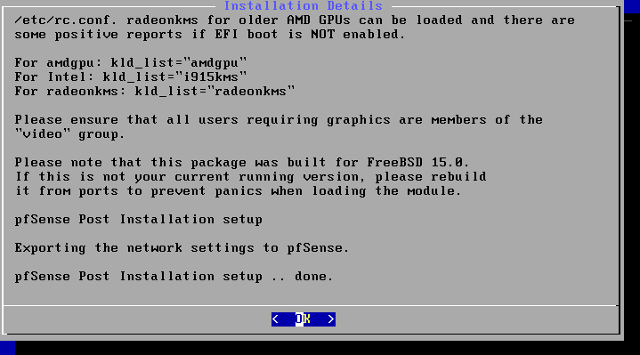

### Completamento dell'installazione e richiesta di Reboot

1. Il processo si conclude e l'interfaccia ci mostra la schermata finale `Installation Complete`.

2. Il messaggio ci conferma che l'installazione di *pfSense CE 2.8.1* è andata a buon fine.

3. L'evidenziatore è già posizionato: lasciamo il cursore su **[ Reboot ]** e premiamo `Invio`.

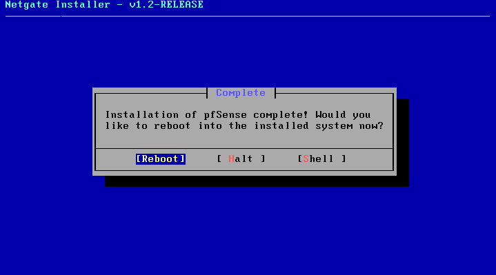

### Primo Boot del sistema e caricamento del Kernel

1. Al riavvio ci accoglie la tipica schermata testuale del bootloader di FreeBSD.

2. Il bootstrap si completa e veniamo accolti dalla console testuale principale di pfSense.

3. Il sistema mostra:
- **WAN** (`em0`) -> Ha preso un IP automatico in DHCP dall'hypervisor (es. `192.168.23.136/24`). Questa ci serve per internet.

- **LAN** (`em1`) -> Si è impostata sul default statico di fabbrica: **`192.168.1.1/24`**.
5. Come sappiamo, la sottorete `192.168.1.0/24` non c'entra nulla con il piano di indirizzamento del nostro laboratorio. Per agganciare il Domain Controller e il resto delle macchine, dobbiamo spostare il firewall su **`192.168.10.1`**. Digitiamo sulla tastiera il numero **`2`** (corrispondente all'opzione *Set interface(s) IP address*) e premiamo `Invio`.

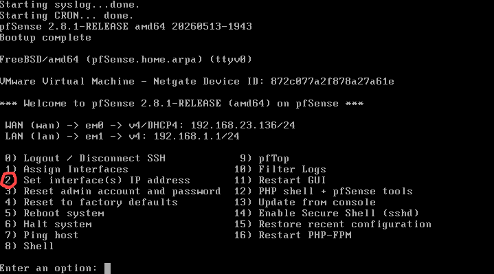

### Selezione dell'interfaccia LAN per la modifica

1. Entriamo nel sotto-menu di riconfigurazione degli IP. La console ci mostra l'elenco delle schede disponibili e ci chiede: `Enter the number of the interface you wish to configure:`.

2. Visto che la WAN va bene così com'è in DHCP, dobbiamo modificare la LAN. Digitiamo il numero **`2`** e premiamo `Invio`.

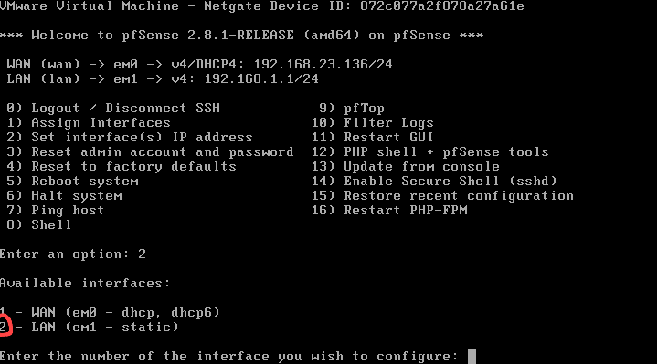

### Inserimento del nuovo indirizzo IP statico per la LAN

1. Il sistema ci chiede di inserire il nuovo indirizzo IPv4 per l'interfaccia selezionata (`Enter the new LAN IPv4 address. Press <ENTER> for none:`).

2. Digitiamo l'IP definitivo del nostro gateway di core: **`192.168.10.1`** e premiamo `Invio`.

### Definizione della Subnet Mask (Bitmask)

1. Subito dopo, la console ci chiede di specificare la maschera di sottorete usando la notazione CIDR (`Enter the new LAN IPv4 subnet bit count (1 to 31):`).

2. Visto che vogliamo una classica maschera classe C (`255.255.255.0`), digitiamo il valore **`24`** e premiamo `Invio`.

### Configurazione del Gateway (da saltare sulla LAN)

1. Il prompt successivo ci chiede se vogliamo associare un gateway a questa interfaccia (`For a WAN, enter the new LAN IPv4 upstream gateway address. For a LAN, press <ENTER> for none:`).

2. Essendo questa l'interfaccia LAN interna (ed essendo pfSense stesso il gateway della rete), non dobbiamo impostare alcun upstream gateway. Lasciamo il campo completamente vuoto e premiamo semplicemente **`Invio`**.

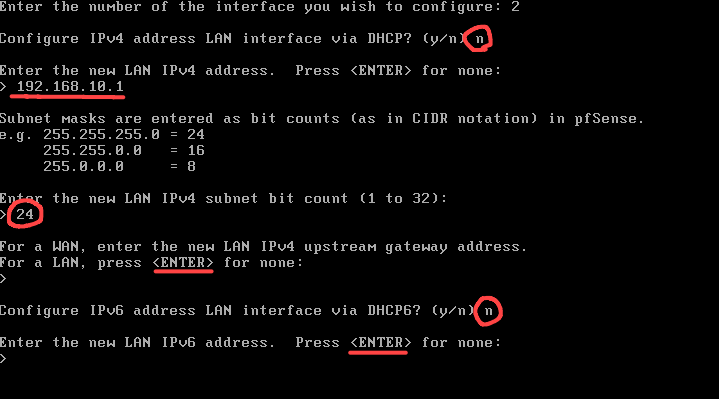

### Disattivazione del Server DHCP integrato di pfSense

1. Arriviamo a un passaggio cruciale. Il sistema ci chiede: `Do you want to enable the DHCP server on LAN? [y|n]`.

2. **Attenzione**: Nel nostro contesto, il ruolo di server DHCP deve essere gestito esclusivamente dal Domain Controller Windows (`DC01` su `192.168.10.100`) tuttavia, non l'abbiamo ancora neanche installato, avendo iniziato adesso il nostro lab, quindi per il momento scegliamo di abilitarlo su pfSense.

3. Digitiamo **`y`** (Sì) e premiamo `Invio`.

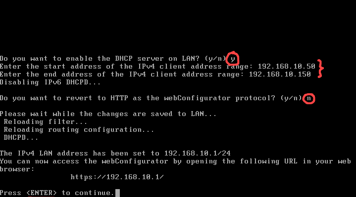

### Primo accesso alla WebGUI di pfSense

1. Apriamo il browser sulla nostra macchina di gestione (in questo caso Firefox su Lubuntu) e digitiamo l'indirizzo IP che abbiamo appena assegnato alla LAN: `https://192.168.10.1`.
   
   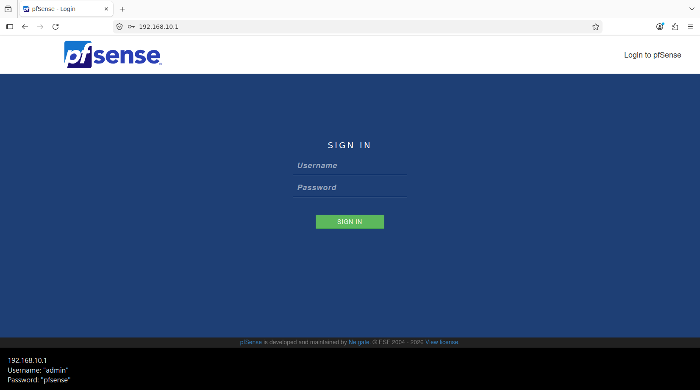

2. Ci accoglie la schermata di login blu di pfSense. In basso a sinistra, le credenziali di fabbrica sono:
   
   - **Username**: `admin`
   
   - **Password**: `pfsense`

3. Inseriamo i dati e clicchiamo su **SIGN IN**.

### Avvio della configurazione guidata (Setup Wizard)

1. Al primo accesso veniamo reindirizzati automaticamente al wizard di configurazione iniziale.

2. Un banner rosso in alto ci avverte subito che la password di default è insicura e va cambiata il prima possibile. Clicchiamo sul pulsante azzurro **Next** per iniziare la procedura guidata.

3. La schermata successiva ci informa sulla disponibilità del supporto globale Netgate 24/7. Trattandosi del nostro laboratorio didattico, andiamo dritti oltre cliccando nuovamente su **Next**.

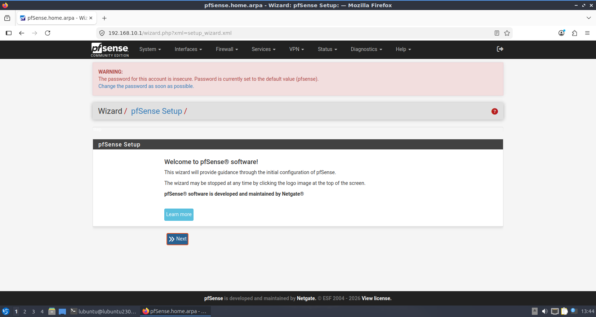

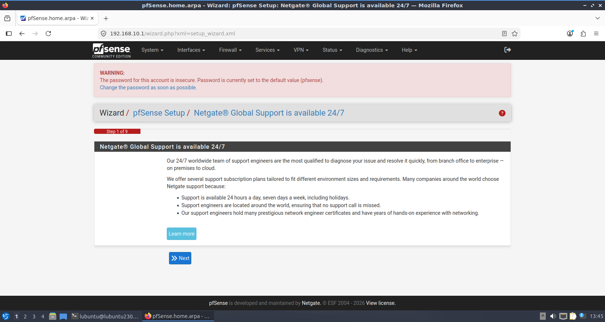

### Configurazione delle informazioni generali e dei DNS

1. Nella schermata *General Information*, definiamo l'identità del nostro firewall:
   
   - **Hostname**: Lasciamo `pfSense` (o scegliamo il nome host che preferiamo).
   
   - **Domain**: Lasciamo impostato `home.arpa`.

2. Scendendo ai campi successivi, andiamo a inserire manualmente i server DNS pubblici per consentire al firewall di risolvere i domini esterni prima che entri in gioco il nostro Domain Controller:
   
   - **Primary DNS Server**: `8.8.8.8` (Google)
   
   - **Secondary DNS Server**: `8.8.4.4` (Google)

3. Lasciamo la spunta su *Override DNS* (permettendo alla WAN di sovrascrivere i DNS se necessario dal DHCP dell'hypervisor) e clicchiamo su **Next**.

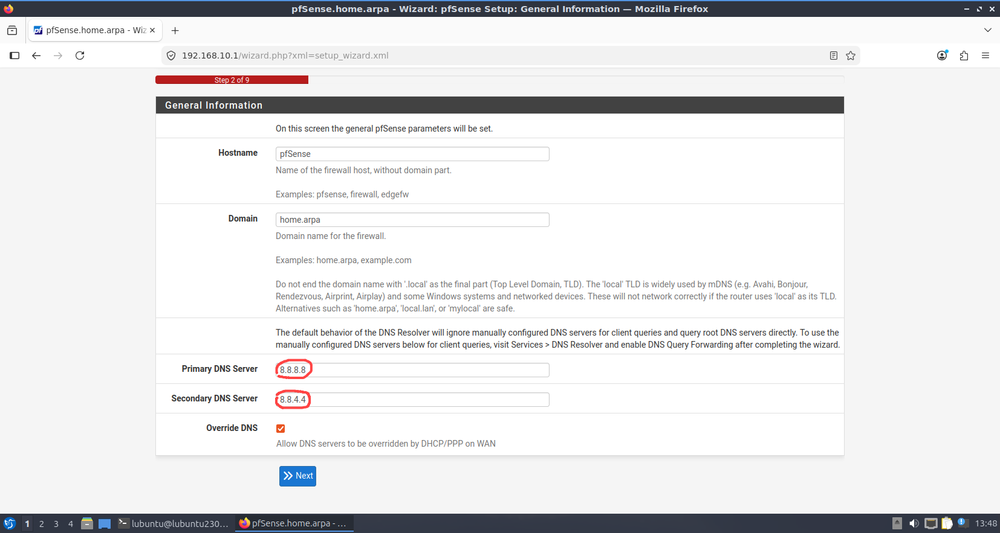

### Impostazione del fuso orario (Time Server Information)

1. Nella terza schermata del wizard, configuriamo i parametri di sincronizzazione dell'orario.

2. Lasciamo invariato il server NTP predefinito (`2.pfsense.pool.ntp.org`) e, nel menu a tendina **Timezone**, andiamo a selezionare **Europe/Rome** per allineare l'orario del firewall al nostro fuso locale. Clicchiamo su **Next**.

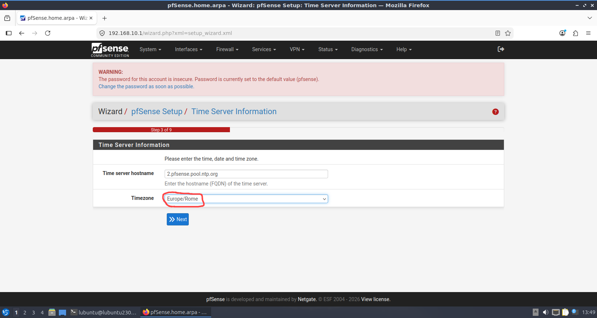

### Configurazione dell'interfaccia WAN (Wide Area Network)

1. La schermata *Configure WAN Interface* permette di definire come il firewall si interfaccia verso l'esterno. Nel menu *Configuration Type*, lasciamo selezionato **DHCP**.

2. Scorrendo la stessa pagina verso il basso, arriviamo alla sezione fondamentale **RFC1918 Networks** e **Block bogon networks**.

3. **Attenzione**: Qui troviamo due caselle selezionate di default (*Block private networks from entering via WAN* e *Block non-Internet routed networks...*). **Dobbiamo togliere la spunta da entrambe le caselle**.
   
   - *Perché lo facciamo?* Poiché la WAN del nostro pfSense si trova all'interno di una rete privata (la rete generata da VMware, es. `192.168.23.X` o simili) e non su un IP pubblico reale, se lasciassimo attivi questi blocchi il firewall scarterebbe tutto il traffico proveniente dall'esterno, impedendoci di navigare e di testare correttamente il laboratorio.

4. Una volta deselezionate le due opzioni, clicchiamo su **Next**.

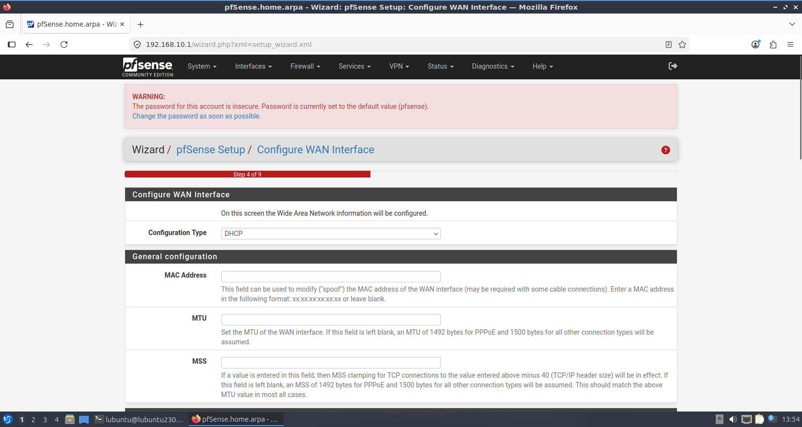

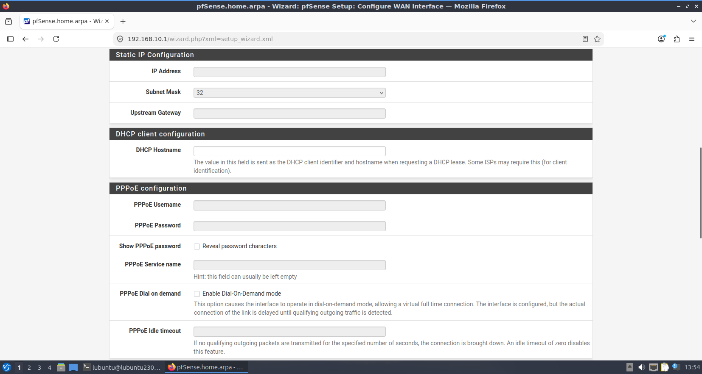

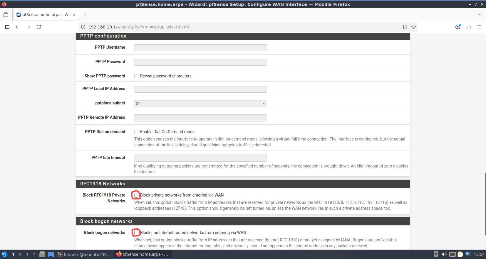

### Configurazione dell'interfaccia LAN e applicazione

1. Nella schermata successiva (*Configure LAN Interface*), il wizard ci mostra i parametri della rete interna. Troviamo già popolati i campi con l'IP **`192.168.10.1`** e la maschera **`24`** che avevamo impostato prima dalla console testuale. Lasciamo tutto così com'è e clicchiamo su **Next**.
   
   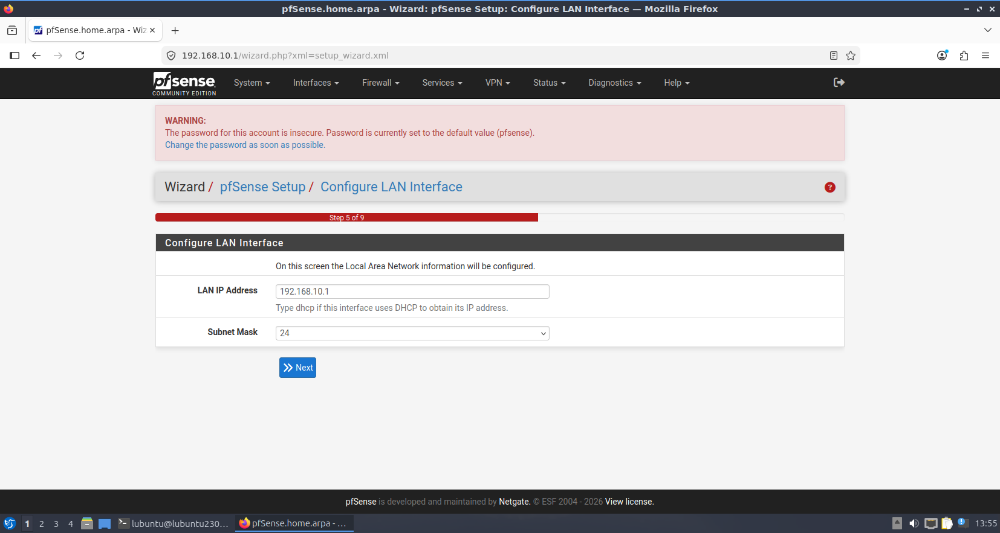

2. Alla schermata 6, ci viene detto di cambiare la password, salviamo le credenziali.

3. Arriviamo infine alla schermata di ricaricamento della configurazione. Il sistema ci avvisa che è pronto ad applicare le modifiche. Clicchiamo sul pulsante azzurro **Reload** per rendere definitivi tutti i cambiamenti e riavviare i servizi di rete con le nuove impostazioni.
   
   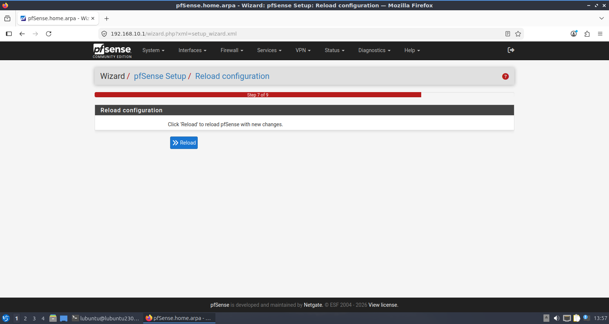

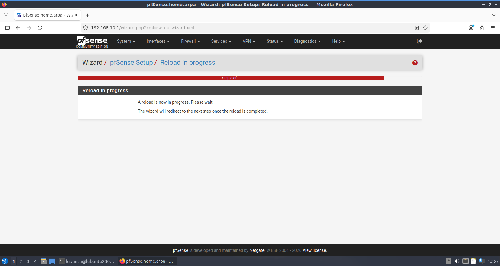

### Finalizzazione del Wizard e ricaricamento dei servizi

1. Ci troviamo davanti alla schermata conclusiva del setup: *Wizard Completed*.

2. Il sistema ci informa che tutte le modifiche di rete, i parametri DNS, il fuso orario e le credenziali di sicurezza sono state salvate correttamente in memoria.

3. Clicchiamo sul pulsante azzurro **Finish** .

4. E' attiva a tutti gli effetti la nuova interfaccia logica del nostro gateway.

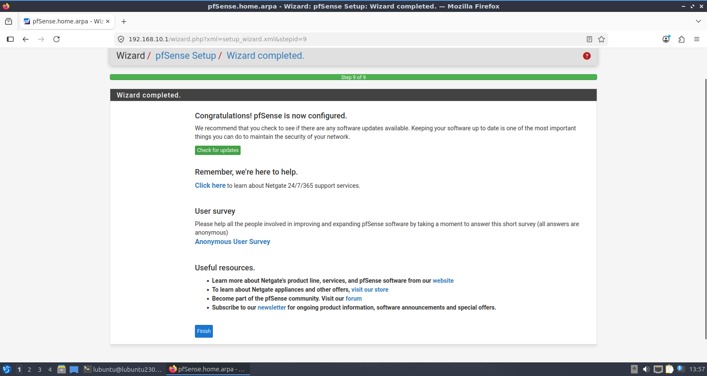
