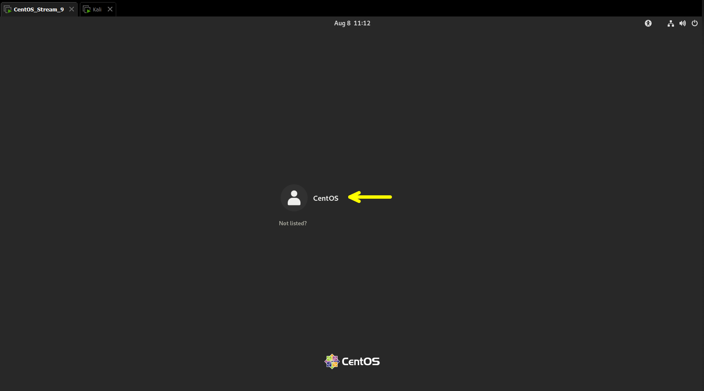
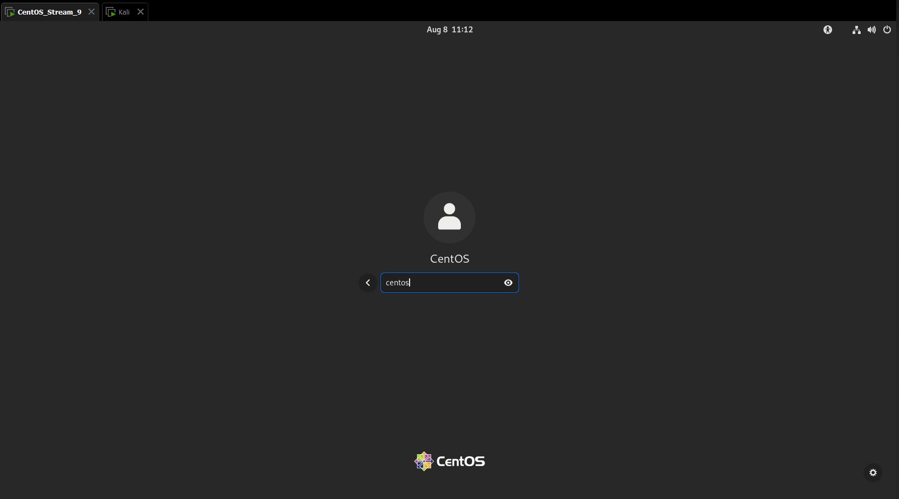
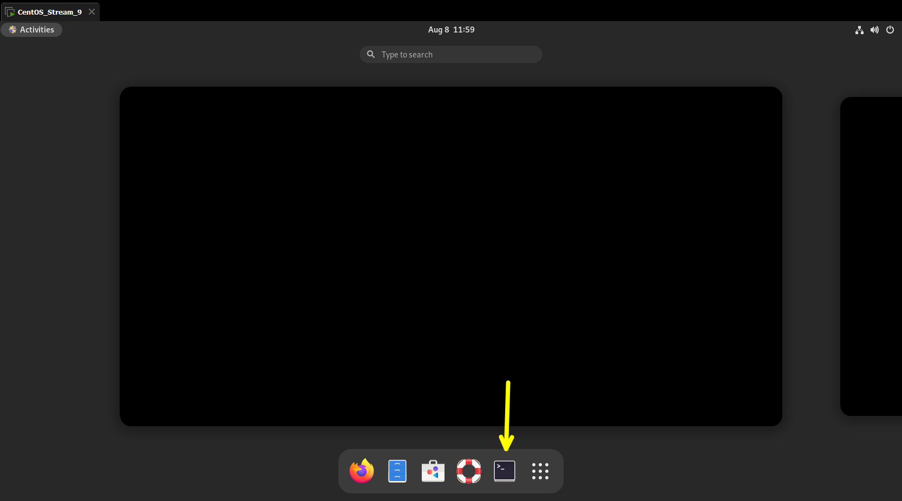
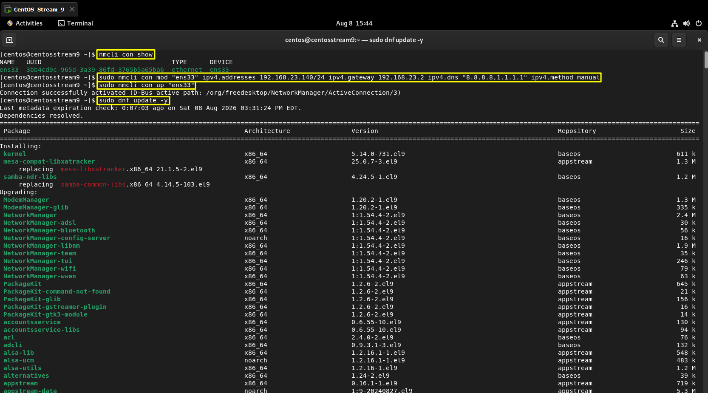
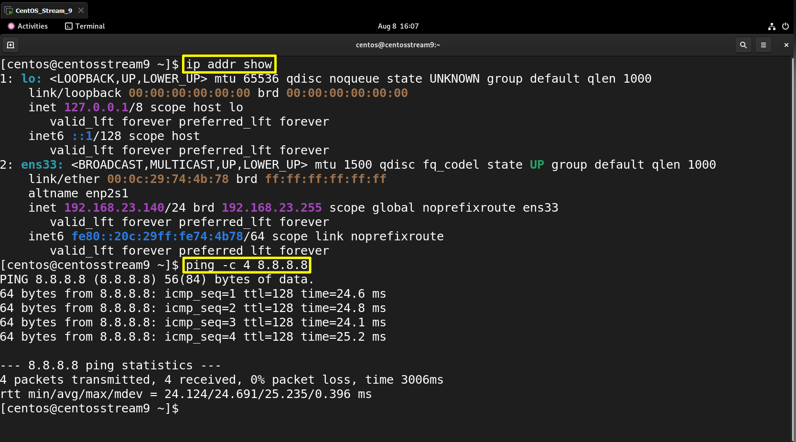

# Setup CentOS Stream 9 su VMware

Guida rapida per l'importazione e la configurazione iniziale di CentOS Stream 9 scaricato da linuxvmimages.com.

## 1. Estrazione e Importazione

1. Estrai il file `CentOS_Stream_9_VMG.7z` utilizzando 7-Zip.
2. Apri VMware, clicca su **File > Open** e seleziona il file `.vmx` estratto.
3. Avvia la macchina virtuale. Quando VMware chiede se hai spostato o copiato la VM, seleziona **"I Copied It"**.



4. Esegui l'accesso. La password di default è `centos`.



## 2. Configurazione Rete Statica (NAT)

Impostazione dell'IP statico `192.168.23.140`.

### 2.1 Verifica il nome dell'interfaccia di rete (di solito `ens33`)



```
nmcli con show
```

### 2.2 Configura IP, Gateway e DNS

```
sudo nmcli con mod "ens33" ipv4.addresses 192.168.23.140/24 ipv4.gateway 192.168.23.2 ipv4.dns "8.8.8.8,1.1.1.1" ipv4.method manual
```

### 2.3 Applica e attiva la connessione

```
sudo nmcli con up "ens33"
```

## 3. Aggiornamento del Sistema

Assicurati che i repository e i pacchetti siano aggiornati:

```
sudo dnf update -y
```



### 3.1 Riavvia il sistema per applicare gli aggiornamenti

```
sudo reboot
```

> **Nota:** Dopo il riavvio, esegui nuovamente l'accesso con le credenziali 'centos'/'centos'.

## 4. Installazione VMware Tools

Per abilitare la comunicazione con l'host (copia-incolla):

### 4.1 Installa i pacchetti (potrebbero essere già presenti nell`immagine)

```
sudo dnf install open-vm-tools open-vm-tools-desktop -y
```

### 4.2 Abilita e avvia il servizio

```
sudo systemctl enable --now vmtoolsd
```

## Verifica Finale

Per verificare che la configurazione di rete sia corretta:

```
ip addr show
ping -c 4 8.8.8.8
```

