## Configurazione guidata via Web GUI

Prendiamo un client qualsiasi all'interno del nostro laboratorio, apriamo il browser e andiamo dritti all'indirizzo ip del server: `http://192.168.10.50/zabbix` per dare il via all'inizializzazione del frontend.

### Schermata di Benvenuto (Welcome)

Il portale si apre sulla pagina di benvenuto di **Zabbix 7.0 LTS**. Nel menu a tendina **Language**, lasciamo selezionato rigorosamente **English (en_US)**. Questa è una scelta consigliata in produzione per un motivo molto semplice: evita di farci impazzire quando dovremo cercare la corrispondenza di log ed errori sulla documentazione ufficiale o sui forum globali. Clicchiamo sul pulsante azzurro **Next step**.

### Verifica dei Prerequisiti PHP (Check of pre-requisites)

Il wizard esegue un controllo automatico di conformità su tutti i moduli e i parametri del motore PHP installato sulla nostra macchina CentOS. Scorriamo la lista e verifichiamo con piacere che tutte le voci (dalle estensioni necessarie ai limiti di memoria come il `memory_limit`, fino al fuso orario) siano marcate con il rassicurante flag verde **OK**. Clicchiamo su **Next step**.

### Connessione al Database MariaDB (Configure DB connection)

In questa schermata dobbiamo inserire le credenziali per permettere al frontend web di dialogare direttamente con il DBMS locale. Compiliamo i campi in questo modo:

- **Database type:** MySQL

- **Database host:** localhost

- **Database port:** 0 (lasciamo zero per fare in modo che il sistema utilizzi automaticamente la porta standard 3306)

- **Database name:** zabbix

- **User:** zabbix

- **Password:** Inseriamo la password segreta che abbiamo generato precedentemente nella shell MySQL, ovvero **ZabbixPassword2026!**

Clicchiamo su **Next step** e avanziamo fino alla fine del wizard.

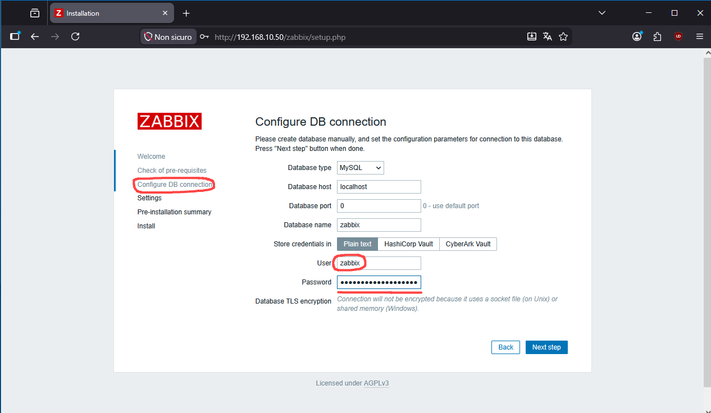

## Primo Accesso e Messa in Sicurezza

### Schermata di Login di Zabbix

Una volta completata la configurazione del database, veniamo reindirizzati alla pagina di autenticazione ufficiale del portale. Inseriamo le credenziali amministrative di fabbrica fornite di default da Zabbix:

- **Username:** Admin *(Attenzione: la "A" deve essere rigorosamente maiuscola, altrimenti il sistema rifiuterà l'accesso)*

- **Password:** zabbix

Clicchiamo sul pulsante **Sign in**.

### Dashboard Principale

Subito dopo il login si spalanca davanti a noi la dashboard predefinita di Zabbix 7.0 LTS. Buttiamo subito l'occhio sul widget **System information**: notiamo che il parametro **Zabbix server is running** mostra un bellissimo flag verde su **Yes**. Il cuore del nostro monitoraggio è attivo e funzionante.

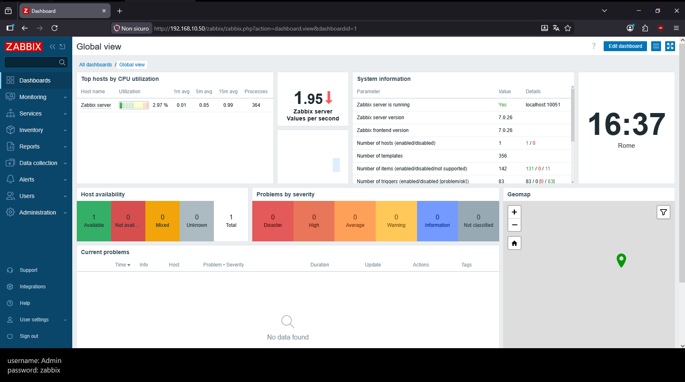

### ## Download di Zabbix Agent per Windows

Per iniziare a monitorare i sistemi operativi Microsoft Windows presenti nel nostro laboratorio, dobbiamo andare a recuperare i binari precompilati dell'agente software direttamente dalla casa madre.

Apriamo il browser e colleghiamoci all'URL: [www.zabbix.com/download_agents](https://www.google.com/search?q=http://www.zabbix.com/download_agents) profilando la ricerca per la versione 7.0+ LTS. Nel modulo di download, impostiamo i parametri con precisione:

- **OS Distribution:** Windows

- **OS Version:** 11, 10 (che va benissimo anche per le versioni Server indicate nella matrice di compatibilità)

- **Hardware:** amd64 (l'architettura classica a 64-bit)

- **Zabbix Version:** 7.0 LTS

- **Encryption:** OpenSSL (per avere il supporto alla cifratura nativa tramite TLS)

- **Packaging:** MSI (scegliamo l'installer Windows nativo, decisamente più agile per l'automazione e il deployment facilitato)

Il menu a tendina in basso ci mostra la release puntuale della pipeline corrente, nello specifico la **7.0.26**. Facciamo click sul link di download generato per scaricare il pacchetto `.msi` sul nostro client locale.

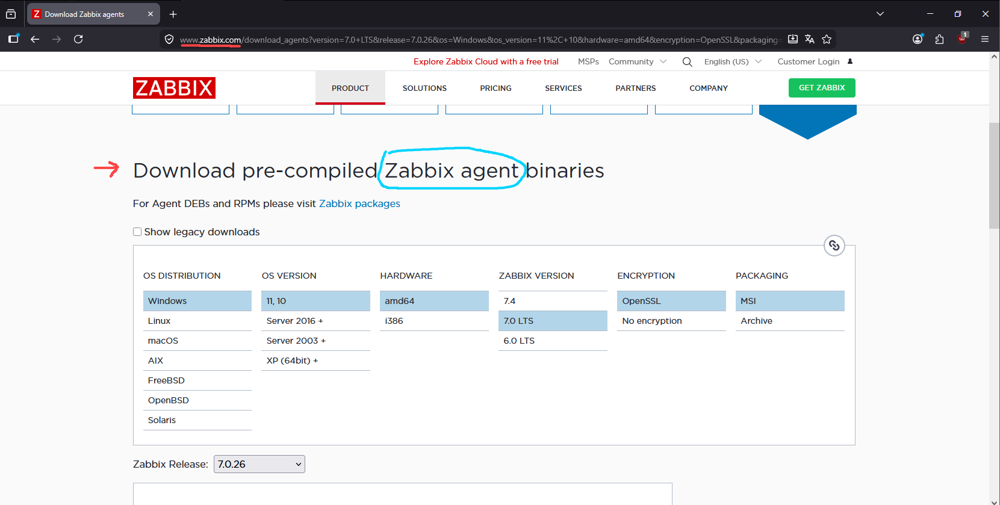

### Inizializzazione dell'Installazione di Zabbix Agent su Windows

Prendiamo il pacchetto MSI appena scaricato, trasferiamolo sul server o sul client Windows target che vogliamo monitorare ed eseguiamo il file per lanciare la procedura guidata.

Si apre il tool **Zabbix Agent (64-bit) Setup Wizard**. La schermata iniziale ci conferma che stiamo installando l'agente a 64-bit per la release aziendale che abbiamo scelto. Trattandosi della schermata di benvenuto standard senza parametri editabili, andiamo dritti al punto cliccando sul pulsante **Next**.

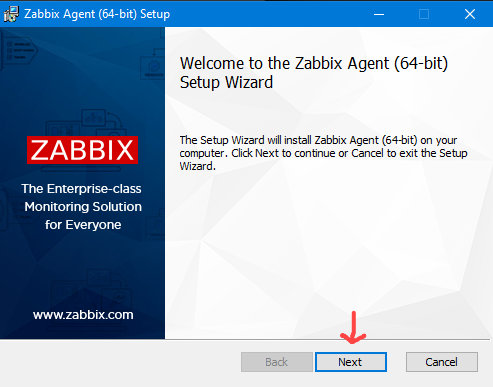

### Selezione dei Componenti e Target Directory (Custom Setup)

In questa schermata andiamo a definire la struttura dei moduli software da piazzare sul file system e la cartella di destinazione.

All'interno dell'albero delle funzionalità (**Features Tree**), lasciamo attive tutte e tre le feature incluse nel pacchetto per non farci mancare nulla:

- **Agent daemon:** Il servizio di core che raccoglie effettivamente le metriche.

- **Zabbix sender:** L'utility a riga di comando comodissima per inviare dati asincroni al server.

- **Zabbix get:** Altra utility a riga di comando fondamentale per fare troubleshooting e interrogare l'agente da remoto.

Nel campo **Location**, il percorso predefinito è impostato su `C:\Program Files\Zabbix Agent\`. Il wizard ci segnala un footprint minimo sul disco: appena 1 KB per la feature principale e circa 16 MB complessivi per le subfeatures. Clicchiamo su **Next** per passare alla parte calda della configurazione di rete.

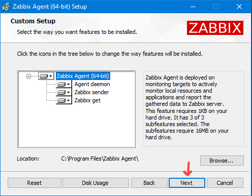

### Configurazione dei Parametri di Rete del Servizio Zabbix Agent

Questa è la schermata fondamentale per fare in modo che i flussi di monitoraggio tra l'agente locale e il server Zabbix centrale si incastrino alla perfezione. Compiliamo i campi con attenzione:

- **Host name:** Inseriamo la stringa esatta **Windows10-Lab**.

> **Nota Bene:** Questo valore dovrà coincidere al millimetro (è case-sensitive!) con il nome host che andremo a registrare sul frontend web di Zabbix più tardi.

- **Zabbix server IP/DNS:** Impostiamo l'indirizzo IP del nostro server Zabbix centrale, ovvero **192.168.10.50** (questo parametro serve per gestire il monitoraggio in modalità Passiva).

- **Agent listen port:** Lasciamo la porta di default **10050**, sulla quale il demone rimarrà in ascolto per rispondere alle interrogazioni del server.

- **Server or Proxy for active checks:** Inseriamo di nuovo l'IP del server **192.168.10.50** (necessario se vogliamo sfruttare l'invio proattivo delle metriche in modalità Attiva).

- **Cifratura (PSK):** Per il momento, lasciamo la casella di controllo *Enable PSK* disattivata.

- **Variabili d'Ambiente:** Spuntiamo la casella **Add agent location to the PATH**. Questa opzione aggiunge il percorso dell'agente alle variabili d'ambiente di Windows, permettendoci di lanciare i binari `zabbix_get` e `zabbix_sender` da qualsiasi prompt dei comandi senza dover digitare ogni volta tutto il path.

Clicchiamo su **Next** per confermare e poi su **Install** per avviare la scrittura fisica dei file e l'attivazione del servizio Windows.

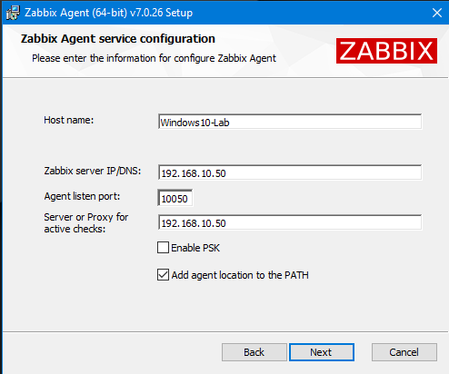

### Navigazione Web GUI per la Registrazione di un Nuovo Host

Una volta completata l'installazione sul client Windows, dobbiamo spostarci sul frontend web del server Zabbix per censire la macchina all'interno del motore di core.

1. Dal menu di navigazione laterale sinistro, facciamo click sulla voce principale **Data collection**.

2. Subito sotto, selezioniamo la sotto-sezione **Hosts** per aprire l'inventario delle macchine monitorate. Al momento la tabella è deserta: mostra un solo host attivo (lo *Zabbix server* stesso in modalità loopback su 127.0.0.1:10050).

3. Clicchiamo sul pulsante azzurro **Create host** posizionato in alto a destra per aprire la scheda del nuovo record.

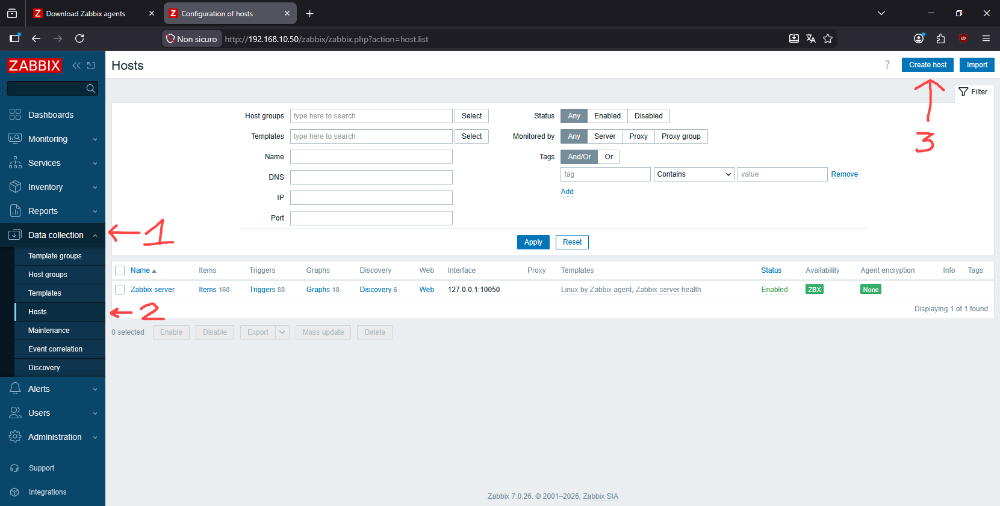

### Configurazione Logica del Host Windows sul Server Zabbix

Andiamo a compilare i metadati e le interfacce di rete necessarie a Zabbix per interrogare l'agente Windows:

- **Host name:** Digitiamo la stringa esatta **Windows10-Lab** (mi raccomando, identica a quella inserita durante il setup dell'MSI).

- **Templates:** Usiamo il menu di ricerca per selezionare il modello ufficiale **Windows by Zabbix agent**. Questo template assocerà automaticamente alla macchina tutti gli item, i trigger e i grafici standard per i sistemi operativi Microsoft.

- **Host groups:** Inseriamo l'host all'interno del gruppo logico **Virtual machines**.

- **Interfaces:** Clicchiamo sul link *Add* e selezioniamo la voce *Agent*. Qui andiamo a mappare il canale di comunicazione:
  
  - **IP address:** Inseriamo l'indirizzo di rete del client Windows, ovvero **192.168.10.51**.
  
  - **Connect to:** Lasciamo il flag radio impostato su **IP**.
  
  - **Port:** Confermiamo la porta standard dell'agente **10050**.

Controlliamo che in basso il parametro *Monitored by* sia impostato su **Server** e che la casella di controllo *Enabled* sia selezionata. Clicchiamo sul pulsante azzurro **Add** in basso a sinistra per inserire l'host nel database e dare il via al monitoraggio.

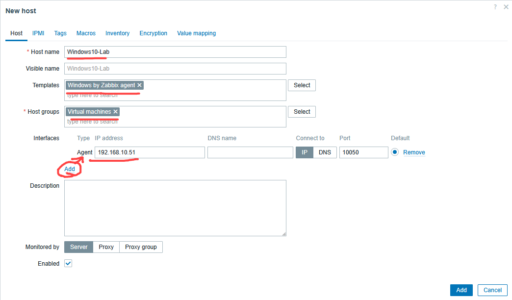

### Verifica del Flusso Dati (Latest Data) per l'Host Windows

Facciamo una controverifica operativa per essere sicuri che lo scambio di pacchetti sia attivo e che il server stia digerendo le metriche di performance della macchina Windows.

Spostiamoci sul menu laterale sinistro, espandiamo la voce **Monitoring** e selezioniamo la sotto-sezione **Latest data**. Nel campo di ricerca dedicato agli **Hosts**, selezioniamo l'entità logica **Windows10-Lab** appena creata e clicchiamo sul pulsante azzurro **Apply**.

La pagina si popola all'istante con la lista dei componenti monitorati e i relativi tag interni estratti dal sistema (CPU, Memory, Network, Filesystem, Services). Scorrendo in basso, possiamo validare la telemetria vedendo addirittura la mappatura dei servizi Windows localizzati in lingua italiana (come *Alimentazione*, *Audio di Windows*, *Client DHCP*, ecc.). L'agente risponde perfettamente.

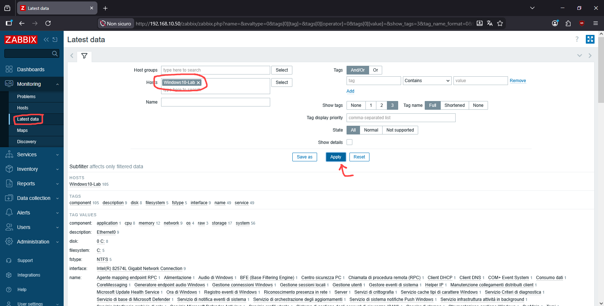

## Abilitazione del Servizio SNMP su pfSense Firewall

Visto che ci siamo, andiamo a configurare l'infrastruttura di rete per abilitare il monitoraggio *agentless* (senza agente) sul nostro firewall perimetrale pfSense, sfruttando il protocollo standard SNMP.

Apriamo una nuova scheda del browser e colleghiamoci al pannello di amministrazione dell'appliance di pfSense all'indirizzo **192.168.10.1**. Nel menu superiore, navighiamo su **Services** -> **SNMP**.
In cima alla pagina, spuntiamo la casella di controllo **Enable** (*Enable the SNMP Daemon and its controls*) per svegliare il demone.

Scorriamo la pagina verso il basso per sistemare i parametri di binding delle interfacce, fondamentale per la sicurezza. All'interno del box di multiselezione, evidenziamo e selezioniamo **esclusivamente l'interfaccia interna LAN**. Evitiamo accuratamente di selezionare WAN, All o Localhost per impedire che il servizio SNMP rimanga esposto verso l'esterno o su interfacce non necessarie. Scendiamo fino in fondo e clicchiamo sul pulsante azzurro **Save** per applicare le modifiche e riavviare il servizio.

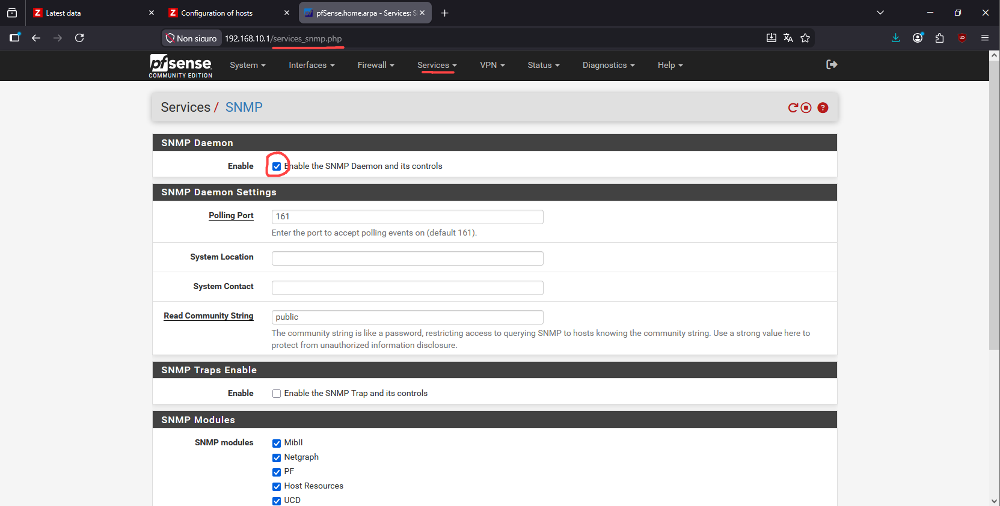

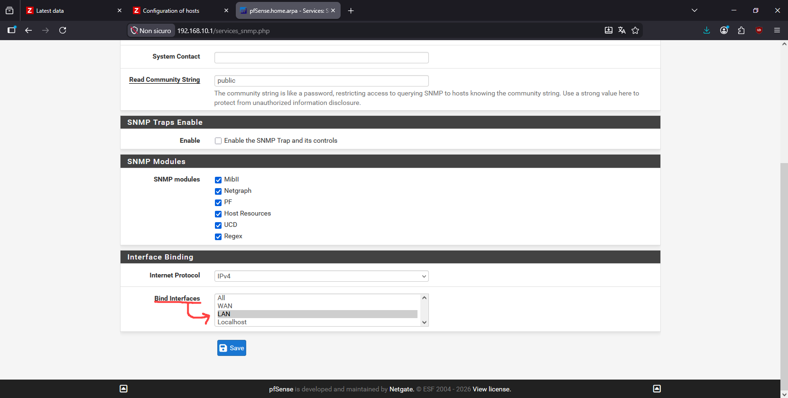

### Creazione e Configurazione dell'Host pfSense in Zabbix tramite SNMP

Torniamo sulla nostra console di Zabbix nella sezione **Data collection** -> **Hosts** e clicchiamo nuovamente su **Create host** per configurare l'appliance tramite SNMPv2.

Nella maschera **New host**, compiliamo i parametri anagrafici:

- **Host name:** Diamo alla macchina un nome identificativo pulito: **pfSense-Core**.

- **Templates:** Associano il modello ufficiale di monitoraggio **pfSense by SNMP**.

- **Host groups:** Inseriamo l'apparato nel gruppo di competenza dedicato **Networking (new)**.

- **Interfaces (SNMP Configuration):** Facciamo click sul pulsante *Add* e selezioniamo la voce *SNMP*. Configuriamo la sezione d'interfaccia in questo modo:
  
  - **IP address:** Inseriamo l'IP della LAN del firewall, ossia **192.168.10.1**.
  
  - **Port:** Impostiamo la porta UDP di ascolto standard del target, la **161**.
  
  - **SNMP version:** Selezioniamo dal menu a tendina **SNMPv2**.
  
  - **SNMP community:** Inseriamo la macro globale di contesto **{$SNMP_COMMUNITY}** (ci pensa Zabbix a risolverla internamente con la stringa di default *public* configurata sul firewall).

Lasciamo il parametro *Max repetition count* al valore di default **10** e assicuriamoci che la casella **Use combined requests** sia selezionata, opzione utilissima per ottimizzare i pacchetti di richiesta GetBulk ed alleggerire il traffico. Clicchiamo su **Add**.

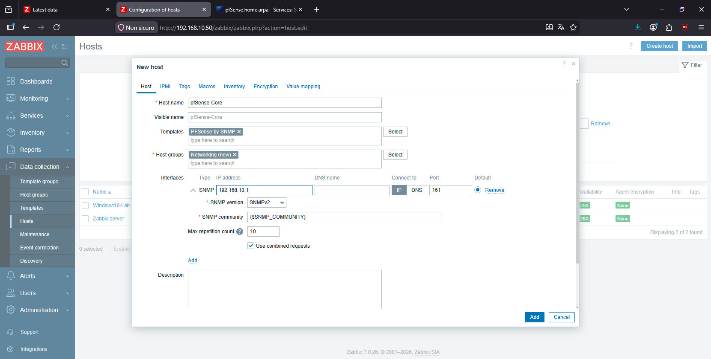

### Installazione del Pacchetto Zabbix Agent su Linux

Passiamo ora al monitoraggio della macchina Linux del nostro laboratorio, installando l'agente software tramite il gestore dei pacchetti nativo della distribuzione.

Apriamo il terminale (shell bash) sulla nostra macchina con l'utente `lubuntu@lubuntu2304`. Lanciamo il comando di installazione standard:

```bash
sudo apt install zabbix-agent -y
```

Il gestore dei pacchetti APT analizza l'albero delle dipendenze e identifica i componenti necessari: i pacchetti da installare sono `libmodbus5` e `zabbix-agent`. Il sistema avvia il download dei binari dai repository [old-releases.ubuntu.com/ubuntu](https://www.google.com/search?q=https://old-releases.ubuntu.com/ubuntu) per architettura amd64 (le versioni specifiche sono la 3.1.6-2.1 per la libreria e la 1:6.0.13+dfsg-1 per l'agente).

Al termine della scrittura, l'installer crea automaticamente il file di configurazione predefinito nel percorso `/etc/zabbix/zabbix_agentd.conf` e genera il symlink di systemd per l'avvio automatico del demone in background (`/lib/systemd/system/zabbix-agent.service`). Il processo si chiude restituendoci il controllo della shell (`lubuntu@lubuntu2304:~$`), segno che l'operazione è andata a buon fine.

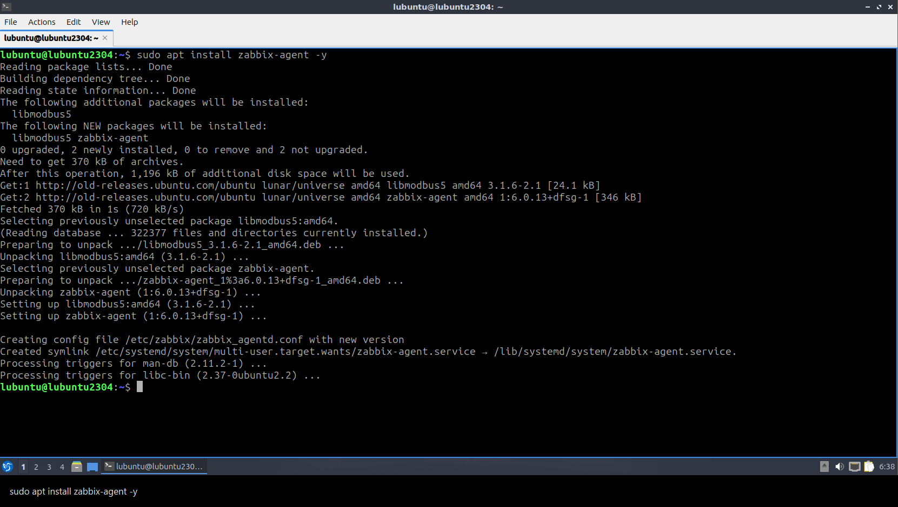

### Registrazione dell'Host Linux sulla Web GUI di Zabbix

Ritorniamo sul frontend web di Zabbix per completare il censimento logico del nodo Linux e dare il via alla raccolta delle metriche.

Apriamo la maschera **New host** e nella scheda **Host** inseriamo i seguenti valori:

- **Host name:** Inseriamo il valore testuale esatto **Lubuntu-Lab** (il campo *Visible name* si valorizzerà da solo di conseguenza).

- **Templates:** Selezioniamo il modello ufficiale **Linux by Zabbix agent**.

- **Host groups:** Associamo la macchina al gruppo logico **Virtual machines**.

- **Interfaces:** Configuriamo il canale di comunicazione cliccando su *Add* -> *Agent*:
  
  - **IP address:** Inseriamo l'indirizzo IP statico assegnato alla macchina Linux: **192.168.10.52**.
  
  - **Connect to:** Lasciamo la spunta su **IP**.
  
  - **Port:** Impostiamo la porta di ascolto standard dell'agente **10050**.

Verifichiamo che il campo *Monitored by* sia su **Server** e che la casella *Enabled* sia attiva. Clicchiamo sul pulsante azzurro **Add** in basso a sinistra per inserire l'host nel database di monitoraggio.

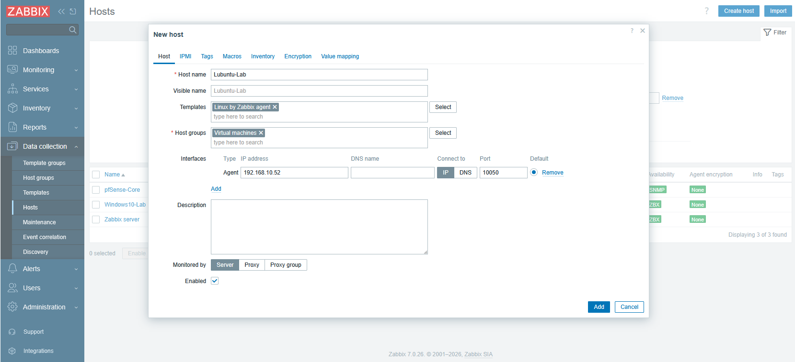

---

### Rilevamento Anomalie CPU e Troubleshooting su Linux

Nemmeno il tempo di aggiungere l'host **Lubuntu-Lab** sulla piattaforma che Zabbix lancia subito un trigger di avviso a schermo: viene rilevata una saturazione critica delle risorse di calcolo dell'host.

Ci colleghiamo al server Linux tramite terminale per un'analisi preliminare e notiamo subito che la causa dell'elevato carico globale della CPU è legata all'esecuzione di una suite pesante di container applicativi (nello specifico, l'ambiente di sicurezza VECTR con tutti i suoi moduli di supporto come database e proxy).

### Analisi dei Container Docker e Arresto della Stack VECTR

Per abbattere il carico della CPU rilevato da Zabbix e ridare stabilità al nostro host di laboratorio, dobbiamo ispezionare l'engine Docker e spegnere in modo controllato i container attivi.

Eseguiamo il comando per listare le istanze attive in memoria:

```bash
sudo docker ps
```

La shell ci mostra il parco container associato al namespace `sandbox1-vectr`:

- `sandbox1-vectr-caddy_gateway-1` (Immagine: caddy:2.6.2-alpine)

- `sandbox1-vectr-webui-1` (Immagine: securityriskadvisors/vectr_webui:9.5.2)

- `sandbox1-vectr-tomcat-1` (Immagine: securityriskadvisors/vectr_tomcat:9.5.2)

- `sandbox1-vectr-postgres-1` (Immagine: postgres:14.2-alpine)

- `sandbox1-vectr-rta-redis-1` (Immagine: redis:6.2-alpine)

Identifichiamo subito il colpevole principale: il container legato a **Tomcat** che ospita un processo Java completamente bloccato in loop. Lanciamo un comando mirato per abbatterlo:

```bash
sudo docker stop sandbox1-vectr-tomcat-1
```

L'output della shell ci restituisce l'eco del nome del container, confermando l'avvenuto spegnimento. Per ripulire completamente la memoria volatile e permettere un futuro riavvio pulito dell'ambiente, lanciamo il comando sequenziale per spegnere tutti i restanti moduli della stack:

```bash
sudo docker stop sandbox1-vectr-caddy_gateway-1 sandbox1-vectr-webui-1 sandbox1-vectr-postgres-1 sandbox1-vectr-rta-redis-1
```

Il terminale conferma lo stop corretto di tutti i componenti. Le risorse della CPU dell'host vengono finalmente liberate, riportando le performance del sistema in uno stato nominale ideale.

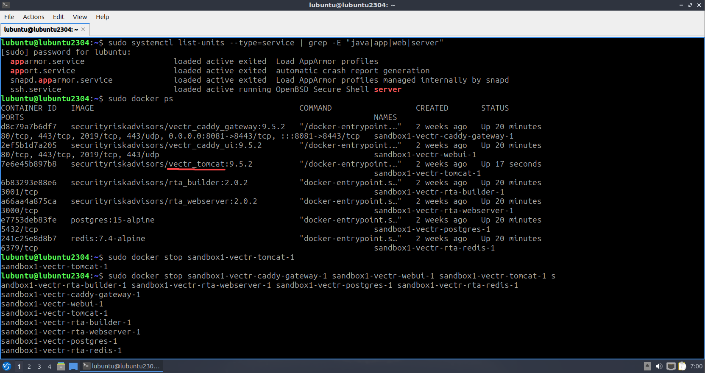

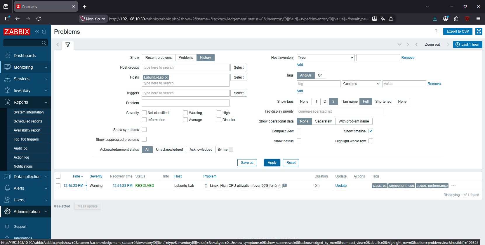

---

### Arresto di un Servizio di Sistema su Windows per Test di Trigger

Adesso che l'infrastruttura è monitorata, facciamo un piccolo test di laboratorio per testare la reattività dei trigger nativi del template Windows, simulando un disservizio software reale sul client Windows 10.

Spostiamoci sulla macchina Windows 10 e apriamo la console di gestione **Servizi** (computer locale). Scorriamo la lista fino a individuare un servizio di sistema standard: lo **Spooler di stampa** (Nome interno: `Spooler`).
Notiamo che lo stato corrente è *In esecuzione* e il tipo di avvio è impostato su *Automatico*. Sfruttiamo il pannello di controllo laterale sinistro e clicchiamo sul comando **Arresta il servizio**, forzando così lo spegnimento dello spooler per simulare un crash improvviso o un arresto non autorizzato.

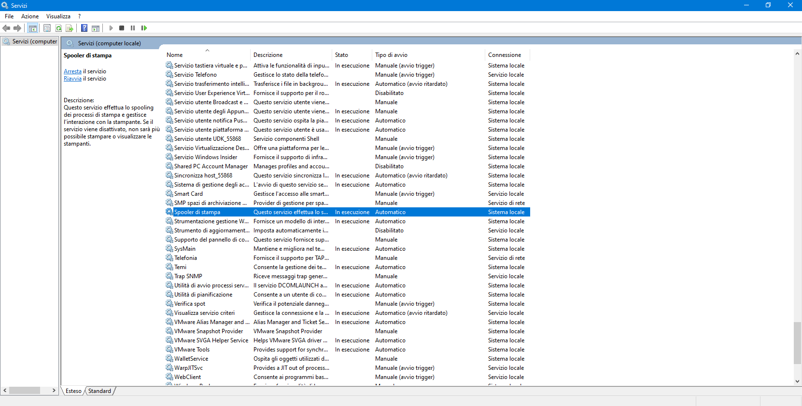

### Rilevamento del Disservizio sulla Dashboard di Zabbix

Torniamo sul frontend web di Zabbix per verificare se il motore di monitoraggio intercetta l'anomalia appena creata.

Diamo un'occhiata al widget **Current Problems** della dashboard: notiamo che alle ore **01:14:04 PM** compare un record fresco di stampa associato all'host **Windows10-Lab**. L'allarme è classificato con una severità di tipo **Average** (contrassegnato dal colore arancione) e mostra la stringa sintattica chiara:

`Windows: "Spooler" (Spooler di stampa) is not running (startup type automatic)`

Il pannello *Problems by severity* riflette istantaneamente l'evento mostrando il contatore incrementato a "1" sotto la colonna *Average*, mentre il resto dell'infrastruttura non segnala altre criticità.

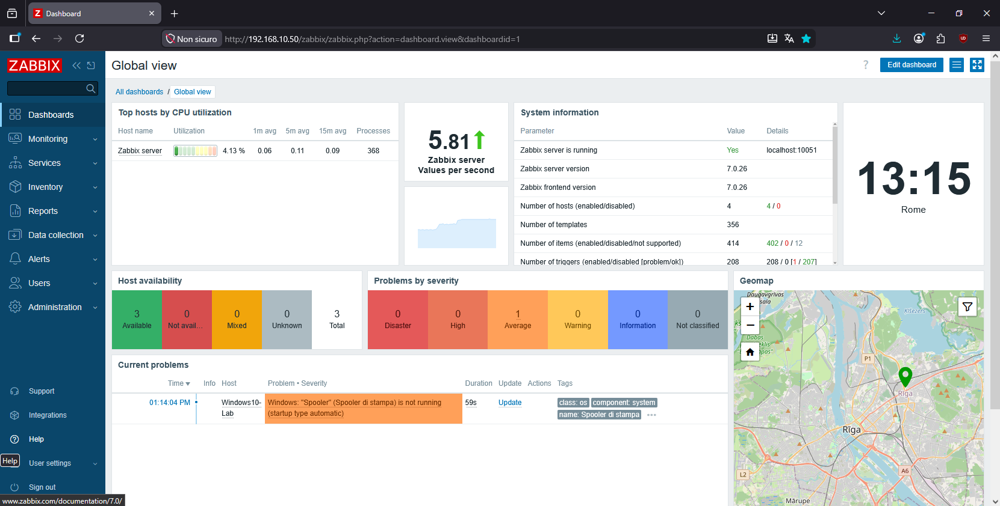

### Risoluzione dell'Allarme dello Spooler di Stampa

Dopo aver verificato il funzionamento del trigger, torniamo sulla macchina Windows e riavviamo manualmente lo Spooler di stampa (oppure attendiamo l'azione di ripristino automatico del servizio) per documentare il rientro dell'allarme.

Navighiamo nella schermata **Monitoring** -> **Problems** di Zabbix: applicando il filtro temporale, possiamo analizzare l'evoluzione storica dell'allarme dello Spooler. L'evento registrato alle ore 01:14:04 PM mostra adesso lo stato **RESOLVED** colorato in verde a partire dalle ore **01:15:04 PM**. L'anomalia ha avuto una persistenza complessiva di appena **1m** prima che l'agente Zabbix comunicasse al server centrale il ripristino del processo sul target, liberando la coda degli allarmi attivi. Poco più in basso nella stessa tabella, vediamo archiviato anche lo storico dell'allarme CPU di Lubuntu-Lab rientrato in precedenza.

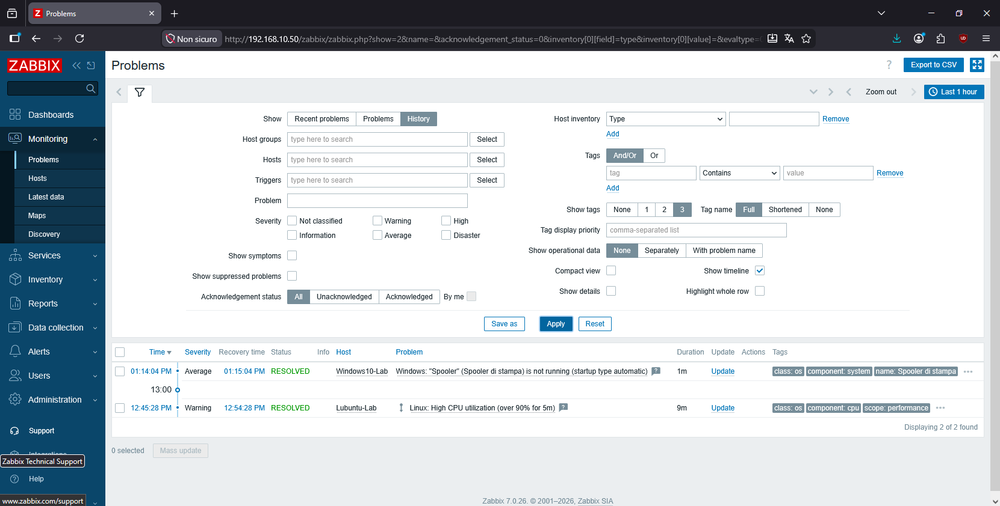

### Disattivazione del Servizio Zabbix Agent su Windows

Alziamo il tiro del nostro collaudo ed eseguiamo un test di raggiungibilità intero a livello di rete e backend, interrompendo deliberatamente il funzionamento dell'agente di monitoraggio stesso sulla macchina Windows 10.

Torniamo all'interno della console dei servizi di sistema di Windows e scorriamo l'elenco fino in fondo fino a trovare la riga **Zabbix Agent** (la cui descrizione recita *Provides system monitoring*). Notiamo che il campo *Stato* adesso risulta completamente vuoto, a conferma del fatto che il demone non è più attivo in memoria, nonostante il tipo di avvio sia impostato su *Automatico (avvio ritardato)*. Lasciamolo spento per osservare la reazione del server centralizzato.

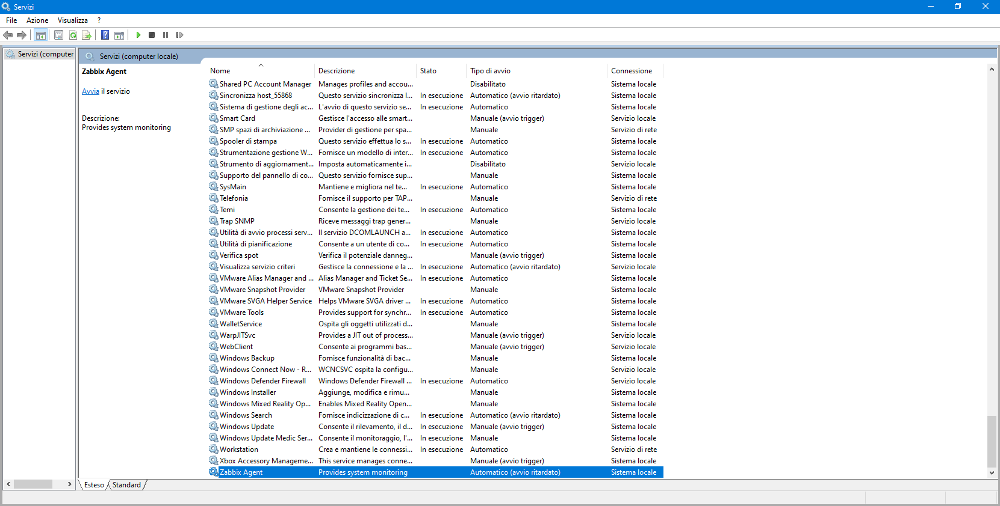

### Generazione dell'Allarme per Agente Non Raggiungibile (Host Unreachable)

Il server Zabbix non ci mette molto ad accorgersi che ha perso i canali di comunicazione heartbeat con il client Windows.

Il widget **Current problems** della Global View segnala una nuova criticità alle ore **01:19:51 PM** sull'host **Windows10-Lab**. Il problema rilevato indica: `Windows: Zabbix agent is not available (for 3m)` con severità **Average** (arancione).
Se buttiamo l'occhio sul widget **Host availability**, notiamo un cambiamento importante: il contatore degli asset verdi *Available* scende da 3 a 2, mentre la casella rossa **Not available** sale a 1, indicandoci tempestivamente che un agente censito ha smesso di rispondere alle chiamate del server.

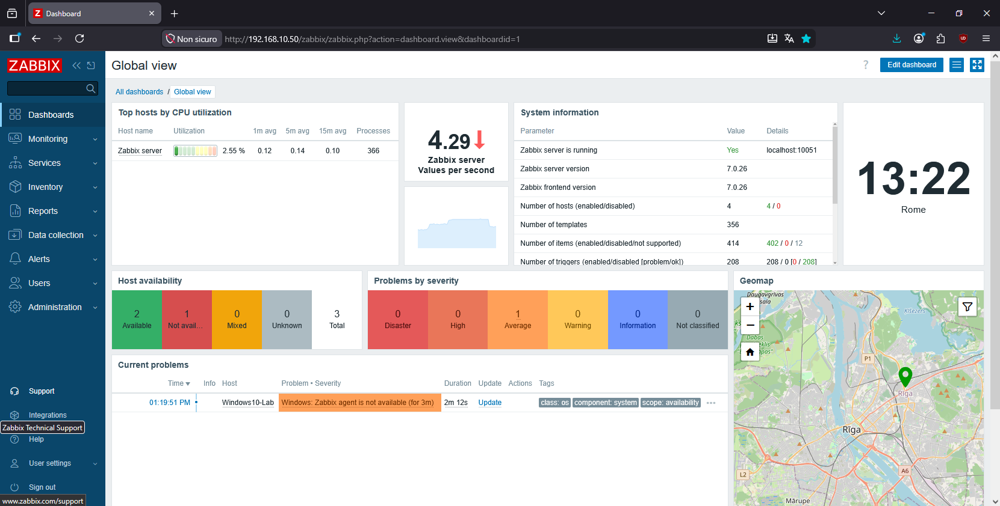

### Visualizzazione della Criticità nel Pannello dei Problemi Attivi

Andiamo a fare un'ispezione dettagliata sulla perdita dell'agente entrando nel modulo di monitoraggio centralizzato.

Navighiamo sulla schermata principale **Monitoring** -> **Problems**. Al centro della pagina viene evidenziata l'unica riga attiva non risolta dell'infrastruttura, marchiata con il badge rosso lampeggiante **PROBLEM** sotto la colonna Status. L'allarme è fisso in bacheca dalle ore 01:19:51 PM e presenta una durata temporale cumulativa di **2m 49s** senza che sia stato effettuato alcun *Acknowledge* (la presa in carico formale) da parte degli operatori del laboratorio.

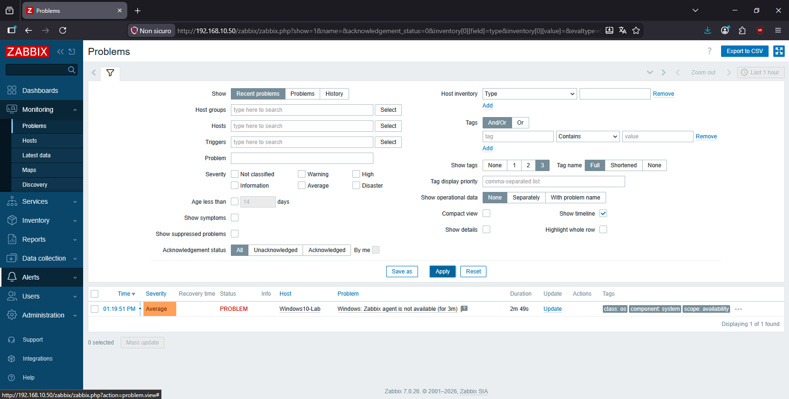

### Chiusura e Ripristino del Canale dell'Agente Windows

Andiamo a riattivare il servizio Zabbix Agent sulla macchina Windows per risolvere il problema di raggiungibilità e osserviamo il ripristino dei flussi.

La tabella dei problemi si aggiorna in tempo reale: lo stato del trigger relativo all'indisponibilità dell'agente per l'host Windows10-Lab passa ufficialmente a **RESOLVED** alle ore **01:22:51 PM**. Facendo due calcoli sui tempi, la durata totale del disservizio (la mancata ricezione delle metriche) è stata di esattamente **3m**, allineandosi al millimetro con le tempistiche di polling e di timeout configurate all'interno degli item di controllo del template predefinito.

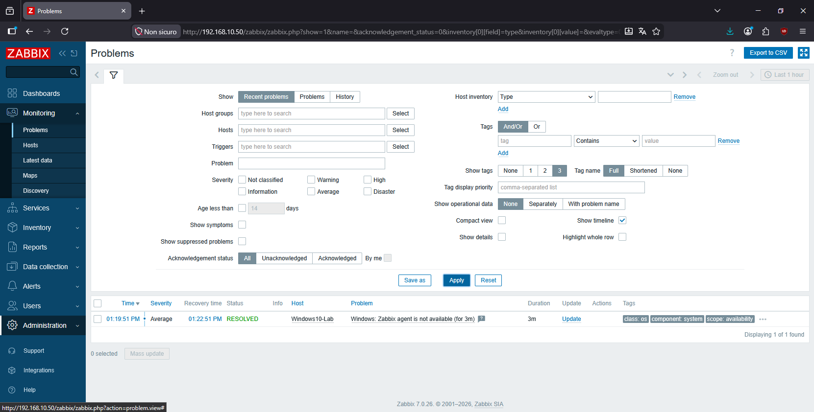

### Inizializzazione della Mappa di Rete (Network Map Layout)

Per concludere il lavoro nel nostro laboratorio in bellezza, andiamo a sfruttare la funzionalità di disegno topologico di Zabbix per mappare graficamente le interconnessioni di tutte le macchine che abbiamo censito fino ad ora.

Spostiamoci sulla sezione **Monitoring** -> **Maps**. Dal menu a tendina superiore, andiamo a selezionare la mappa denominata di default **Local network**. Allo stato iniziale la tela si presenta vuota o parziale, mostrando unicamente l'icona del server predefinita che rappresenta il loopback locale: **Zabbix server (127.0.0.1)** accompagnato dall'indicatore di stato logico **OK** in verde.

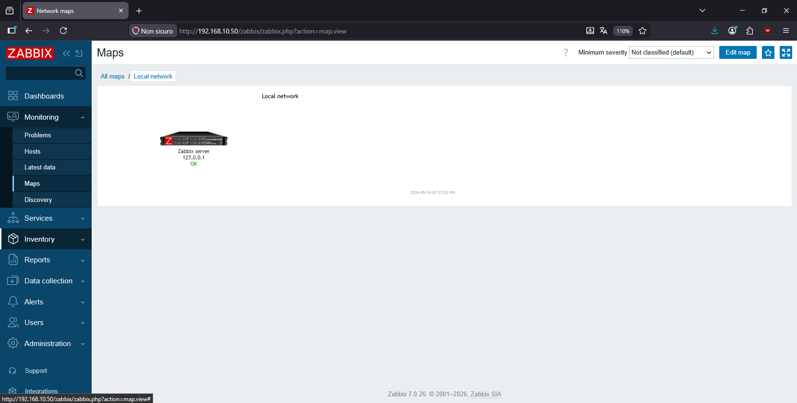

### Editing della Mappa e Inserimento di Nuovi Elementi Topologici

Per iniziare a disegnare la nostra rete, facciamo click sul pulsante **Edit map** posizionato in alto a destra. Aggiungiamo un nuovo elemento vettoriale nell'area di lavoro, che viene evidenziato da un perimetro tratteggiato arancione.

Spostiamo lo sguardo sul pannello laterale destro delle proprietà (**Map element**) e configuriamo l'oggetto:

- **Type:** Impostiamo la voce su **Image**.

- **Label:** Il campo testuale di fabbrica mostra *New element* (che andremo a personalizzare associandolo all'host reale).

- **Icons:** Sfruttiamo il set di icone di sistema selezionando l'icona standard denominata **Server_(96)**.

- **Coordinates:** Se vogliamo posizionare il nodo in modo geometricamente preciso sulla griglia di pixel, andiamo a impostare i parametri sugli assi su **X: 289** e **Y: 77**.

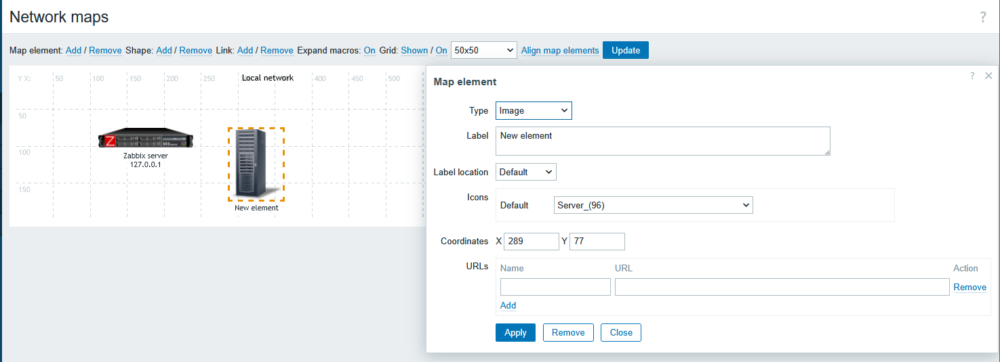

### Topologia Finale della Rete di Laboratorio Monitorata

Dopo aver inserito tutti i componenti e aver tirato i collegamenti logici, salviamo il lavoro per goderci la visualizzazione finale della mappa di rete completata, che ci fornisce un quadro sinottico e interattivo dello stato di salute di tutto il laboratorio.

La topologia comprende ora quattro nodi interconnessi in modo pulito:

- **pfSense-Core (192.168.10.1):** Posizionato al centro del disegno logico, fa da gateway e firewall della rete.

- **Lubuntu-Lab (192.168.10.52):** La nostra macchina Linux connessa all'interfaccia interna del firewall.

- **Windows10-Lab (192.168.10.51):** Il client Windows attestato sulla rete interna privata.

- **Zabbix server (127.0.0.1):** Il motore di monitoraggio collegato logicamente a tutti i nodi dell'infrastruttura.

Sotto ciascuna icona viene stampato in tempo reale l'indirizzo IP associato e il rassicurante marker verde **OK**. Questo ci dimostra che tutti i trigger su tutti gli host sono nominali: non vi è alcun problema attivo nell'intera infrastruttura del laboratorio alle ore **01:34:16 PM**. Il nostro ecosistema è interamente sotto controllo.

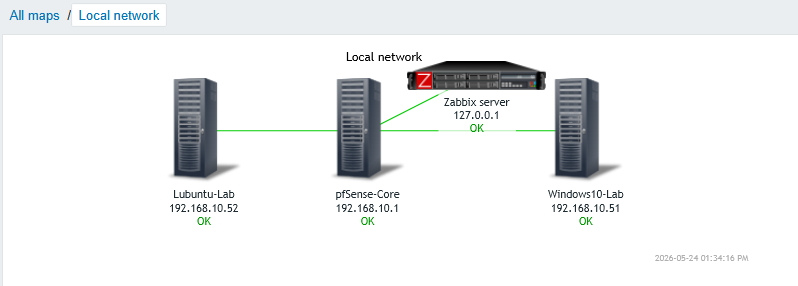
