# Installazione e configurazione di Windows Server 2022 Standard Evaluation

### Accesso al Centro Valutazione Microsoft

Iniziamo la costruzione del Domain Controller del nostro laboratorio. Per farlo, ci serve l'immagine ufficiale del sistema operativo server di Microsoft.

- Apriamo il browser e colleghiamoci alla pagina del **Centro valutazione** dedicata a Windows Server 2022.

- Ci troviamo davanti alla schermata di selezione della lingua per il pacchetto di installazione. Scorriamo la lista verso il basso lasciando perdere le prime opzioni.

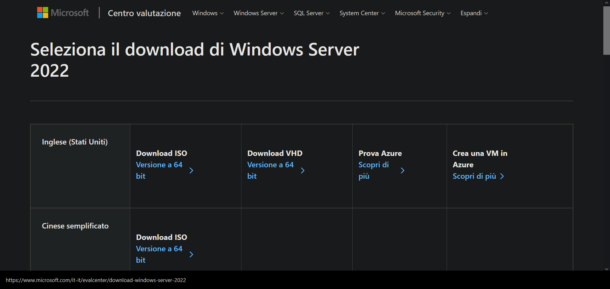

### Selezione della lingua e download della ISO

- Individuiamo la riga dedicata alla lingua **Italiano** (cerchiata in rosso nello screenshot).

- Facciamo click sul link blu **Download ISO - Versione a 64 bit**. Il browser avvierà immediatamente lo scaricamento del file d'installazione direttamente dai server Microsoft, senza bisogno di chiavi di licenza in questa fase.

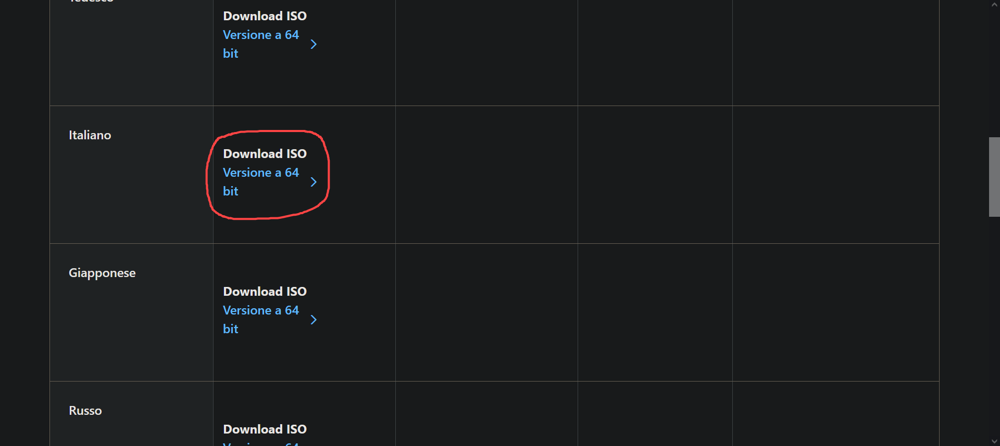

### Note importanti sulle linee guida di valutazione

Mentre il download va avanti, diamo un'occhiata alle linee guida fornite da Microsoft nella stessa pagina:

- La versione di valutazione (Evaluation) ha una durata massima di **180 giorni**, dopodiché scadrà (ma potremo eventualmente resettare il counter dei giorni via terminale più avanti).

- **Nota critica (sottolineata in rosso):** Le versioni di valutazione di Windows Server devono obbligatoriamente essere attivate su Internet nei primi **10 giorni** dall'installazione, altrimenti il server inizierà a soffrire di arresti automatici ogni ora, il che distruggerebbe la stabilità del nostro intero lab.

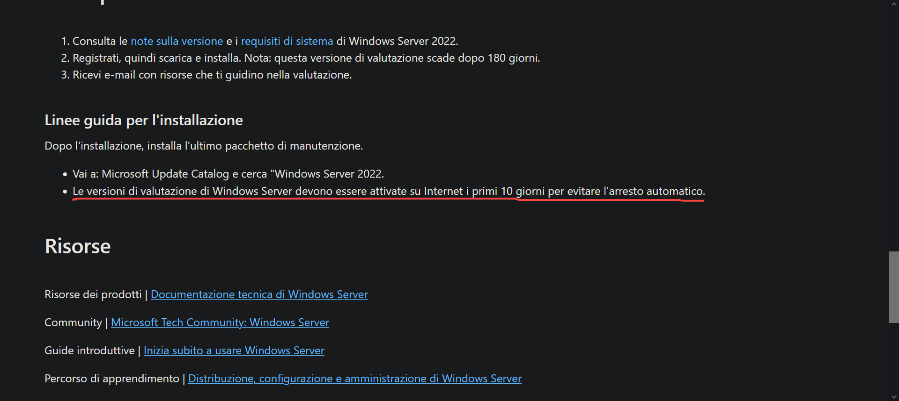

### Configurazione della Macchina Virtuale su VMware Workstation

Prima di far partire l'installer, configuriamo la macchina virtuale su VMware seguendo questi passaggi precisi nel wizard:

1. Nel wizard di creazione, mettiamo la spunta su **I will install the operating system later**. In questo modo evitiamo che VMware tenti l'installazione automatica automatizzata (*Easy Install*), che spesso salta la selezione della GUI.

2. Come **Virtual machine name**, inseriamo: `Windows Server 2022`.

3. Spostiamo i file fuori dal disco principale per non riempirlo, modificando la cartella di destinazione in: `D:\Virtual Machines\Windows Server 2022`.

4. Nella sezione dedicata all'archiviazione, impostiamo la dimensione massima del disco a **50 GB**.

5. Clicchiamo sul pulsante **Customize Hardware** per raddrizzare le risorse di sistema:
   
   - **Memory:** Impostiamo la RAM a **2 GB** (2048 MB).
   
   - **Processors:** Assegniamo **2 Processori** per garantire fluidità.
   
   - **New CD/DVD:** Spostiamo il pallino su *Use ISO image file* e andiamo a pescare il file scaricato in precedenza: `D:\Virtual Machines\ISO\SERVER_EVAL_x64FRE_it-it.iso`.

### Fase di Boot e avvio dell'installer

- Accendiamo la macchina virtuale cliccando sul pulsante **Play verde** nella barra superiore di VMware.

- **Attenzione alla tempistica:** Non appena a schermo compare la scritta in alto *“Press any key to boot from CD or DVD...”*, clicchiamo immediatamente con il mouse all'interno della schermata nera della VM per catturare l'input e premiamo la **barra spaziatrice** sulla tastiera per agganciare il boot della ISO.

### Impostazioni internazionali e layout di tastiera

Superata la fase di boot, entriamo nella prima vera schermata dell'installazione di Windows.

- Lasciamo i parametri locali su **Italiano (Italia)** sia per la lingua che per il formato dell'ora.

- Verifichiamo che il metodo di input della tastiera sia configurato su **Italiano**.

- Proseguiamo cliccando sul pulsante **Avanti** (indicato dalla freccia rossa in basso a destra).

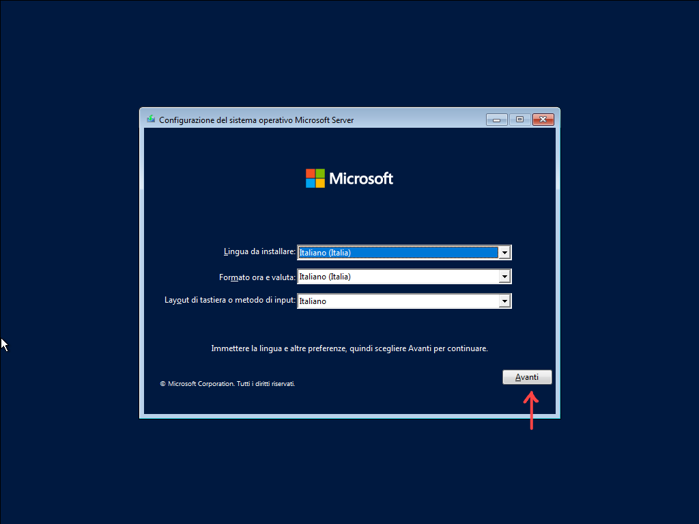

### Selezione della variante con Interfaccia Grafica (GUI)

Qui dobbiamo prestare la massima attenzione per evitare di ritrovarci con un server gestibile solo da riga di comando.

- Selezioniamo la seconda voce dell'elenco: **Windows Server 2022 Standard Evaluation (esperienza desktop)**.

- > **Nota operativa:** La dicitura *(esperienza desktop)* è l'equivalente Microsoft per indicare l'interfaccia grafica completa. Se selezionate la prima voce, installerete la versione Server Core (solo prompt dei comandi e PowerShell).

- Clicchiamo su **Avanti** per confermare.

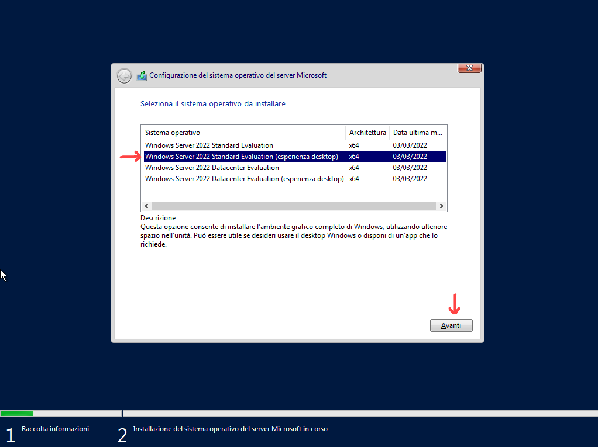

### Scelta del tipo di installazione

Il sistema ci chiede come gestire la scrittura sul disco rigido.

- Facciamo click sulla seconda opzione: **Personalizza: installa solo il sistema operativo Microsoft Server (avanzato)**.

- Trattandosi di un'installazione pulita in un laboratorio nuovo, non abbiamo aggiornamenti da eseguire.

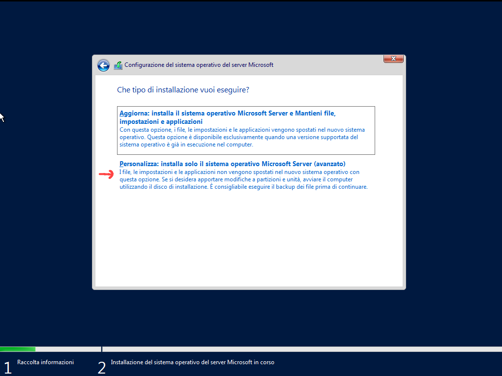

### Allocazione dello spazio sul disco virtuale

- L'installer ci mostra l'elenco dei dischi connessi. Troviamo la nostra unità virtuale configurata su VMware, etichettata come **Spazio non allocato unità 0** con una dimensione esatta di **50.0 GB**.

- Lasciamo tutto così com'è, senza toccare i tasti di partizionamento manuale, e clicchiamo su **Avanti**. L'installer provvederà autonomamente a formattare il disco in NTFS e a creare i volumi di sistema.

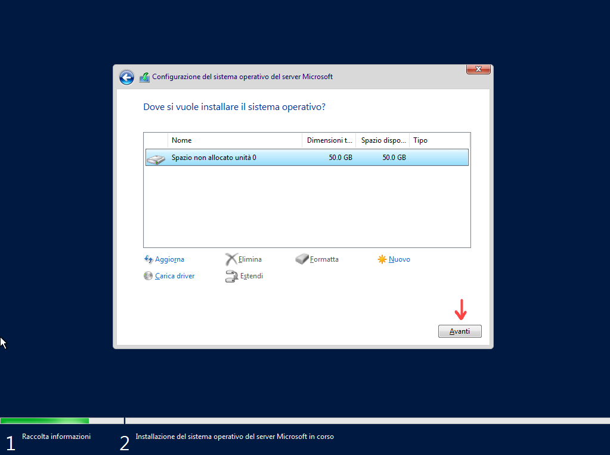

### Configurazione della password dell'Amministratore locale

Al termine della copia dei file e dopo il riavvio automatico della VM, il sistema richiede l'impostazione delle credenziali di sicurezza.

- L'account utente di sistema è predefinito e bloccato sul nome **Administrator**.

- Nei campi dedicati alla password, inseriamo la password complessa scelta per il nostro dominio: `P@ssword2026!`.

- Clicchiamo su **Fine** per confermare e completare la fase di setup.

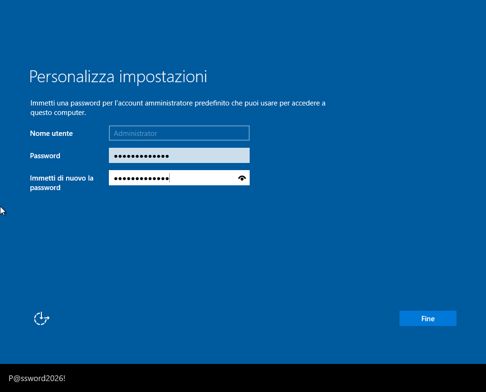

### Rilevamento della rete e impostazione del profilo del Firewall

Arrivati per la prima volta sul desktop, Windows rileva la presenza della scheda di rete virtuale.

- Sul lato destro dello schermo si apre il pannello laterale azzurro **Reti**.

- Alla domanda *"Vuoi consentire al tuo PC di essere individuabile per altri PC e dispositivi nella rete?"*, clicchiamo senza esitazione su **Sì** (evidenziato dal cerchio rosso).

- > **Perché lo facciamo?** Cliccando su *Sì*, Windows configura la scheda sotto il profilo di rete *Privata*. Questo attenua le restrizioni del Firewall di Windows all'interno del laboratorio, consentendo lo scambio dei pacchetti ICMP (il ping) e agevolando le future comunicazioni con lo Zabbix Server e i client.

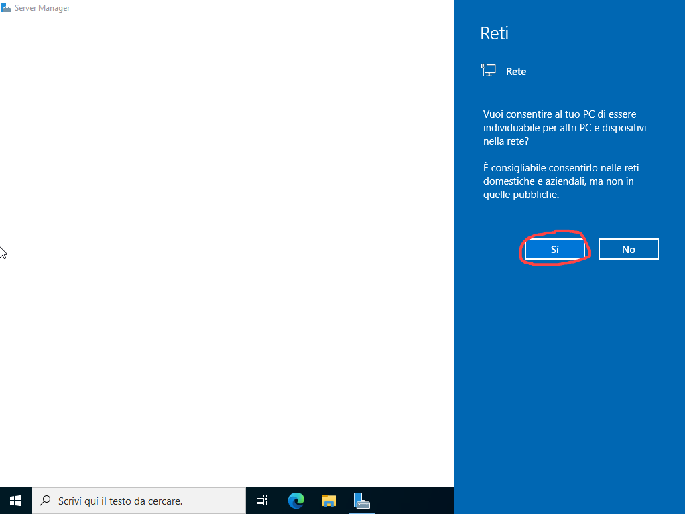

### Configurazione iniziale del Server Manager

Come da impostazione predefinita di Windows Server, la console di gestione si apre automaticamente in primo piano.

- Notiamo la presenza di un banner pop-up che promuove l'installazione di *Windows Admin Center*.

- Per evitare che questo messaggio si ripresenti ad ogni avvio della macchina, mettiamo la spunta sulla casella **Non visualizzare più questo messaggio** nell'angolo in basso a sinistra (segnato con la "X" rossa).

- Chiudiamo definitivamente il pop-up cliccando sulla **X** in alto a destra per liberare l'interfaccia di lavoro.

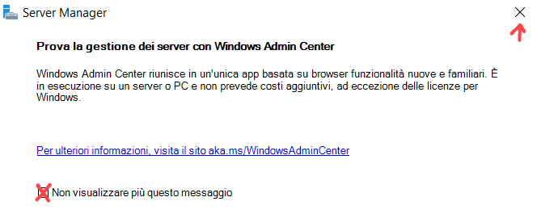

### Ottimizzazione finale dell'Hypervisor (VMware Tools)

Prima di procedere con la configurazione dei servizi di rete o del Domain Controller, dobbiamo installare i driver di integrazione per ottimizzare le prestazioni video e di rete della macchina virtuale.

- Nella barra dei menu superiore di VMware Workstation, clicchiamo su **VM** -> **Install VMware Tools**.

- All'interno di Windows Server, apriamo l'Esplora file, andiamo su *Questo PC*, facciamo doppio click sull'unità CD virtuale appena montata ed eseguiamo il setup guidato premendo sempre *Avanti* fino alla fine, riavviando il server quando richiesto.

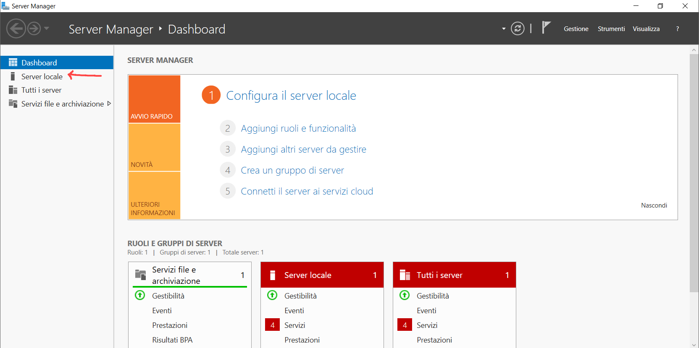

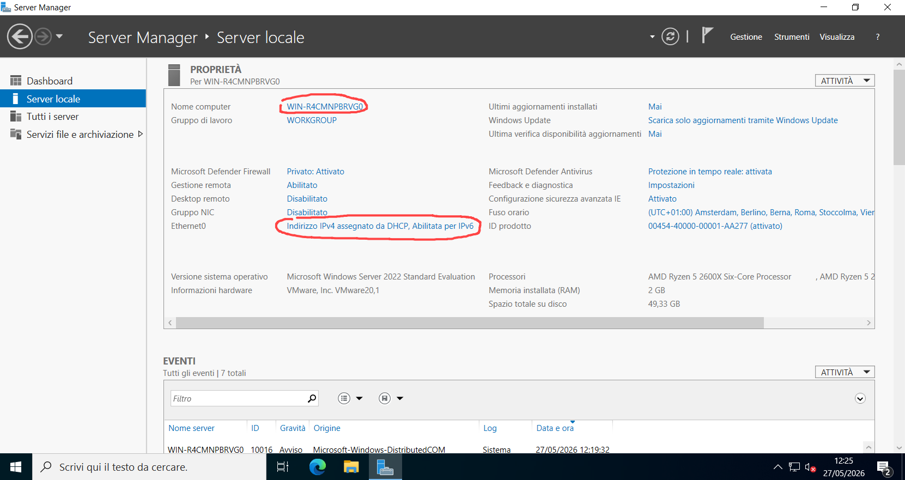

### Modifica del nome del computer (Hostname) dal Server Manager

Prima di promuovere la macchina a Domain Controller, dobbiamo togliere il nome casuale e dargli un'identità chiara all'interno del laboratorio.

- Apriamo il **Server Manager** e facciamo click sulla voce **Server locale** nel menu laterale sinistro.

- Clicchiamo direttamente sulla stringa di testo blu accanto alla voce *Nome computer* (che in questo momento mostra `WIN-R4CMNPBRVG0`).

- Nella finestrella *Proprietà del sistema* che si apre, facciamo click sul pulsante **Cambia...**.

- Nel campo **Nome computer:**, cancelliamo la vecchia stringa e inseriamo il nome definitivo: `DC-01`.

- Lasciamo l'appartenenza su **Gruppo di lavoro** (WORKGROUP) e clicchiamo su **OK**. Accettiamo il messaggio del sistema che ci avvisa che le modifiche diventeranno effettive solo dopo il riavvio della macchina.

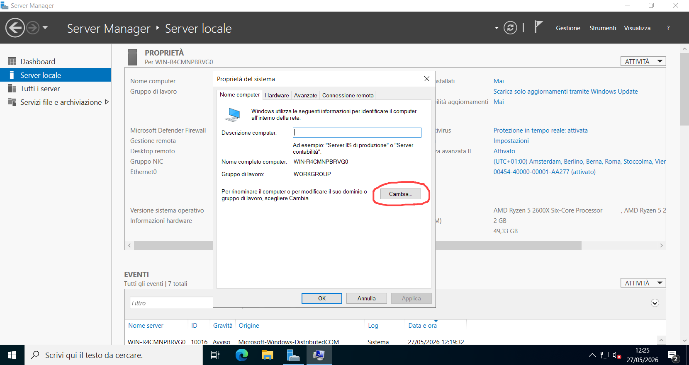

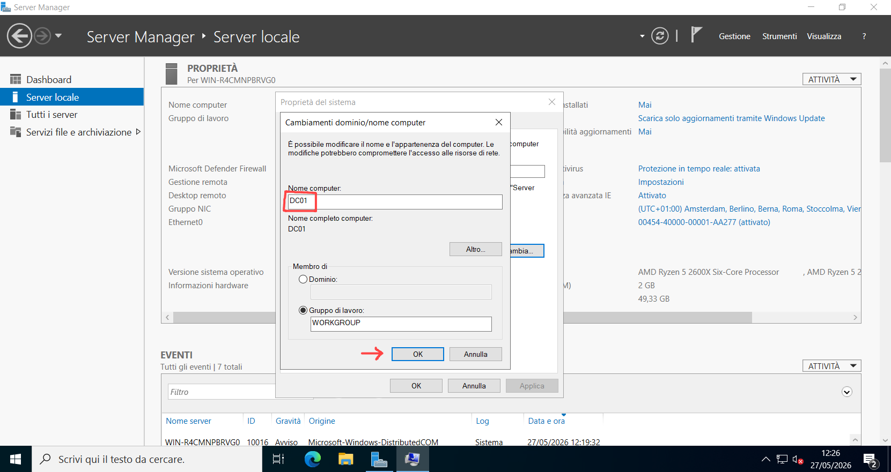 

### Assegnazione dell'indirizzo IP statico

Per evitare che il nostro futuro Domain Controller cambi indirizzo logico a ogni riavvio, dobbiamo abbandonare il DHCP e impostare un IP statico sulla scheda di rete.

- Rimanendo nella schermata di riepilogo di **Server locale** dentro il Server Manager, cerchiamo la voce *Ethernet0*. Clicchiamo sul link blu associato (indicato come **Indirizzo IPv4 assegnato da DHCP, Abilitata per IPv6**).

- Si apre la cartella delle connessioni di rete: facciamo click con il tasto destro sull'icona della scheda `Ethernet0`, scegliamo *Proprietà* e facciamo doppio click su **Protocollo Internet versione 4 (TCP/IPv4)**.

- Spostiamo il pallino su **Utilizza il seguente indirizzo IP:** e compiliamo a mano i parametri della nostra sottorete:
  
  - **Indirizzo IP:** `192.168.10.10`
  
  - **Subnet mask:** `255.255.255.0`
  
  - **Gateway predefinito:** `192.168.10.1` (l'indirizzo IP del nostro pfSense)

- Spostiamo il pallino su **Utilizza i seguenti indirizzi server DNS:** e per adesso inseriamo l'IP del gateway stesso come **Server DNS predefinito**: `192.168.10.1`.

- Clicchiamo su **OK** per salvare e rendere persistenti le modifiche sulla scheda di rete prima del reboot.

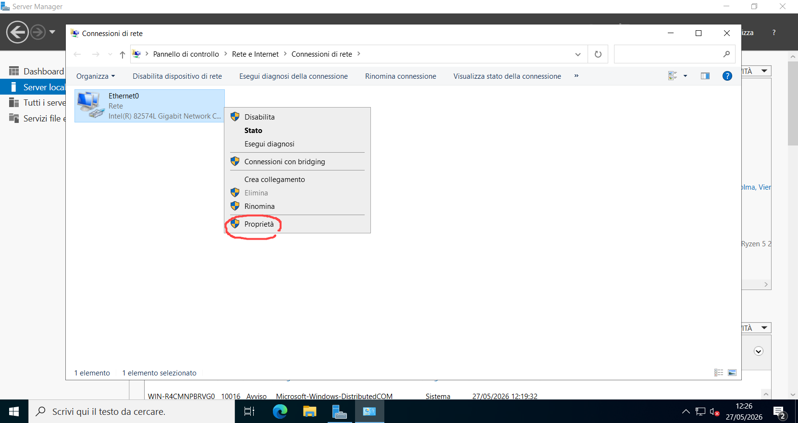
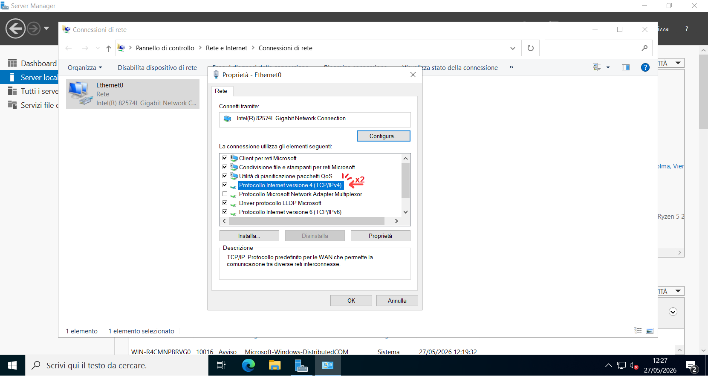

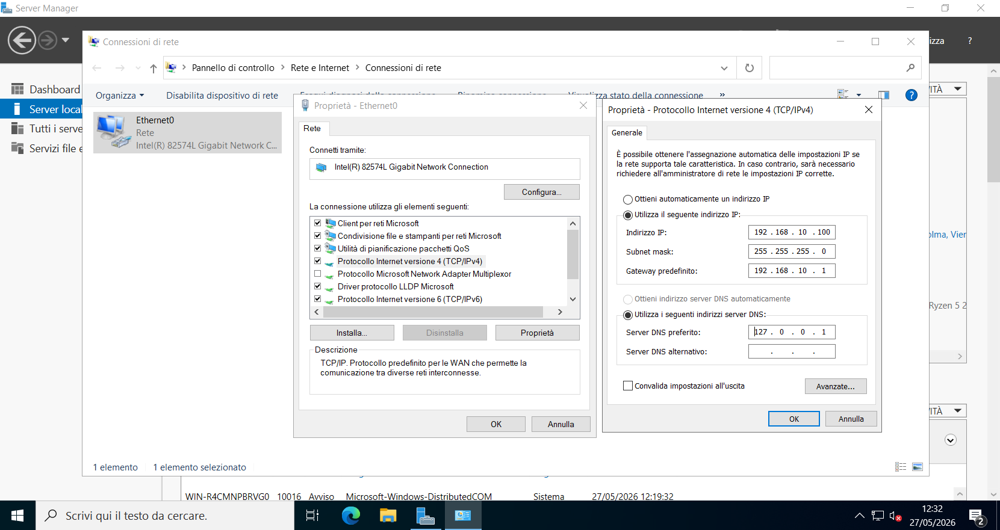
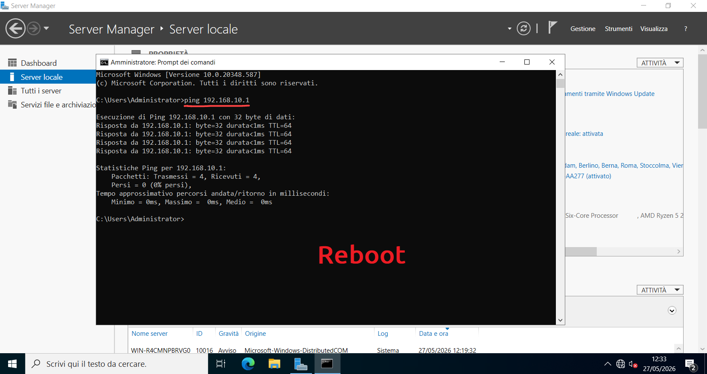
