# Promozione a Domain Controller, Configurazione di Active Directory, GPO e Centralizzazione DHCP

In questa sezione andiamo a realizzare il cuore logico dell'intera identità del nostro laboratorio enterprise indipendente: l'installazione dei Servizi di dominio Active Directory (AD DS) su Windows Server 2022 (DC01), il join del client Windows 10 e la successiva centralizzazione del ruolo DHCP, risolvendo i conflitti di rete monitorati tramite Zabbix. Infine, consolidiamo la sicurezza degli endpoint implementando una Group Policy Object (GPO) per il controllo degli accessi e l'inibizione del Pannello di Controllo sui client di dominio.

## 1. Installazione del Ruolo Servizi di dominio Active Directory (AD DS)

In questa prima fase andiamo a preparare il server caricando sul disco i file binari necessari per Active Directory. Fino a questo momento la macchina è un semplice server standalone; l'installazione del ruolo è il prerequisito fondamentale per la successiva promozione.

1. Accediamo alla console di Windows Server 2022. Dalla dashboard principale del **Server Manager** (il centro nevralgico di gestione dell'OS), spostiamo lo sguardo in alto a destra, facciamo click sul menu a tendina **Gestione** (*Manage*) e selezioniamo la prima opzione: **Aggiungi ruoli e funzionalità** (*Add Roles and Features*).
   
   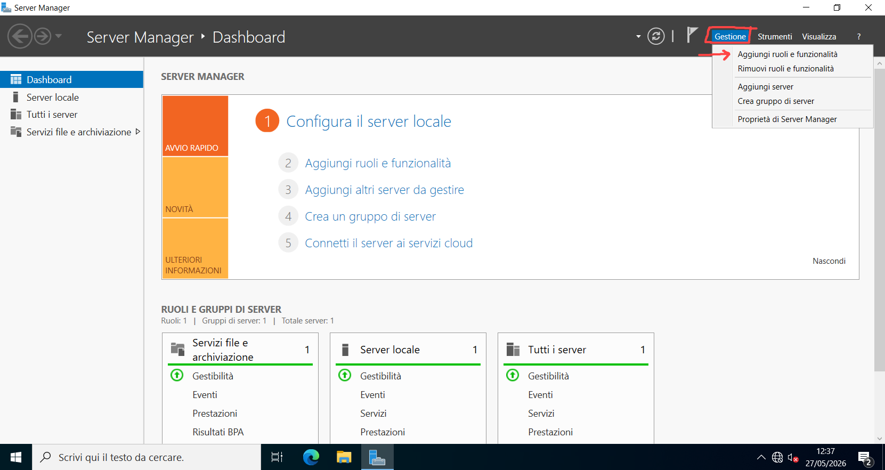

2. Si apre il wizard di configurazione guidata. Nella schermata **Tipo di installazione**, lasciamo selezionata l'opzione predefinita **Installazione basata su ruoli o basata su funzionalità**. Questa scelta ci permette di aggiungere servizi mirati localmente sul nostro server, scartando le opzioni legate alle infrastrutture desktop remote (VDI). Clicchiamo su **Avanti >**.
   
   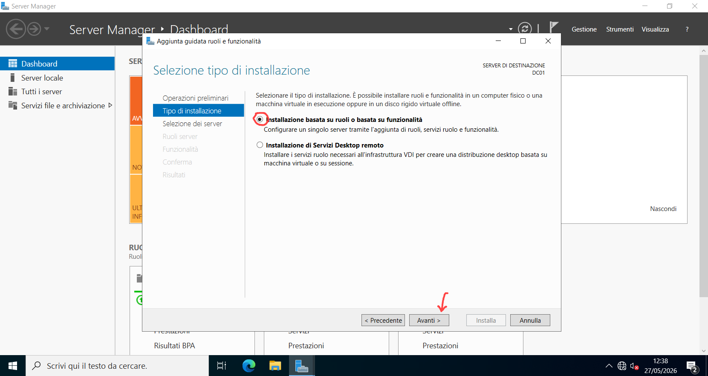

3. Nella schermata **Selezione del server**, dobbiamo definire su quale macchina applicare le modifiche. Il radio button è impostato su *Selezionare un server dal pool di server*. Identifichiamo l'unica riga presente in tabella, che corrisponde alla nostra macchina locale: verifichiamo che il nome sia **DC01**, che risponda sull'IP `192.168.10.100` e che il sistema operativo sia *Windows Server 2022 Standard Evaluation*. Clicchiamo su **Avanti >**.
   
   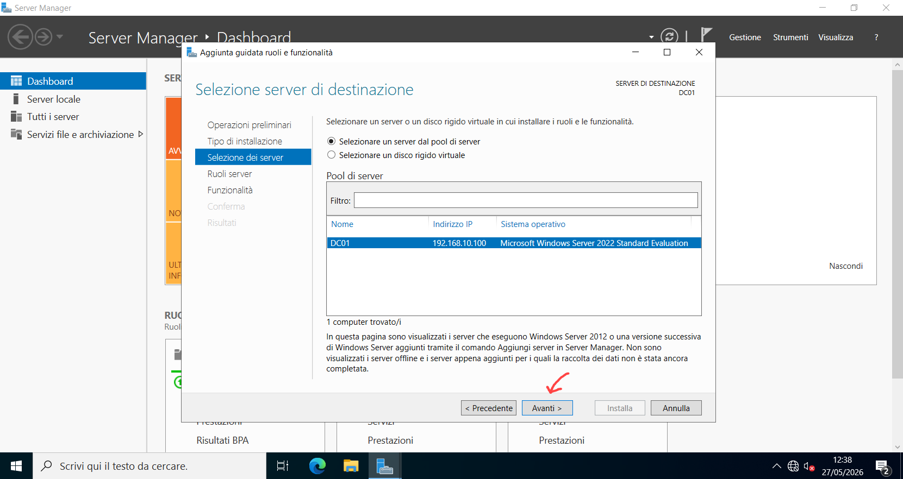

4. Arriviamo alla schermata cruciale dei **Ruoli server**. Scorriamo la lista dei servizi disponibili, individuiamo la voce **Servizi di dominio Active Directory** (*Active Directory Domain Services*) e andiamo a spuntare la relativa casella di controllo.
   
   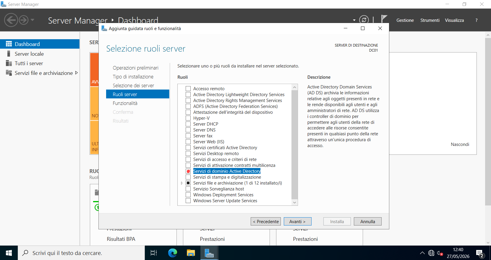

5. Non appena inseriamo la spunta, Windows Server capisce che il ruolo richiede degli strumenti di management specifici per poter essere configurato e gestito. Si apre quindi un pop-up automatico intitolato *Aggiungi funzionalità necessarie per Servizi di dominio Active Directory?*. Lasciamo tutto così com'è e clicchiamo sul pulsante **Aggiungi funzionalità** per approvare l'installazione degli strumenti di amministrazione remota (RSAT) e della console grafica. Il pop-up si chiuderà riportandoci al wizard principale.
   
   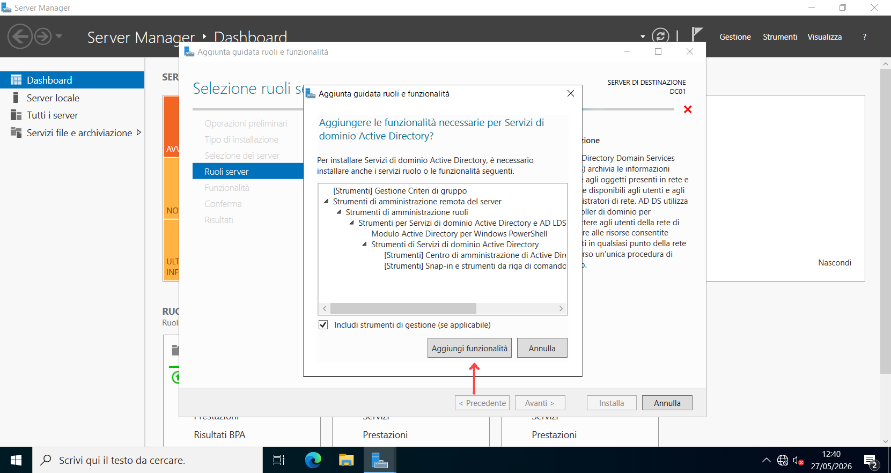

6. Nella schermata successiva, dedicata alle **Funzionalità**, il sistema ci mostra i componenti software aggiuntivi. Noteremo che elementi fondamentali come il *.NET Framework 4.8* sono già pre-installati o selezionati automaticamente dal ruolo precedente. In questa fase non dobbiamo aggiungere nient'altro manualmente. Clicchiamo direttamente su **Avanti >** per saltare la schermata.
   
   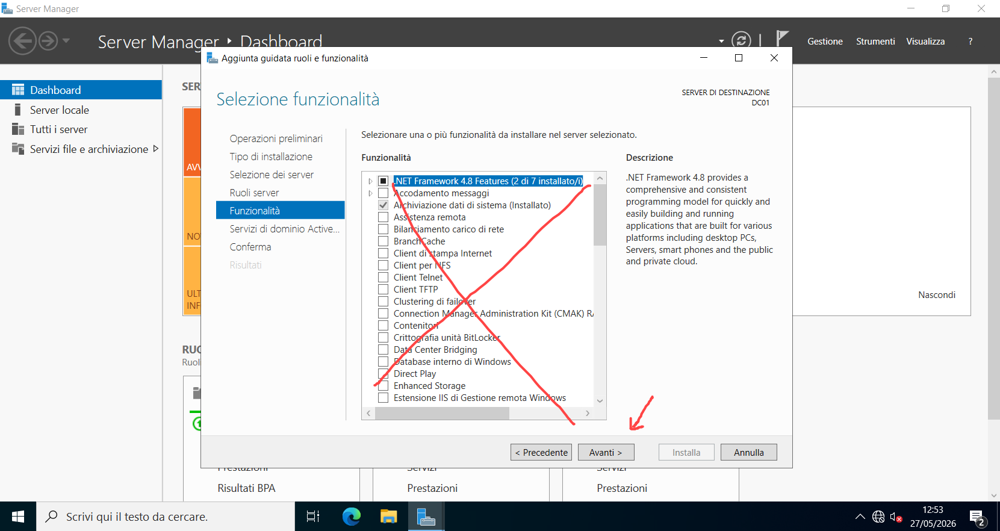

7. Il wizard ci mostra una scheda informativa dedicata ad Active Directory. È una pagina di riepilogo architetturale importante: ci ricorda il comportamento logico di AD DS e ci avvisa che, per funzionare correttamente, l'infrastruttura necessita di un server DNS all'interno della rete (che andremo a configurare nel passaggio successivo). Clicchiamo su **Avanti >**.
   
   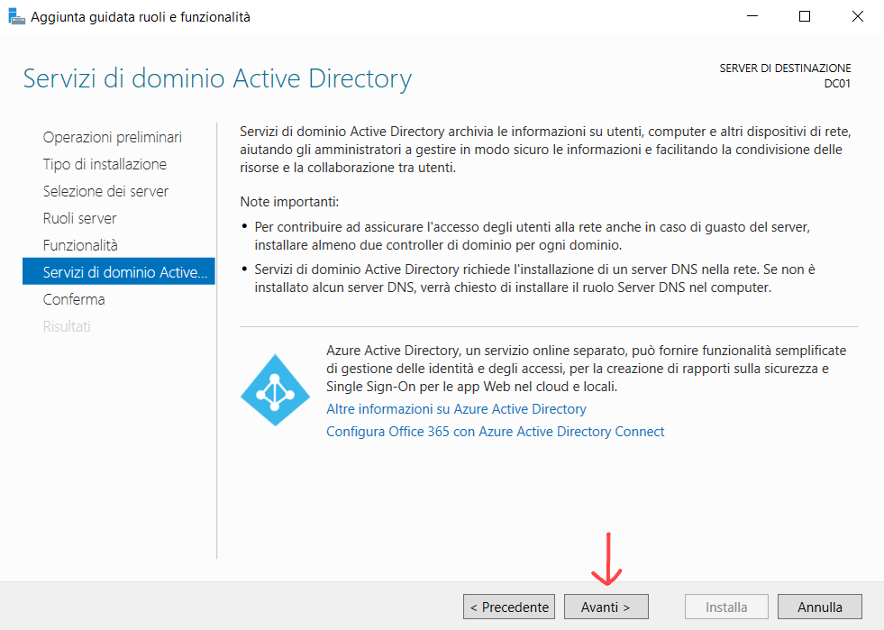

8. Siamo giunti alla schermata di **Conferma**, l'ultimo controllo prima della scrittura dei file su disco. Per ottimizzare i tempi e automatizzare le operazioni di laboratorio, andiamo a selezionare manualmente la casella di controllo **Riavvia automaticamente il server di destinazione se necessario**. All'apparire del pop-up di avviso che ci chiede l'autorizzazione al reboot immediato senza preavviso, clicchiamo su **Sì**. Verifichiamo nel riepilogo testuale che il ruolo in coda sia effettivamente *Servizi di dominio Active Directory* e facciamo click sul pulsante **Installa**.
   
   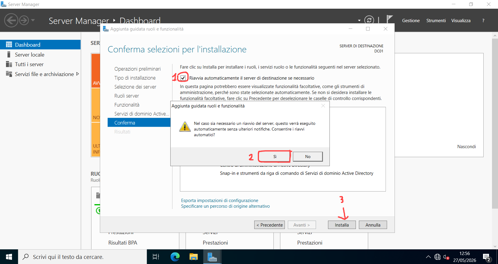

## 2. Promozione del Server a Domain Controller (Inizializzazione della Foresta)

L'operazione precedente si limita a copiare i binari di Active Directory sul sistema, ma non rende la macchina un Domain Controller. Adesso eseguiamo la promozione vera e propria, definendo la struttura logica del nostro dominio.

1. Una volta che la barra di avanzamento nella schermata **Risultati** ha terminato il suo lavoro, il sistema ci avviserà che la configurazione è parziale con il messaggio: *“Configurazione necessaria. Installazione completata in DC01...”*. Per trasformare la macchina nel punto di riferimento dell'identità aziendale, facciamo click sul link ipertestuale blu **Alza di livello il server a controller di dominio** (*Promote this server to a domain controller*).
   
   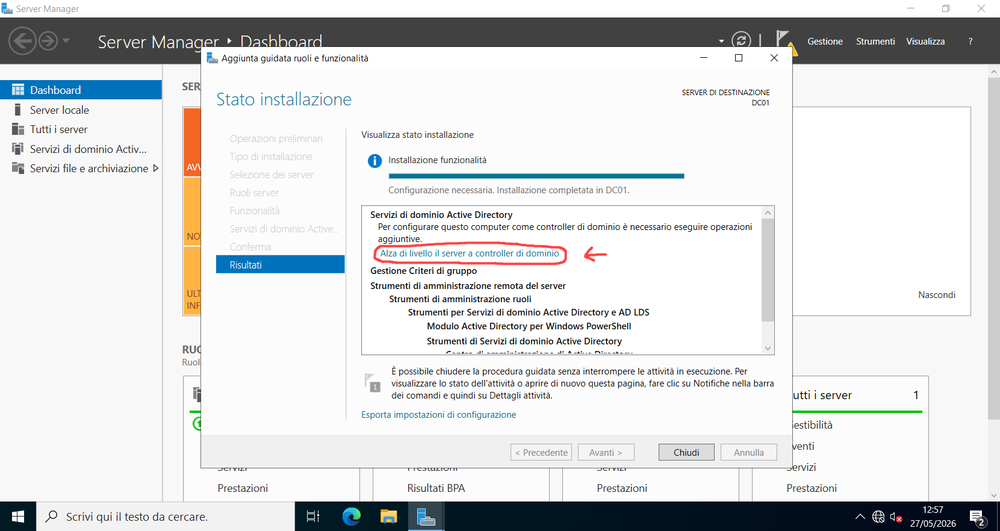

2. Si apre la *Configurazione guidata Servizi di dominio Active Directory*. Nella prima scheda, **Configurazione distribuzione**, dobbiamo impostare l'operazione di deployment. Trattandosi del primissimo Domain Controller del nostro homelab enterprise, andiamo a selezionare il terzo radio button: **Aggiungi una nuova foresta**. Subito sotto, nel campo di testo **Nome dominio radice**, digitiamo la stringa formale del nostro dominio locale: **`lab.local`**. Clicchiamo su **Avanti >**.
   
   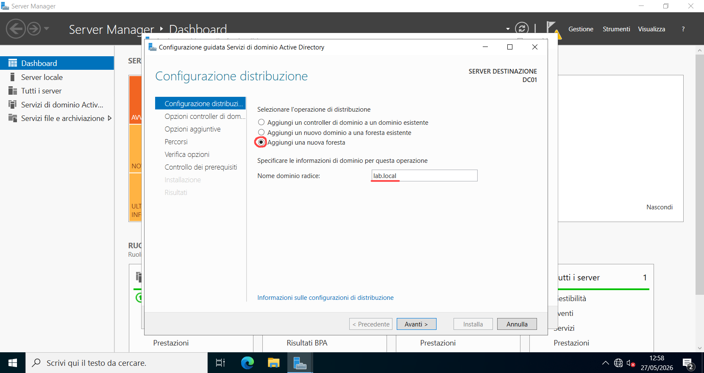

3. Nella scheda **Opzioni del controller di dominio**, impostiamo i livelli funzionali e le credenziali di emergenza. Lasciamo i menu a tendina *Livello funzionale della foresta* e *del dominio* impostati sul valore massimo di default disponibile (**Windows Server 2016**). Nella sezione dedicata alle funzionalità, le caselle **Server DNS (Domain Name System)** e **Catalogo globale (GC)** vengono selezionate in automatico (scelta mandatoria per il primo DC). Spostiamo l'attenzione in basso ed immettiamo una password sicura nei campi **Password** e **Conferma password** per la modalità **DSRM** (*Directory Services Restore Mode*). Questa chiave di sicurezza è fondamentale per effettuare attività di ripristino o manutenzione del database offline di Active Directory. Clicchiamo su **Avanti >**.
   
   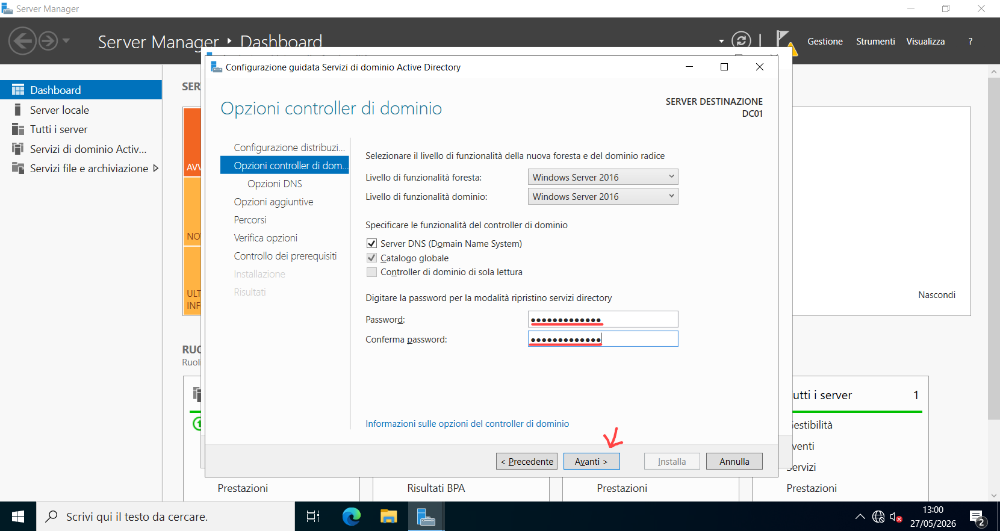

4. Arriviamo alla scheda **Opzioni DNS**. In alto notiamo un banner di avviso giallo con il testo: *“Impossibile creare una delega per il server DNS perché non è possibile trovare la zona radice autorevole corrispondente...”*. Questo comportamento è del tutto normale, atteso e corretto. Stiamo configurando una foresta radice (`lab.local`) completamente isolata e autorevole all'interno del nostro laboratorio privato; non esiste una zona DNS superiore su Internet a cui legarsi. Ignoriamo tranquillamente l'avviso e andiamo avanti cliccando su **Avanti >**.
   
   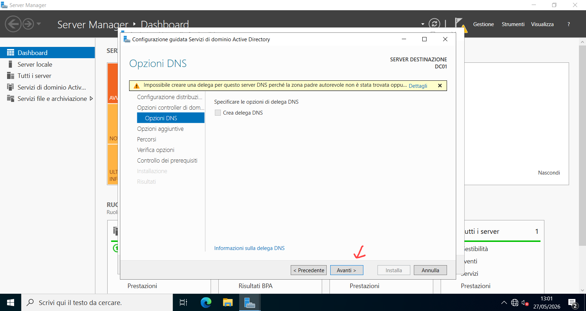

5. Nello step **Opzioni aggiuntive**, il sistema esegue il parsing del dominio radice per assegnare l'identificativo NetBIOS legacy per la retrocompatibilità di rete. Il wizard rimuove automaticamente il suffisso `.local` e popola il campo con la stringa in maiuscolo **`LAB`**. Verificato che non vi siano conflitti di broadcast sulla nostra rete privata, clicchiamo su **Avanti >**.
   
   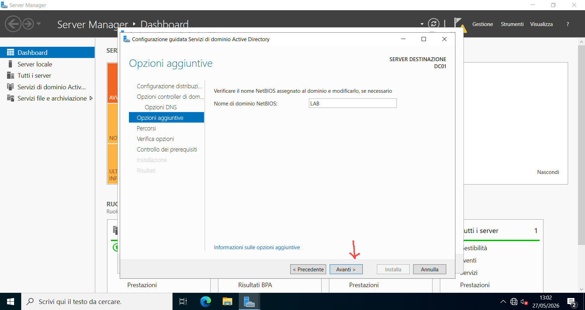

6. Nella schermata **Percorsi**, lasciamo che Windows Server allochi i file strutturali dell'Identity Provider all'interno delle cartelle di sistema predefinite proposte come best practice (la cartella del database `NTDS`, i file di registro dei log e la cartella delle policy di gruppo `SYSVOL` sul disco `C:`). Clicchiamo su **Avanti >**.
   
   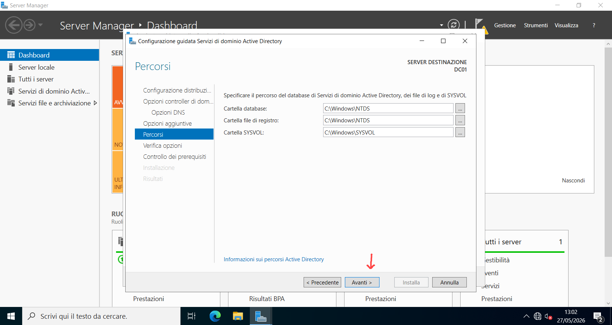

7. La scheda **Verifica opzioni** funge da riepilogo generale di tutte le scelte effettuate nei passaggi precedenti. Diamo un'occhiata veloce per controllare che tutto sia coerente e facciamo click su **Avanti >** per lanciare la telemetria interna di convalida.
   
   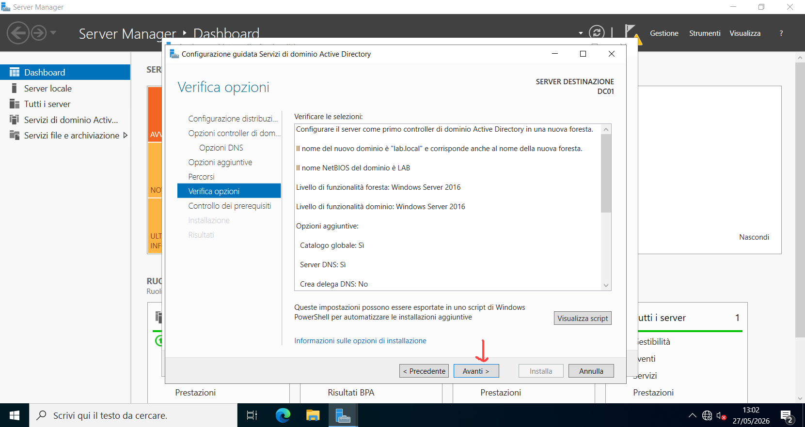

8. Nella schermata **Controllo dei prerequisiti**, l'OS esegue i test di conformità hardware e software sulla macchina DC01. Quando in alto compare il rassicurante banner verde con il messaggio d'esito positivo (*“Tutti i controlli dei prerequisiti sono riusciti...”*), siamo pronti. Nel box inferiore verranno mostrati alcuni warning standard sulla sicurezza degli algoritmi legacy (es. Windows NT 4.0) che possiamo ignorare. Facciamo click sul pulsante **Installa** per avviare la promozione a Domain Controller. Al termine della scrittura, il server eseguirà un riavvio automatico.
   
   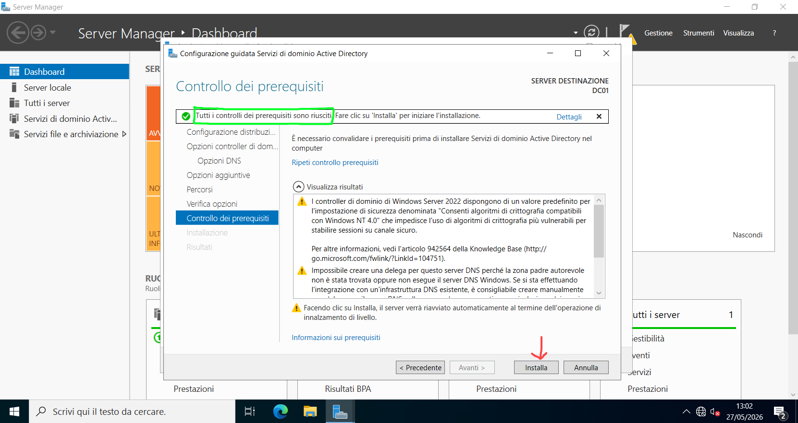
   
   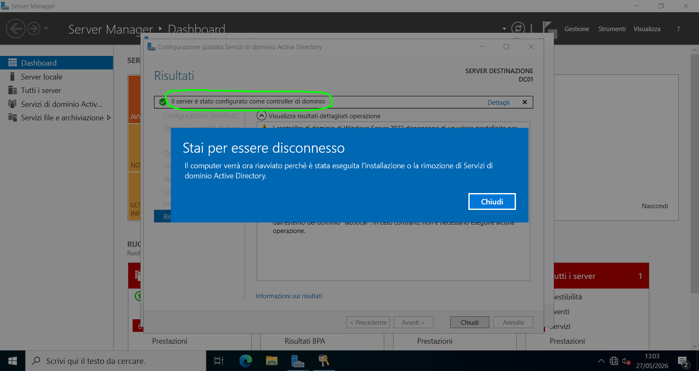

9. Al riavvio del server, la schermata di sblocco e logon di Windows ci conferma visivamente il successo dell'operazione: sotto l'icona dell'utente amministrativo non troviamo più il nome del computer locale, bensì la stringa formale del dominio **`LAB\Administrator`**. Inseriamo la password di amministrazione ed effettuiamo l'accesso. La Dashboard del Server Manager si caricherà mostrando i servizi AD DS e DNS perfettamente attivi.
   
   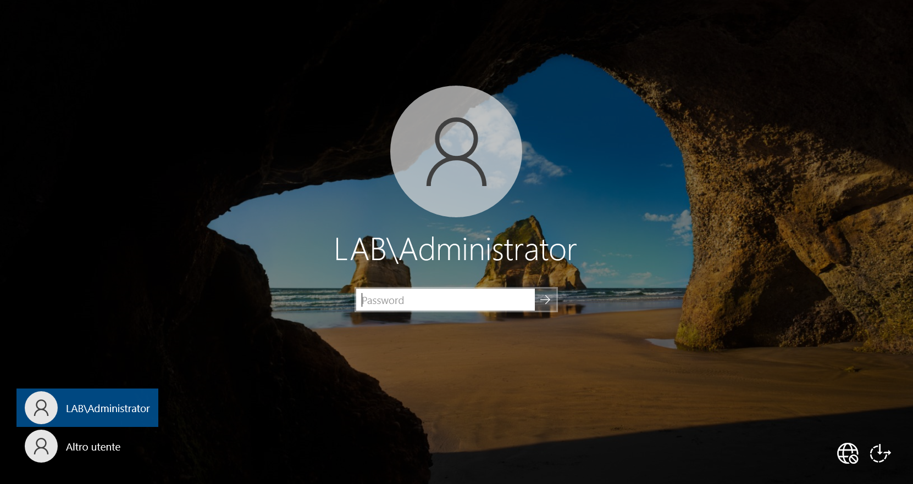
   
   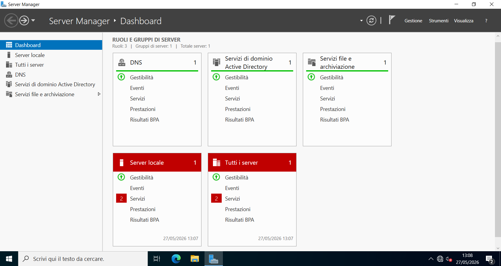

## 3. Configurazione di Rete e Join al Dominio del Client Windows 10

Per fare in modo che una workstation venga inserita nella gerarchia aziendale e gestita centralmente dall'Identity Provider, dobbiamo configurare la sua interfaccia di rete e associarla esplicitamente al dominio `lab.local`.

1. Spostiamoci sulla macchina virtuale dedicata al client. Apriamo il Pannello di controllo, navighiamo in *Rete e Internet > Connessioni di rete*, facciamo click destro sull'icona della scheda di rete fisica/virtuale **Ethernet0** e selezioniamo *Proprietà*. Da qui, facciamo doppio click sulla voce **Protocollo Internet versione 4 (TCP/IPv4)**.

2. Per permettere alla macchina di trovare il Domain Controller, configuriamo temporaneamente un indirizzo IP fisso coerente con la sottorete del laboratorio:
   
   - Selezioniamo *Utilizza il seguente indirizzo IP* e inseriamo l'IP **`192.168.10.51`**, la subnet mask **`255.255.255.0`** e il gateway predefinito **`192.168.10.1`** (l'IP interno del nostro firewall pfSense).
   
   - Selezioniamo *Utilizza i seguenti indirizzi server DNS* e nel campo **Server DNS preferito** inseriamo l'indirizzo **`192.168.10.100`** (corrispondente all'IP del nostro Domain Controller DC01). **Nota critica**: questo passaggio è fondamentale; senza questo puntamento preciso, il client non sarà mai in grado di risolvere i record DNS interni necessari a localizzare Active Directory. Lasciamo vuoto il campo del DNS alternativo e clicchiamo su **OK** per applicare.
   
   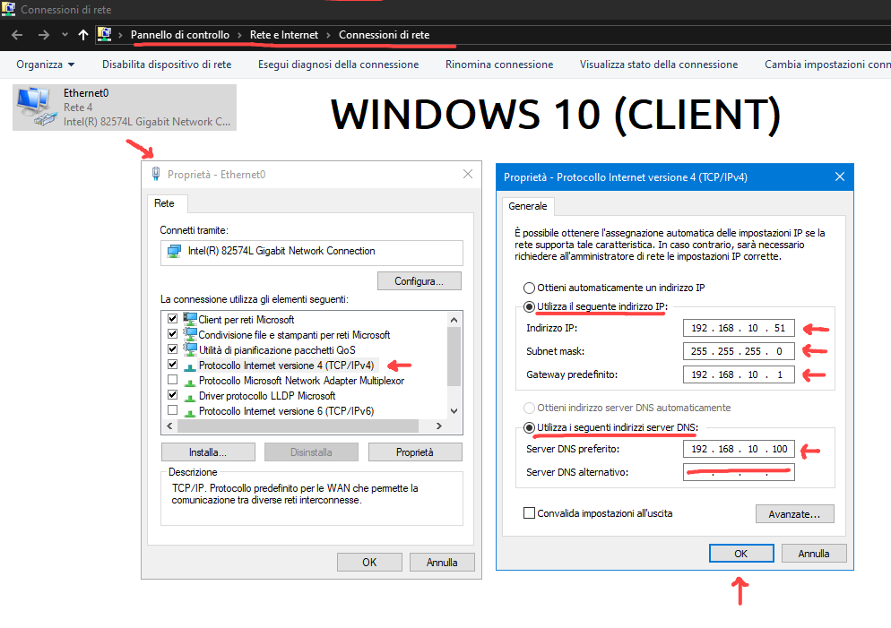

3. Prima di procedere con l'associazione formale, verifichiamo la bontà della risoluzione dei nomi. Apriamo il **Prompt dei comandi** sul client Windows 10 ed eseguiamo un test di ping verso il nome del dominio:
   
   DOS
   
   ```
   ping lab.local
   ```
   
   Verifichiamo con soddisfazione che il prompt esegua il parsing corretto traducendo il nome `lab.local` nell'IP del Domain Controller (`192.168.10.100`) con pacchetti interamente ricevuti.
   
   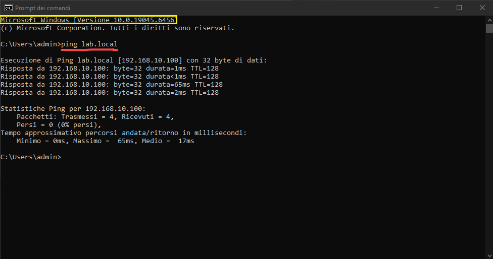

4. Adesso passiamo all'azione. Apriamo la finestra delle **Proprietà del sistema** di Windows 10 (posizionandoci sulla scheda *Nome computer*). La schermata ci mostra il nome host attuale della macchina ed il gruppo di lavoro standard (*WORKGROUP*). Facciamo click sul pulsante **Cambia...**.

5. Nella sottofinestra *Cambiamenti dominio/nome computer*, spostiamo il pallino di attivazione nella sezione *Membro di* su **Dominio** e digitiamo all'interno del campo di testo la stringa del nostro dominio aziendale: **`lab.local`**. Facciamo click su **OK**.
   
   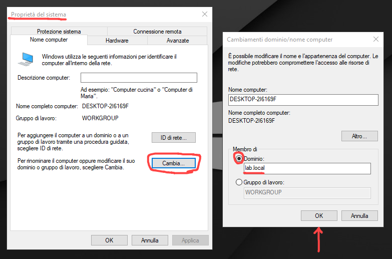

6. L'invio della richiesta interroga il Domain Controller, il quale apre un box di sicurezza nativo di Windows sovrapposto allo schermo per autorizzare la creazione dell'account computer all'interno del database. Inseriamo le credenziali con privilegi elevati del dominio: nel campo nome utente digitiamo **`Administrator`** e nel campo password inseriamo la master password del laboratorio (es. **`P@ssword2026!`**). Clicchiamo su **OK**.
   
   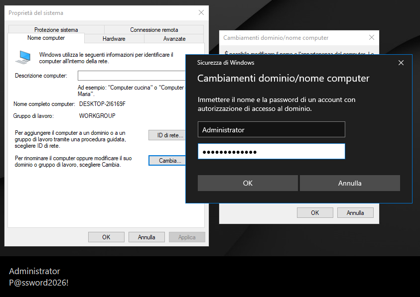

7. Dopo pochi istanti di elaborazione, il sistema convalida l'autenticazione e mostra il pop-up centrale di notifica informativa con il messaggio: *“Benvenuto nel dominio lab.local.”*. Clicchiamo su **OK** per chiudere la notifica. Il sistema ci avviserà che le modifiche diventeranno effettive solo dopo il riavvio obbligatorio della macchina; confermiamo e lasciamo riavviare il client.
   
   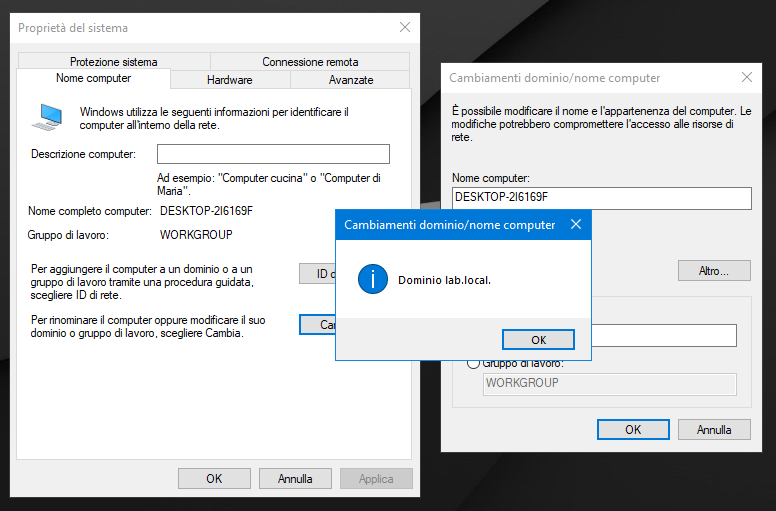

8. Al riavvio della macchina client Windows 10, ci troviamo davanti alla schermata di blocco. Per evitare l'accesso con l'utente admin locale, facciamo click in basso a sinistra sulla voce **Altro utente**. Al centro compariranno i campi di inserimento credenziali e, cosa fondamentale, sotto la casella della password leggeremo la dicitura chiara: **Accedi a: LAB**. Questa è la conferma che la workstation sta puntando direttamente ad Active Directory. Digitiamo l'identità in formato legacy **`LAB\Administrator`** e la password per effettuare il primo logon centralizzato di test sulla workstation.
   
   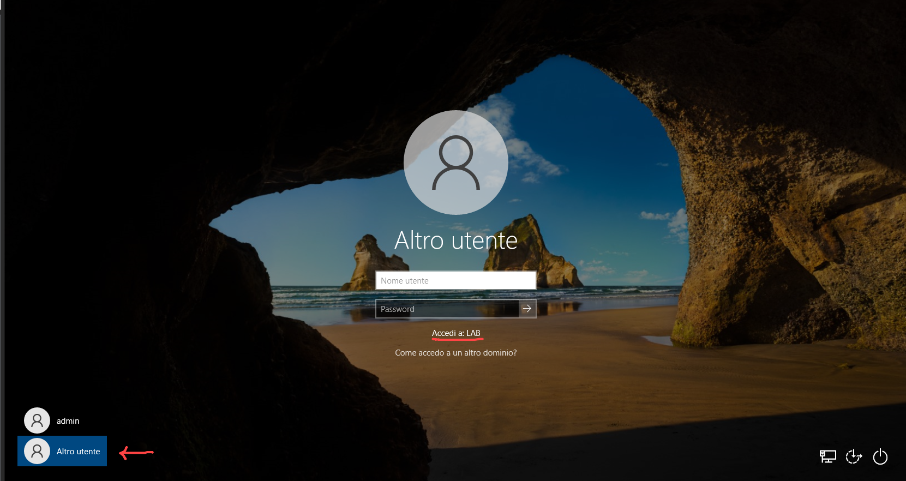
   
   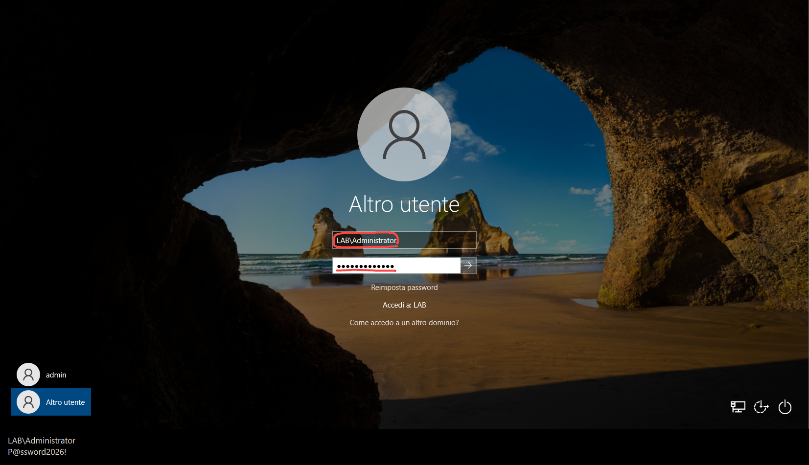

## 4. Gestione degli Oggetti e Creazione di un Utente di Dominio

L'utilizzo dell'account Administrator sui client è una pratica contraria alle policy di sicurezza. Procediamo a creare un utente standard all'interno del database della directory per le attività quotidiane del laboratorio.

1. Ritorniamo sulla console di **DC01**. Dal Server Manager, spostiamo il cursore nell'angolo superiore destro, clicchiamo sul menu a discesa **Strumenti** (*Tools*) e selezioniamo la voce dedicata: **Utenti e computer di Active Directory** (*Active Directory Users and Computers*). Sullo sfondo, la dashboard ci conferma che lo stato di salute di tutti i ruoli installati è nominale (marker verdi).
   
   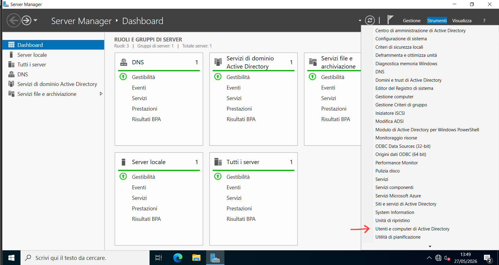

2. Si apre la console MMC di gestione degli oggetti (`dsa.msc`). Nel menu ad albero di sinistra espandiamo il nodo del dominio `lab.local` e selezioniamo il contenitore di sistema predefinito denominato **Users**. Spostiamo il cursore nello spazio di lavoro centrale, facciamo click con il tasto destro in un punto vuoto e selezioniamo il percorso dal menu contestuale: **Nuovo > Utente**.
   
   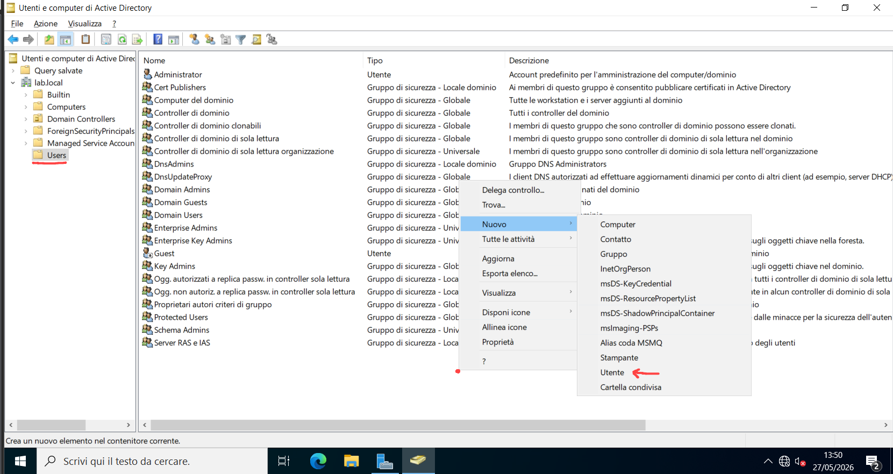

3. Si apre il primo step del pannello guidato *Nuovo oggetto Utente*. Andiamo a valorizzare gli attributi anagrafici fondamentali (Nome e Cognome) e impostiamo la sintassi per le credenziali di rete. Nel campo **Nome accesso utente** (*User logon name*) digitiamo l'identificativo standard scelto per il laboratorio, nel mio caso **`kev.pal`**. Accanto, il menu a tendina assocerà il suffisso completando l'UPN in `kev.pal@lab.local`. Il campo sottostante per i sistemi precedenti a Windows 2000 si autocompilerà come `LAB\kev.pal`. Clicchiamo su **Avanti >**.
   
   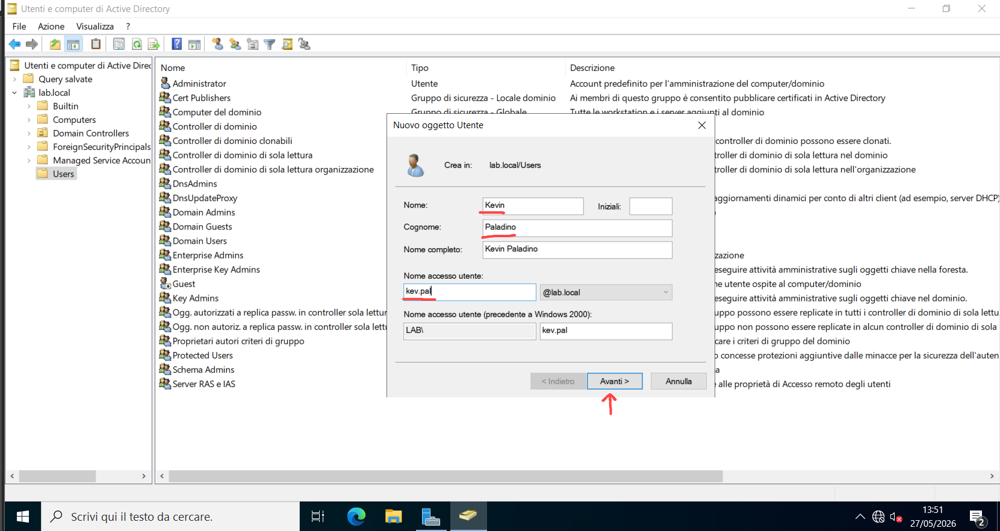

4. Nel secondo step del wizard andiamo a definire i criteri di sicurezza per la credenziale. Inseriamo una password complessa nei campi **Password** e **Conferma password**. Trattandosi di un account di test inserito in un ambiente di laboratorio controllato, andiamo a **deselezionare** la casella *Cambiamento obbligatorio password all'accesso successivo* e andiamo a selezionare esplicitamente la spunta su **Nessuna scadenza password**, evitando così che l'account scada o si blocchi durante i test futuri. Clicchiamo su **Avanti >** e successivamente su **Fine** nella schermata di riepilogo.
   
   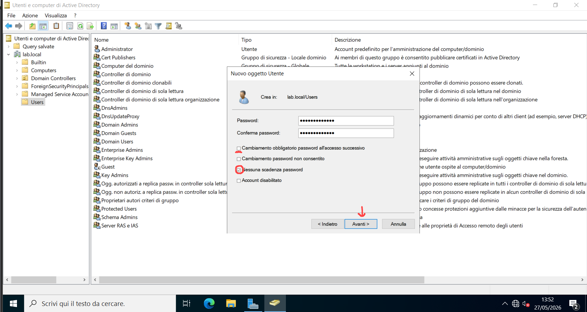

5. Per verificare l'effettiva operatività del nuovo oggetto, torniamo sulla macchina client Windows 10. Dalla schermata di logon, assicurandoci di aver selezionato la voce *Altro utente*, inseriamo nel campo di testo il nome di accesso appena creato (**`kev.pal`**) seguito dalla password corrispondente. Premiamo Invio: il client interrogherà il Domain Controller, validerà i privilegi e avvierà l'inizializzazione del nuovo profilo utente di rete sulla workstation.
   
   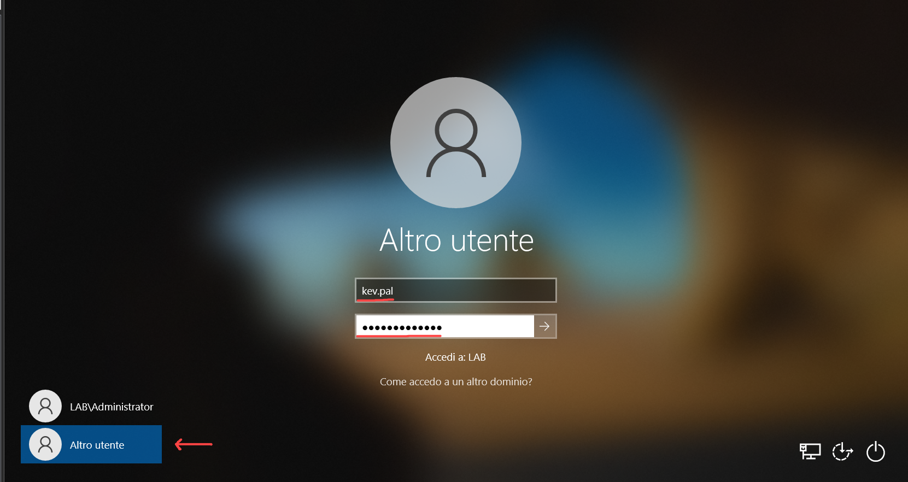

## 5. Installazione e Configurazione del Ruolo Server DHCP

Mantenere gli IP statici sui client richiede un carico amministrativo eccessivo ed espone al rischio di errori manuali. Andiamo ad installare e centralizzare il servizio DHCP direttamente su Windows Server per automatizzare la distribuzione degli indirizzi IP e dei parametri DNS a tutte le macchine del laboratorio.

1. Ritorniamo su **DC01** e rilanciamo il wizard *Aggiungi ruoli e funzionalità* dal Server Manager. Avanziamo fino alla scheda **Ruoli server**, individuiamo nell'elenco la voce **Server DHCP** e andiamo a selezionare la relativa casella di controllo, approvando le funzionalità correlate nel pop-up che compare. Avanziamo nelle schermate successive senza apportare modifiche manuali fino alla fine e clicchiamo su **Installa**.
   
   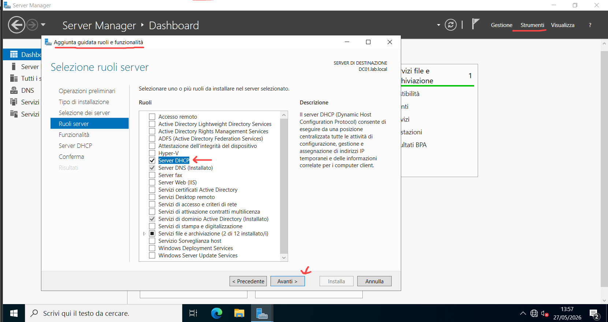

2. Al completamento del processo software, la scheda *Risultati* ci informerà che l'istanza è presente sul disco ma richiede passaggi post-installazione. Facciamo click sul link ipertestuale di avviso evidenziato in rosso: **Completa configurazione DHCP**.
   
   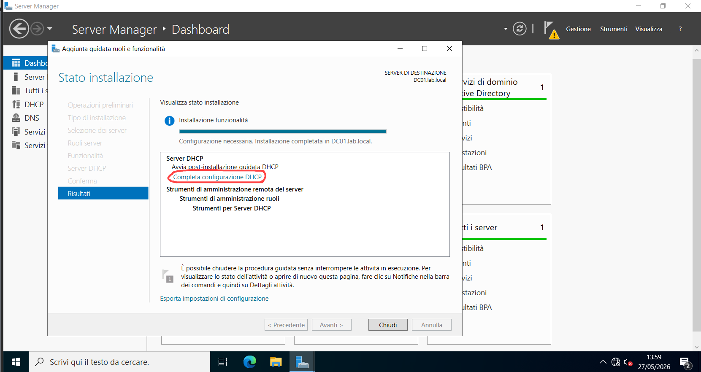

3. Si apre la finestra secondaria *Configurazione guidata post-installazione DHCP*, posizionata sullo step logico di **Autorizzazione**. Per fare in modo che il server DHCP sia legittimato a distribuire IP all'interno del dominio Active Directory, dobbiamo autorizzarlo. Lasciamo attiva l'opzione predefinita *Usa credenziali dell'utente seguente* (che mostra già popolato il campo con l'account amministrativo principale **`LAB\Administrator`**) e facciamo click sul pulsante **Commit** in basso a destra. Una volta completato il task con successo, chiudiamo la finestra.
   
   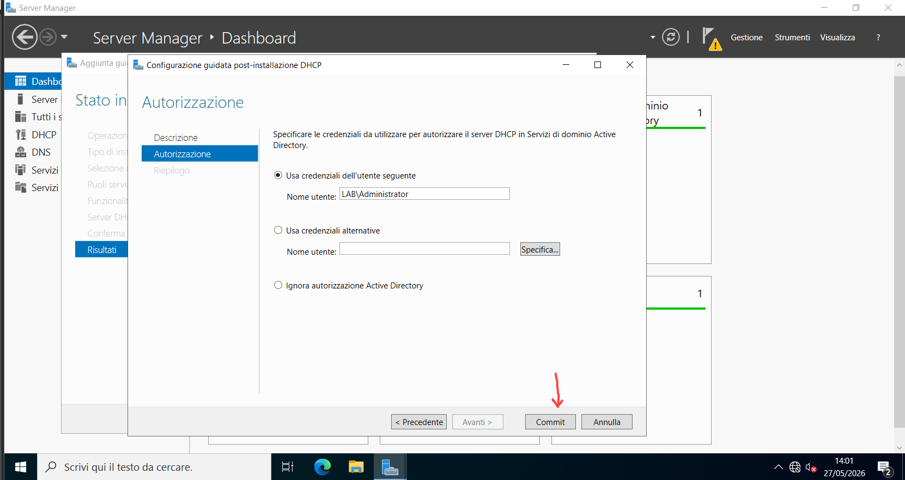

4. Torniamo sulla barra superiore del Server Manager, clicchiamo su **Strumenti** (*Tools*) e selezioniamo la voce specifica **DHCP** per lanciare la console amministrativa nativa.
   
   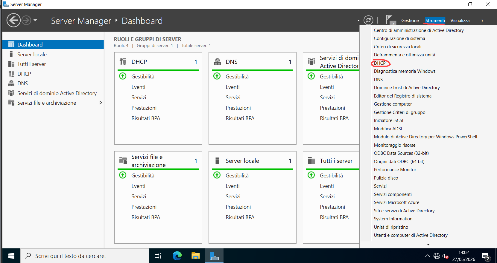

5. All'interno della console DHCP, espandiamo il nodo del nostro server autorizzato **`dc01.lab.local`** nel menu ad albero di sinistra, rivelando le opzioni per i protocolli di rete. Facciamo click con il tasto destro sulla voce **IPv4** e, dal menu contestuale comparso al centro dello schermo, selezioniamo la seconda opzione dall'alto: **Nuovo ambito...** (*New Scope*).
   
   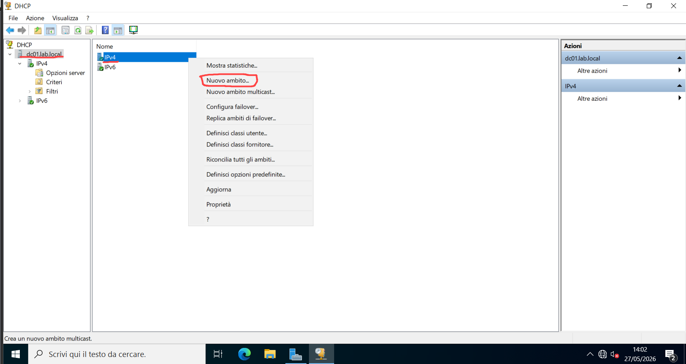

6. Si avvia la procedura guidata di creazione dell'ambito logico di indirizzamento. Nel primo step operativo, denominato **Nome ambito**, dobbiamo assegnare un identificativo testuale alla rete. All'interno del campo di testo obbligatorio *Nome*, digitiamo una stringa chiara come **`Rete_Lab`**, lasciamo vuoto il campo *Descrizione* e clicchiamo su **Avanti >**.
   
   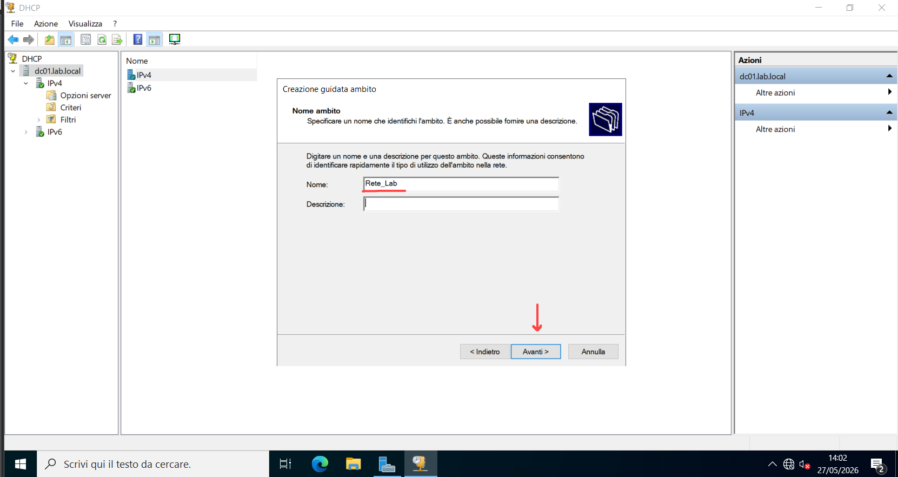

7. Nella scheda **Intervallo indirizzi IP**, dobbiamo andare a recintare il perimetro del nostro pool di distribuzione. Nella sezione *Impostazioni di configurazione per il server DHCP*, compiliamo i limiti esatti della nostra sottorete aziendale:
   
   - **Indirizzo IP iniziale**: `192.168.10.50`
   
   - **Indirizzo IP finale**: `192.168.10.150`
     
     Nella sezione sottostante, dedicata ai parametri della subnet mask, impostiamo il valore di contatore della **Lunghezza** su **`24`**, che autocompilerà il campo *Subnet mask* con il valore standard della classe C: **`255.255.255.0`**. Clicchiamo su **Avanti >**.
   
   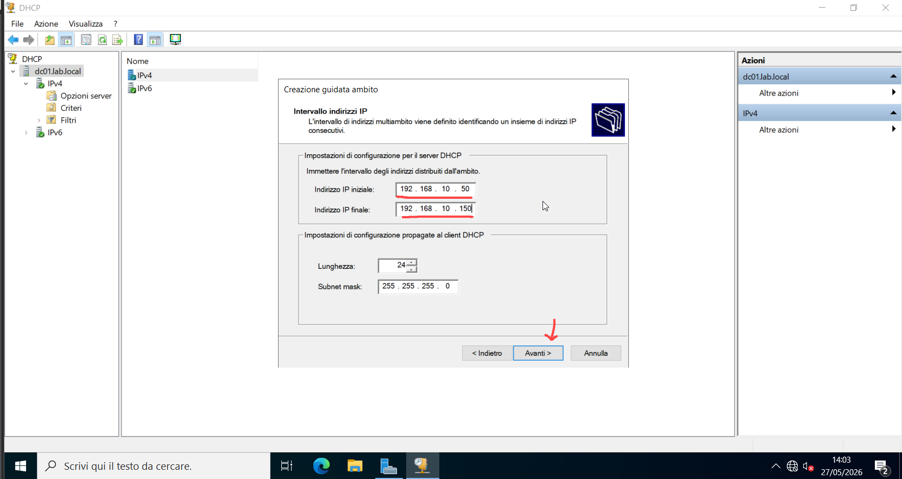

8. Avanziamo nel wizard superando le schermate di esclusione e di lease-time fino ad arrivare alla scheda **Router (gateway predefinito)**. Questo passaggio permette al DHCP di indicare ai client la strada per uscire dalla rete locale. Nel campo di testo inseriamo l'indirizzo IP interno del nostro firewall pfSense: **`192.168.10.1`**, facciamo click sul pulsante *Aggiungi* per registrarlo nella lista di instradamento e clicchiamo su **Avanti >**.
   
   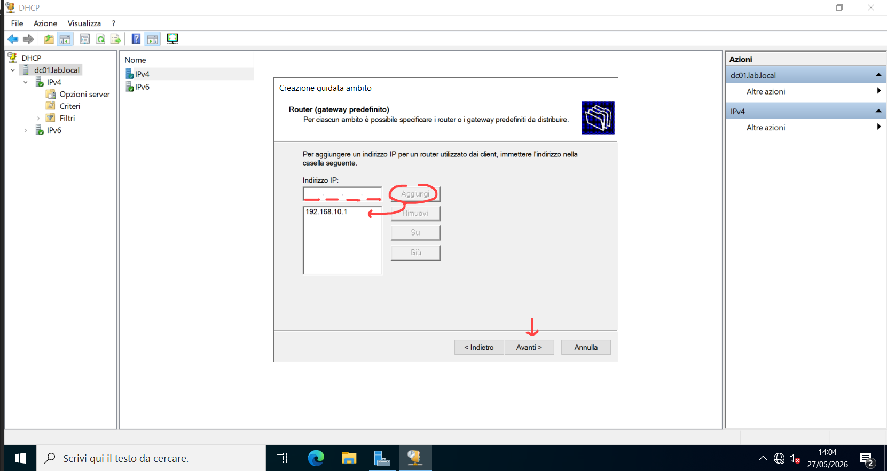

9. Arriviamo alla scheda **Nome dominio e server DNS**. Il wizard eredita automaticamente le impostazioni di Active Directory, mostrando nel campo *Dominio padre* la stringa `lab.local` e inserendo nella lista inferiore l'IP del nostro Domain Controller (**`192.168.10.100`**). Questo assicurerà che ogni client riceva l'IP di DC01 come DNS primario, garantendo l'integrità del join. Clicchiamo su **Avanti >**, selezioniamo l'opzione per attivare l'ambito immediatamente e concludiamo la procedura.
   
   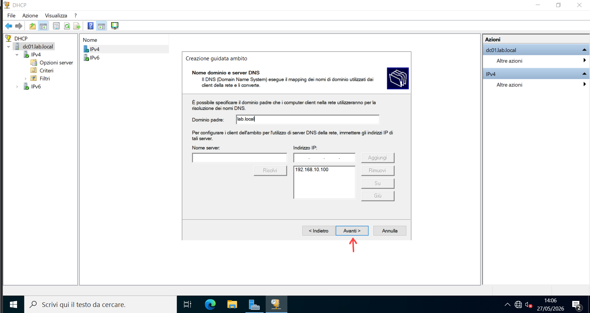

## 6. Passaggio del Client a DHCP e Risoluzione dei Conflitti di Rete (Rogue DHCP)

Avendo configurato un server DHCP ufficiale all'interno della Active Directory, dobbiamo riconfigurare il client Windows 10 affinché smetta di usare l'IP fisso temporaneo e ascolti i broadcast della rete. Tuttavia, la presenza simultanea di un altro server DHCP attivo (come quello predefinito su pfSense) genererà un grave conflitto di rete.

1. Spostiamoci sulla macchina virtuale **Windows 10** ed entriamo nuovamente nelle proprietà IPv4 della scheda di rete Ethernet0 per rimuovere l'assegnazione statica. Spostiamo i radio button selezionando **Ottieni automaticamente un indirizzo IP** e **Ottieni indirizzo server DNS automaticamente**. Clicchiamo su **OK** in basso a destra per applicare le modifiche e forzare la scheda di rete in ascolto di broadcast DHCP.
   
   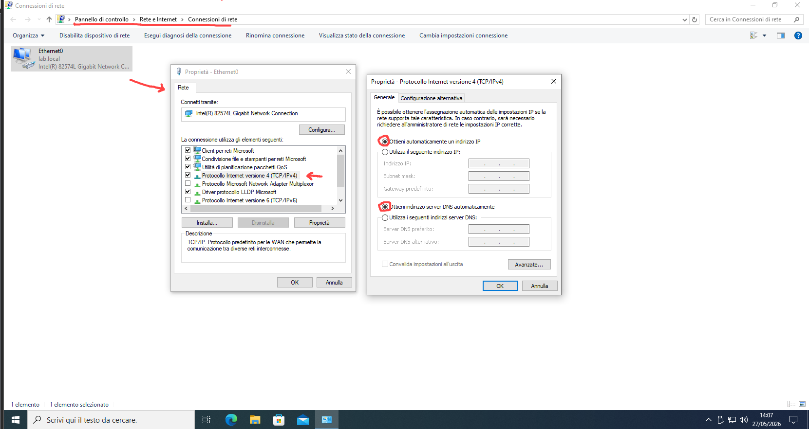

2. Per convalidare lo stato del network e verificare i parametri ottenuti in modalità dinamica, apriamo il **Prompt dei comandi** sul client ed eseguiamo l'ispezione visiva tramite il comando:
   
   DOS
   
   ```
   ipconfig /all
   ```
   
   Analizzando l'output a schermo, verifichiamo che la configurazione sia corretta e allineata: la voce *DHCP abilitato* è contrassegnata da un chiaro *Sì*, l'indirizzo IPv4 assegnato è il primo del pool (**`192.168.10.50`**) e i parametri di *Server DHCP* e *Server DNS* puntano stabilmente all'indirizzo del Domain Controller (`192.168.10.100`).
   
   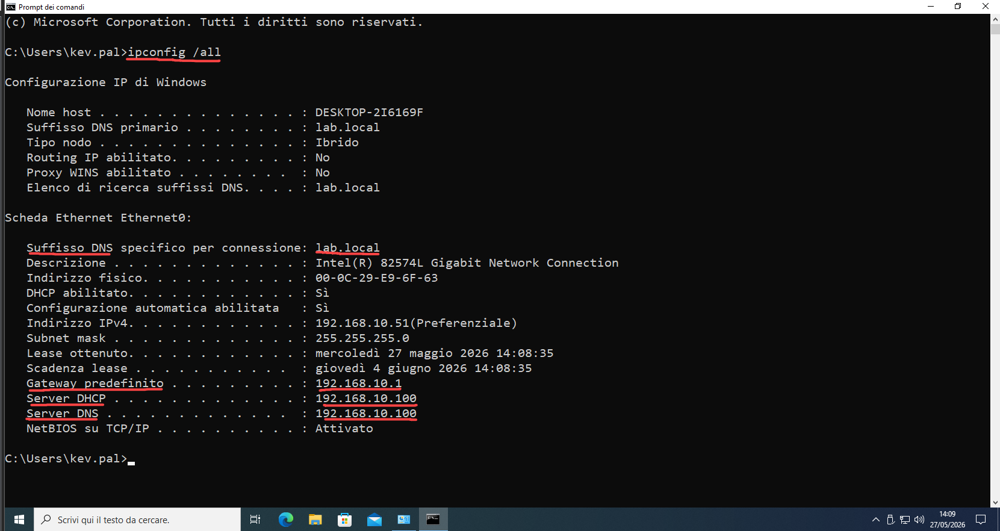

3. **Risoluzione del conflitto di rete (Rogue DHCP):** L'infrastruttura presenta ora un'anomalia critica: sia Windows Server sia il firewall pfSense rispondono alle richieste DHCP sulla stessa subnet. Per risolvere questo conflitto, apriamo il browser e colleghiamoci alla Web GUI di pfSense (`https://192.168.10.1`). Navighiamo nel menu superiore seguendo il percorso **Services > DHCP Server** e posizioniamoci sulla scheda d'interfaccia **LAN**. Individuiamo la primissima casella di controllo in alto, denominata **Enable DHCP server on LAN interface**, e **deselezioniamola** (rimuovendo la spunta). Questa scelta sistemistica è fondamentale per spegnere il server DHCP non autorizzato, delegando interamente la distribuzione degli IP a Windows Server. Scorriamo la pagina verso il basso e facciamo click su **Save** per rendere definitive le modifiche.
   
   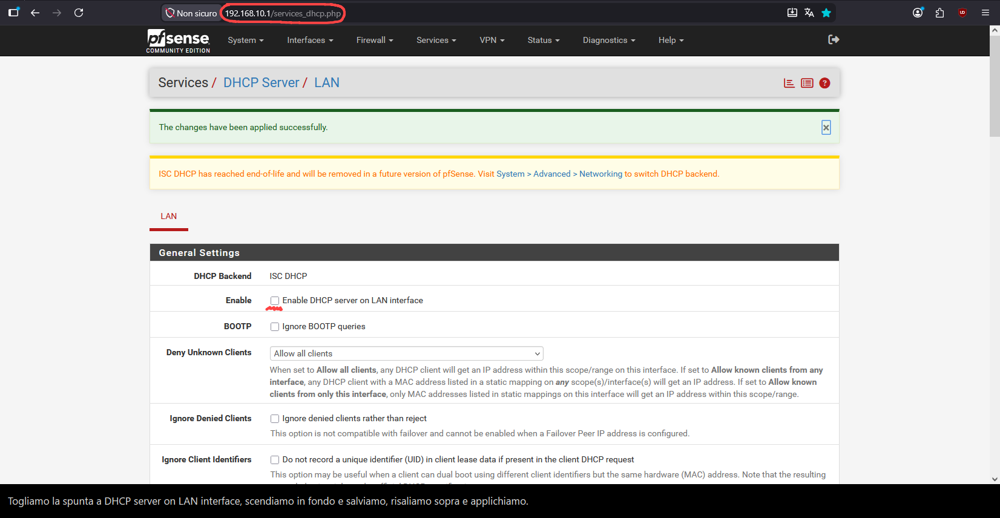

4. **Intercettazione dell'allarme su Zabbix:** Avendo spento il servizio sul firewall, l'infrastruttura di monitoraggio rileva immediatamente il cambiamento di stato. Se andiamo a dare uno sguardo alla nostra console enterprise **Zabbix**, noteremo che nel widget **Current Problems** della dashboard principale è scattato un alert associato alla macchina DC01 (o al nodo pfSense):
   
   > **Problem:** PFSense: DHCP server is not running
   
   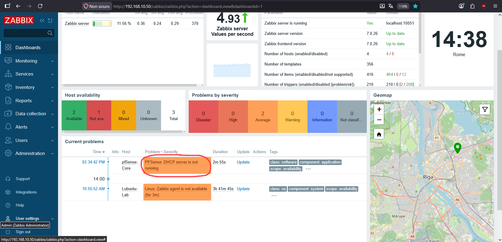

5. **Disattivazione del trigger obsoleto:** Poiché lo spegnimento del DHCP su pfSense è una scelta architetturale definitiva e desiderata per questo laboratorio, dobbiamo istruire Zabbix affinché non lo consideri più come un problema. Nel menu laterale di Zabbix, navighiamo in **Data Collection > Hosts**.

6. All'interno della tabella, individuiamo la riga corrispondente a **pfSense-Core**. Spostiamo lo sguardo verso destra e clicchiamo sul link ipertestuale **Triggers** associato a questo host.
   
   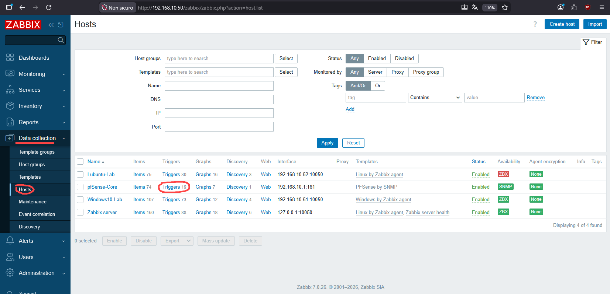

7. Nella lista dei controlli attivi, cerchiamo la regola legata allo stato del servizio DHCP e andiamo a cliccare sullo stato **Enabled**: l'interfaccia lo commuterà in **Disabled**, spegnendo definitivamente il monitoraggio su quel parametro e ripulendo la dashboard principale da alert non necessari.
   
   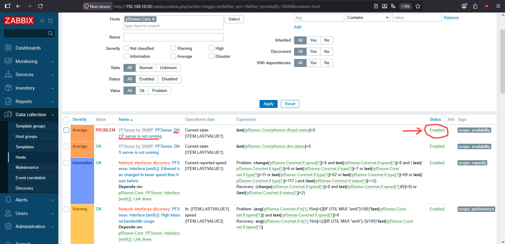

L'allineamento è completato con successo: c'è un solo server DHCP attivo nel dominio, i falsi positivi su Zabbix sono stati azzerati e l'infrastruttura di rete è ora pulita, realistica e centralizzata sotto il controllo del Domain Controller.

---

## Configurazione dei Server d'Inoltro DNS (Forwarder 8.8.8.8)

Dopo il riavvio e il primo logon sul Domain Controller, la macchina è l'autorità suprema per il dominio locale `lab.local`. Tuttavia, non è ancora in grado di risolvere i domini Internet esterni per i client della rete. Procediamo a configurare i server d'inoltro.

- Dalla dashboard principale del **Server Manager**, spostiamo lo sguardo in alto a destra, facciamo click sul menu **Strumenti** (*Tools*) e selezioniamo la voce **DNS** per lanciare la console di gestione nativa (`01.png`).
  
  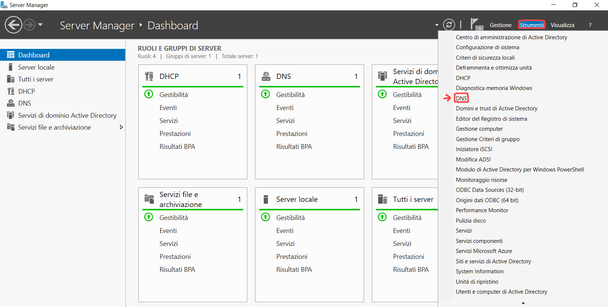

- All'interno della finestra **Gestore DNS**, espandiamo l'albero di sinistra, facciamo click destro sul nodo del nostro server **DC01** e selezioniamo l'opzione **Proprietà** dal menu contestuale (`02.png`).
  
  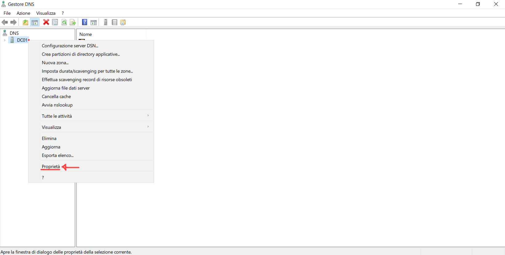

- Nella finestra delle proprietà del server, spostiamoci sulla scheda **Server d'inoltro** (*Forwarders*) e facciamo click sul pulsante **Modifica...** (*Edit*) posizionato al centro sulla destra (`03.png`).
  
  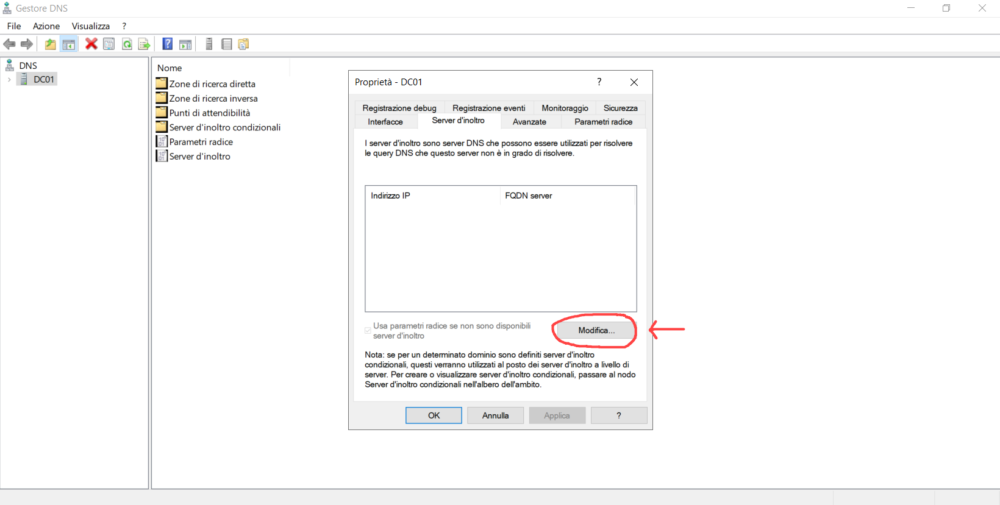

- Si apre il pop-up *Modifica server d'inoltro*. Facciamo click all'interno dello spazio editabile che riporta la dicitura *<Fare clic per aggiungere un indirizzo IP o un nome DNS>* (`04.png`).
  
  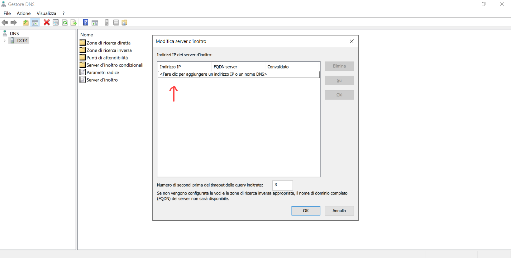

- Digitiamo l'indirizzo IP pubblico **`8.8.8.8`** (DNS di Google) e premiamo Invio. Il sistema esegue una convalida automatica in background: quando compare il segno di spunta verde con la risoluzione dell'FQDN **`dns.google`** e lo stato **OK**, facciamo click su **OK** (`05.png`) e successivamente su **Applica** nella schermata precedente per salvare definitivamente.
  
  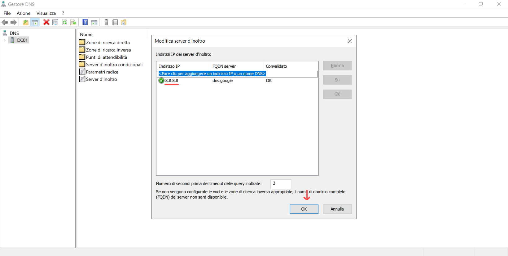

## Monitoraggio Enterprise: Installazione e Censimento dello Zabbix Agent su DC01

Per includere il nuovo Domain Controller all'interno della nostra infrastruttura di monitoraggio centralizzata, procediamo con il deploy dell'agente software di Zabbix,

- Apriamo il browser web all'interno del server e navighiamo sulla pagina ufficiale di Zabbix dedicata agli agenti (`https://www.zabbix.com/download_agents`). Selezioniamo la release stabile **7.0 LTS** e, in corrispondenza della voce **Zabbix agent v7.0.27** per Windows `amd64` con supporto OpenSSL, facciamo click sul pulsante verde **DOWNLOAD** per scaricare l'installer in formato `.msi`.
  
  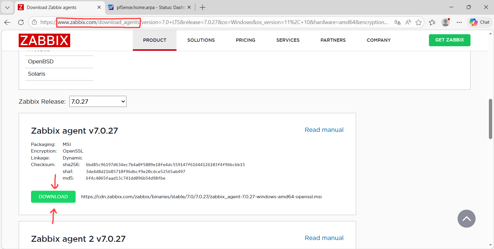

- Completato il download, apriamo la cartella dei file scaricati ed eseguiamo l'installer con un doppio click. Si aprirà la finestra di benvenuto del wizard grafico: **Welcome to the Zabbix Agent (64-bit) Setup Wizard**. Facciamo click su **Next** per procedere.
  
  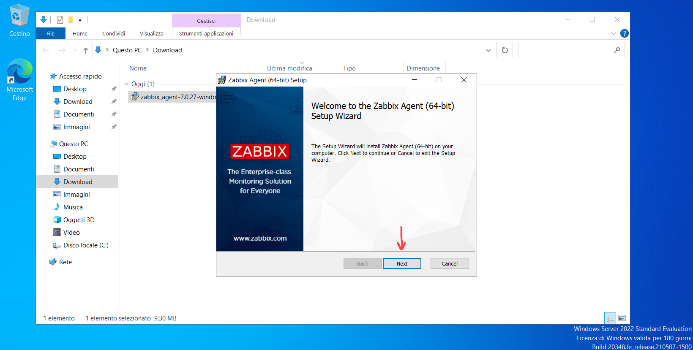

- Nella schermata successiva relativa all'**End-User License Agreement**, andiamo a selezionare la casella di controllo **I accept the terms in the License Agreement** per approvare i termini della licenza GNU GPL v3 e clicchiamo su **Next**.
  
  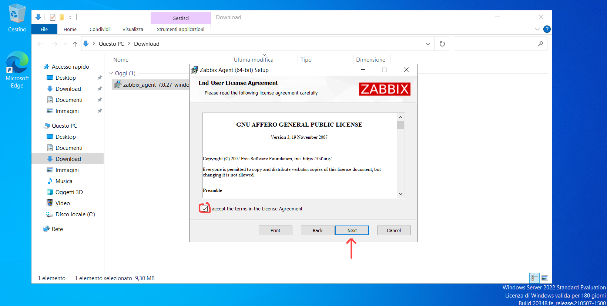

- Arriviamo alla maschera fondamentale di configurazione del servizio: **Zabbix Agent service configuration**. All'interno del campo **Host name**, assicuriamoci di digitare esattamente il nome logico della macchina, ovvero **`DC01`**. Nei campi di testo dedicati a **Zabbix server IP/DNS** e **Server or Proxy for active checks**, inseriamo l'indirizzo IP statico del nostro server di monitoraggio: **`192.168.10.50`**. Lasciamo la porta di ascolto di default (`10050`) e andiamo a spuntare l'opzione **Add agent location to the PATH** per facilitare eventuali chiamate da prompt dei comandi. Clicchiamo su **Next**.
  
  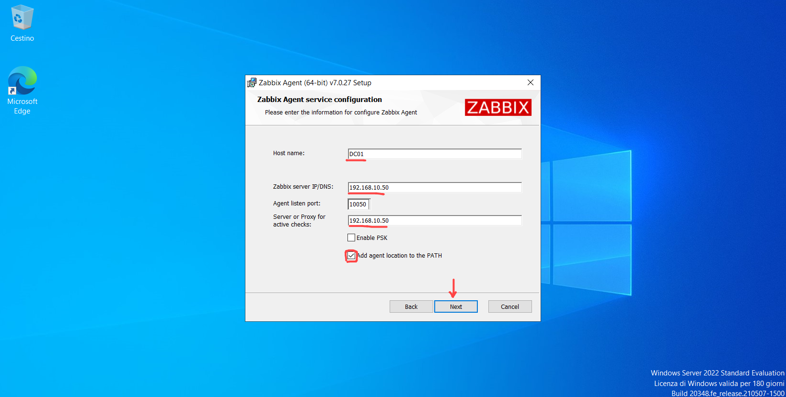

- Nella schermata **Ready to install Zabbix Agent (64-bit)**, confermiamo la correttezza di tutti i parametri inseriti facendo click sul pulsante **Install** per avviare il caricamento del servizio di sistema. Al termine, chiudiamo il wizard cliccando su *Finish*.
  
  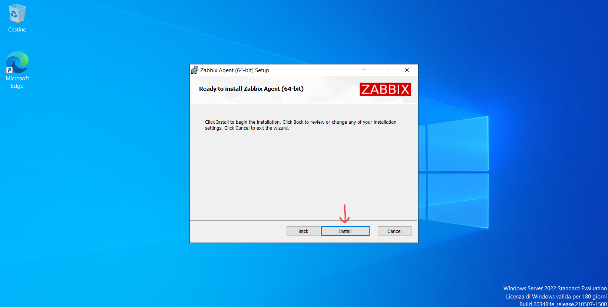

- Spostiamoci ora sulla Web GUI del nostro server di monitoraggio collegandoci all'indirizzo `http://192.168.10.50/zabbix`. Dal menu laterale navighiamo in **Data collection > Hosts** e clicchiamo in alto a destra su *Create host*. All'interno del pannello a comparsa **New host**, compiliamo i campi come segue:
  
  - **Host name**: `DC01`
  
  - **Templates**: Selezioniamo il template ufficiale **`Windows by Zabbix agent`**
  
  - **Host groups**: Associamo l'oggetto al gruppo **`Virtual machines`**
  
  - **Interfaces**: Clicchiamo su *Add*, selezioniamo *Agent* e inseriamo nel campo IP address la stringa **`192.168.10.100`** (l'IP del nostro Domain Controller). Lasciamo la porta `10050` e facciamo click sul pulsante blu **Add** in basso.
  
  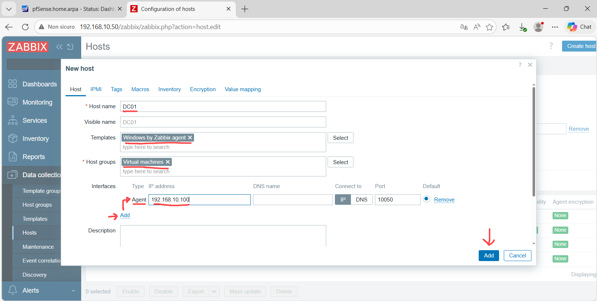

- Ritornando sulla tabella riepilogativa degli host, attendiamo qualche istante per permettere all'infrastruttura di completare l'handshake di rete. L'host **DC01** mostrerà l'indicatore **ZBX** all'interno della colonna *Availability* acceso di un colore **verde brillante**, confermando che l'agente risponde correttamente e sta inviando i dati di telemetria.
  
  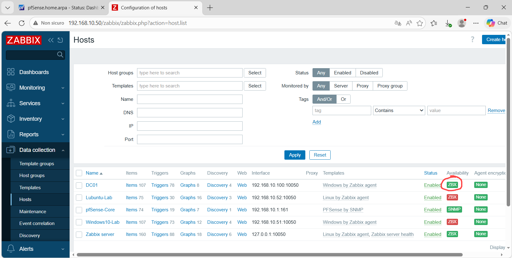

- Per mantenere aggiornata la topologia visiva del laboratorio, navighiamo nel menu di sinistra su **Monitoring > Maps** e apriamo la mappa della nostra rete locale. Clicchiamo su *Edit map* e successivamente su *Add element*. Nel pannello delle proprietà dell'elemento (**Map element**), impostiamo il campo *Type* su *Host* e, nel campo di ricerca sotto la dicitura **Host**, selezioniamo la voce **`DC01`**.
  
  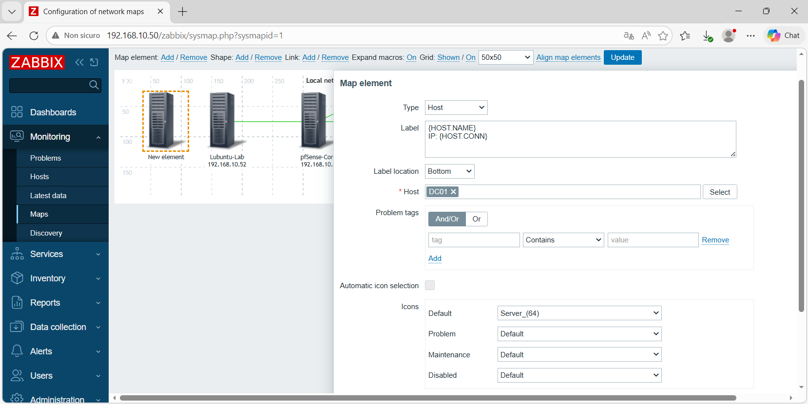

- Tracciamo i collegamenti logici verso il firewall pfSense e salviamo le modifiche. Il risultato finale ci restituisce una mappa topologica centralizzata e pulita, allineata con l'architettura reale del laboratorio enterprise, in cui tutti i nodi (inclusi il client Windows 10 sul `.51` e Lubuntu sul `.52`) si trovano in uno stato nominale contrassegnato dal marker verde **OK**.
  
  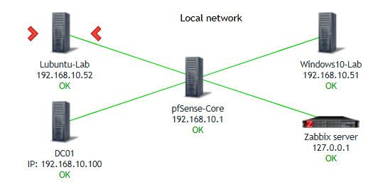

## Sicurezza del Dominio: Configurazione GPO Blocco Pannello di Controllo

Per garantire la conformità e la sicurezza degli endpoint aziendali del laboratorio, applichiamo una Group Policy Object (GPO) legata alla radice del dominio. L'obiettivo è bloccare l'accesso al Pannello di Controllo e all'app Impostazioni a tutti gli utenti non amministrativi.

- Dalla dashboard del **Server Manager**, facciamo click in alto a destra su **Strumenti** (*Tools*) e selezioniamo la voce **Gestione Criteri di gruppo** (*Group Policy Management*) per aprire la console di amministrazione delle GPO.
  
  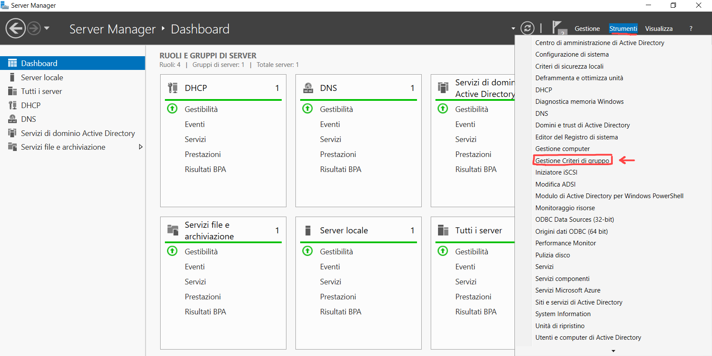

- All'interno della console, espandiamo l'albero di sinistra fino a visualizzare la voce relativa alla nostra foresta locale **`Foresta: lab.local`**.
  
  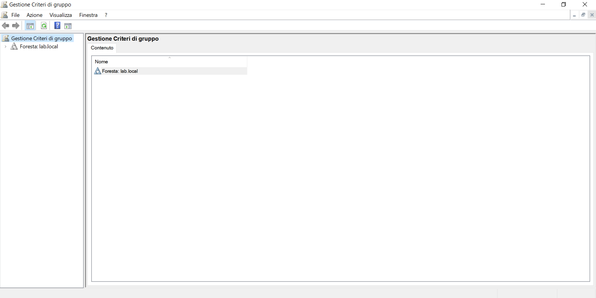

- Espandiamo la cartella *Domini* e facciamo click destro direttamente sul nome del nostro dominio principale **`lab.local`**. Dal menu contestuale che compare, selezioniamo la primissima opzione: **Crea un oggetto Criteri di gruppo in questo dominio e crea qui un collegamento...**.
  
  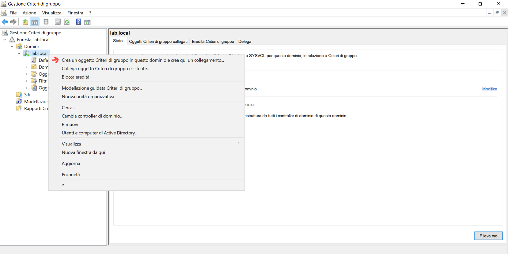

- Nel pop-up *Nuovo oggetto Criteri di gruppo*, inseriamo un nome descrittivo e chiaro all'interno del campo di testo, digitando **`Blocco Pannello Controllo`**. Lasciamo la voce *Oggetto Criteri di gruppo Starter di origine* impostata su *(nessuno)* e confermiamo cliccando su **OK**.
  
  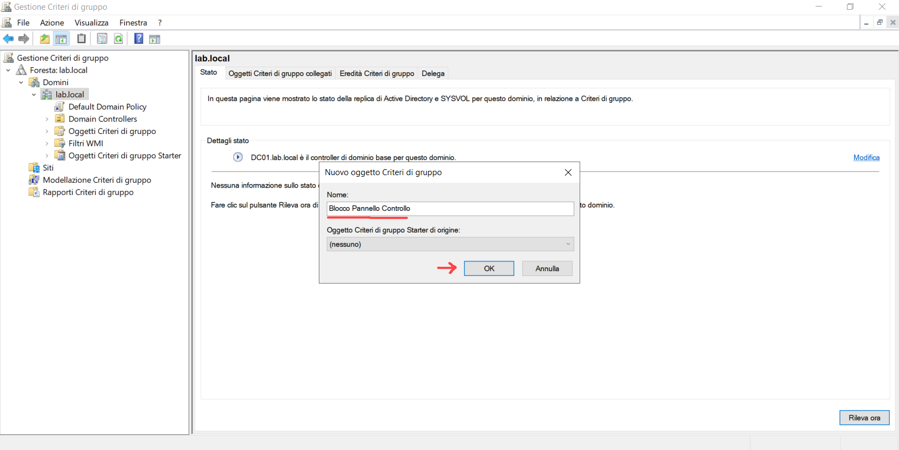

- Subito dopo, la console mostrerà un messaggio informativo di avviso che ricorda come le modifiche apportate in questa finestra di dialogo verranno applicate all'intero oggetto e a tutte le sue posizioni collegate. Facciamo click su **OK** per superarlo.
  
  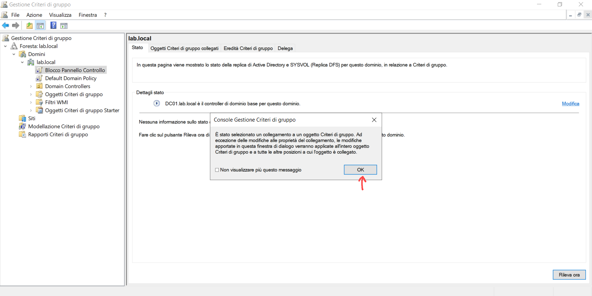

- L'oggetto appena creato apparirà ora correttamente allineato e collegato alla radice di `lab.local`, ereditando di default il filtraggio di sicurezza applicato al gruppo *Authenticated Users*.
  
  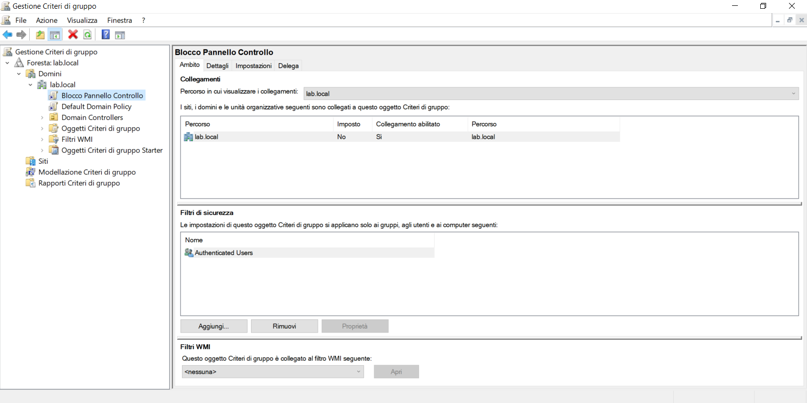

- Per definire le regole interne della policy, facciamo click destro sulla voce **Blocco Pannello Controllo** nell'albero di sinistra e selezioniamo l'opzione **Modifica...** (*Edit*) dal menu a comparsa.
  
  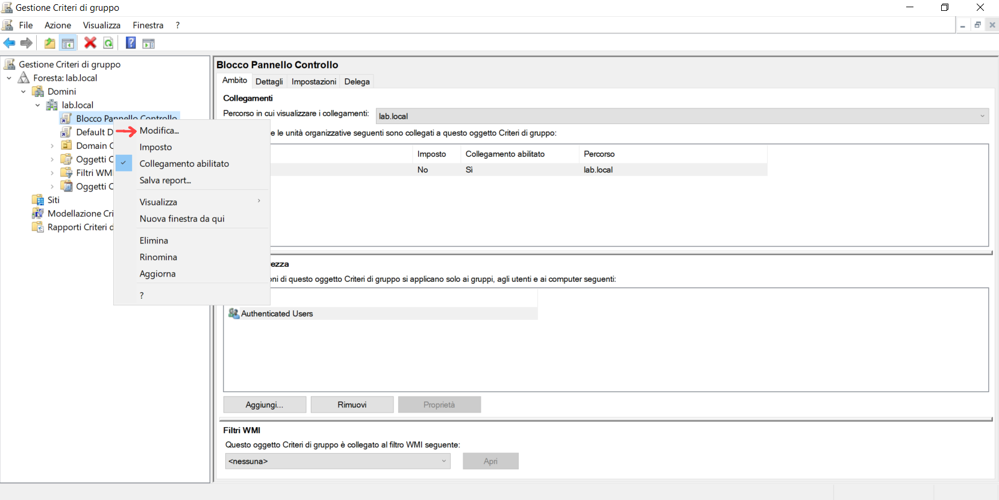

- Nella nuova finestra dell'*Editor Gestione Criteri di gruppo*, focalizziamo l'attenzione sulla sezione dedicata alle restrizioni del profilo: navighiamo nel percorso **Configurazione utente** > **Criteri** > **Modelli amministrativi: definizioni di criteri (file ADMX)** e selezioniamo la cartella **Pannello di controllo**.
  
  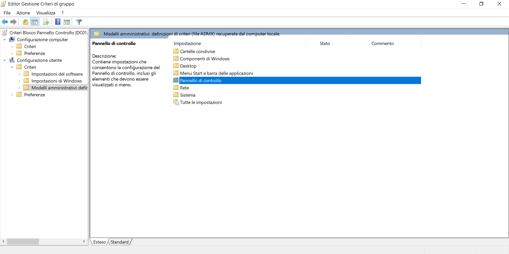

- Spostandoci nel pannello di destra, individuiamo la voce di impostazione denominata **Impedisci l'accesso al Pannello di controllo e a Impostazioni PC** (che al momento si trova nello stato di default *Non configurato*) e facciamo doppio click su di essa.
  
  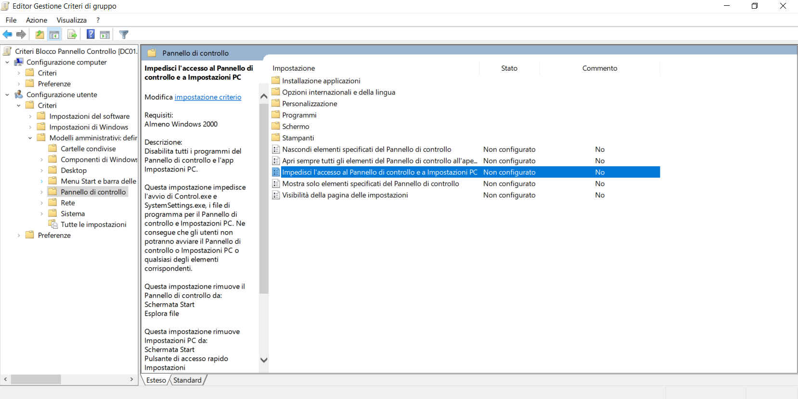

- All'interno della finestra di configurazione del singolo criterio, andiamo a modificare il selettore posizionandolo sulla voce **Attivata** (*Enabled*). Questo forzerà l'inibizione dei file eseguibili `Control.exe` e `SystemSettings.exe` sui client. Per rendere definitiva la configurazione, facciamo click su **Applica** e successivamente su **OK**.
  
  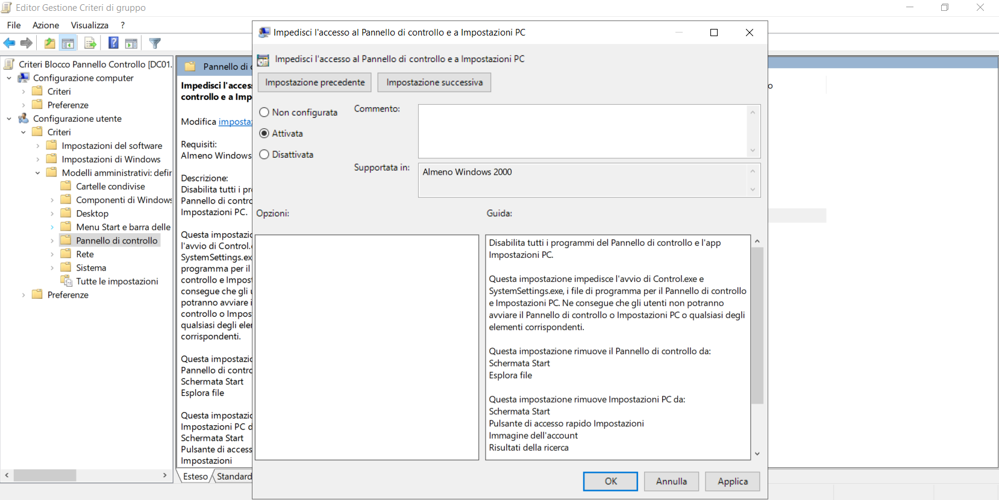

### Verifica e Testing sui Client di Dominio

Per validare l'effettiva ricezione e applicazione della policy, ci spostiamo su una workstation client (Windows 10) ed eseguiamo i test di accesso con un utente standard del dominio.

- Effettuiamo l'accesso alla workstation client utilizzando l'account dell'utente di dominio standard (es. `Kevin Paladino`) inserendo la password associata nella schermata di login di Windows.
  
  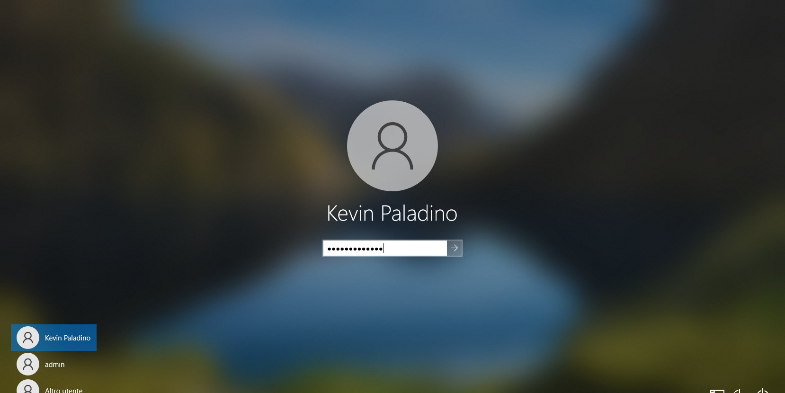

- Una volta caricato il profilo, apriamo il prompt dei comandi ed eseguiamo il comando **`gpupdate /force`** per richiedere immediatamente al Domain Controller l'allineamento dei criteri. Attendiamo la conferma a schermo dell'avvenuto aggiornamento dei criteri sia per la componente *Computer* che per la componente *Utente*.
  
  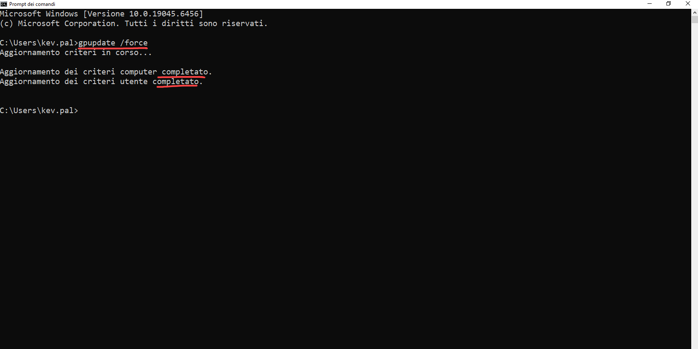

- Proviamo ad aggirare o ad accedere normalmente alle configurazioni cercando il **Pannello di controllo** all'interno della barra di ricerca di Windows.
  
  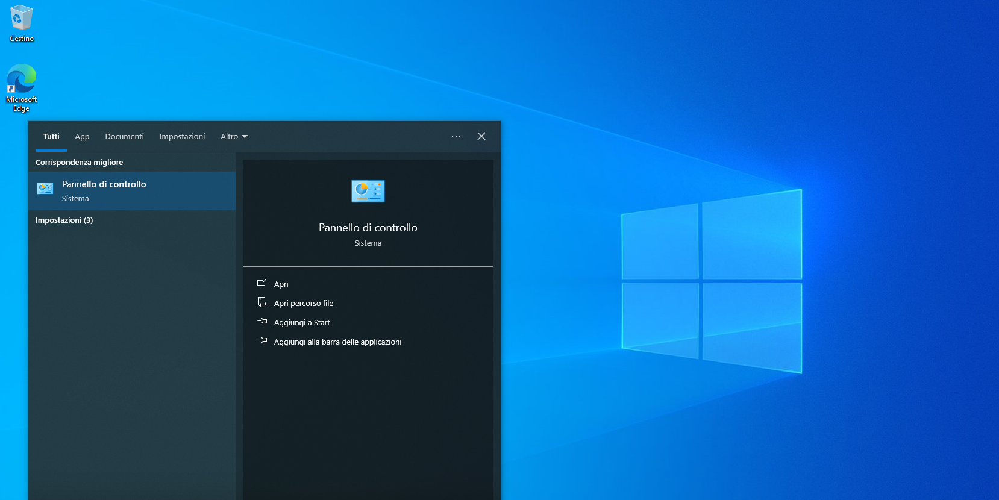

- Al tentativo di apertura dell'applicazione, il sistema intercetta la chiamata e blocca l'esecuzione mostrando una finestra pop-up di blocco denominata *Restrizioni*: **"Operazione annullata. Sul computer sono attivate delle restrizioni. Contattare l'amministratore del sistema."**. Questo conferma che la GPO è attiva, funzionante e applicata correttamente al target impostato.
  
  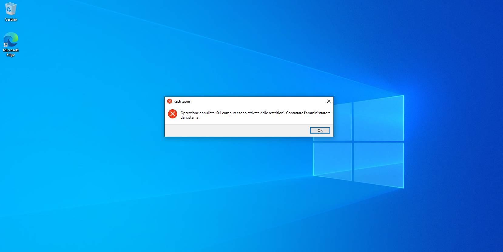
